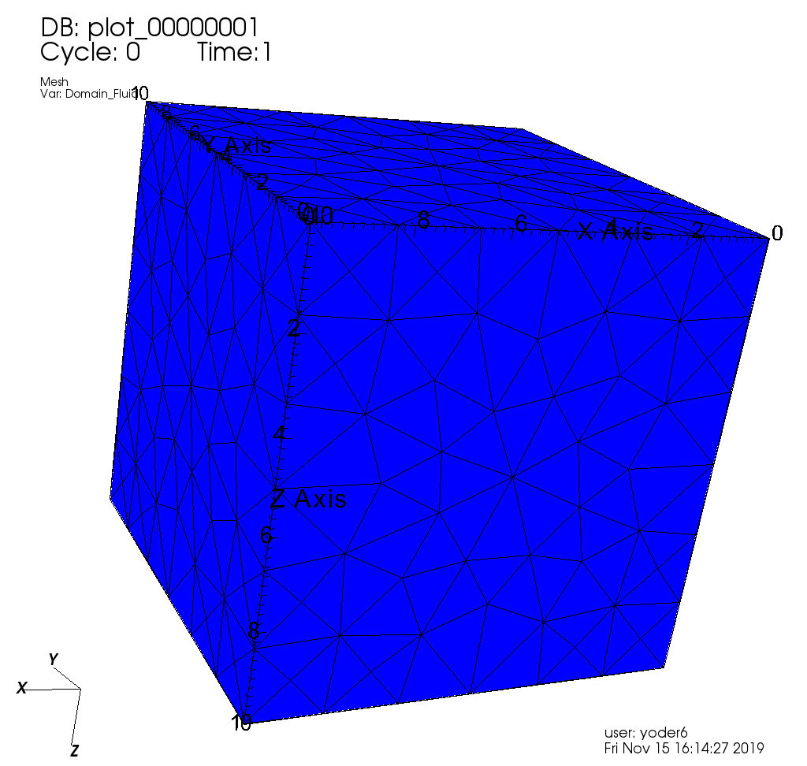

.. _TutorialSinglePhaseFlow:

#########################################
Single-phase flow  
#########################################

This example will use the single flow solver (see :ref:`SinglePhaseFlow`) from GEOSX.

***************************************
Internally Generated Mesh
***************************************

We begin with a simple a cube test case, before exploring more complex examples. 
The xml file for this test case is located at src/coreComponents/physicsSolvers/FiniteVolume/integratedTests/singlePhaseFlow/3D_10x10x10_compressible.xml
A pressure source term will be set in the top corner block and a sink pressure term will be set in the bottom corner block.

Building the input XML file
^^^^^^^^^^^^^^^^^^^^^^^^^^^^
Building the input XML file requires the definition of the following XML tags:

 #. :ref:`Solver <Solver_tag>`
 #. :ref:`Mesh <Mesh_tag>`
 #. :ref:`Geometry <Geometry_tag>`
 #. :ref:`Events <Events_tag>`
 #. :ref:`NumericalMethods <NumericalMethods_tag>`
 #. :ref:`ElementRegions <ElementRegions_tag>`
 #. :ref:`Constitutive <Constitutive_tag>`
 #. :ref:`FieldSpecifications <FieldSpecifications_tag>`
 #. :ref:`Functions and Partition <Functions_tag>`
 #. :ref:`Outputs <Outputs_tag>`

We open the XML file with the Problem block,

.. literalinclude:: ../../../../coreComponents/physicsSolvers/FiniteVolume/integratedTests/singlePhaseFlow/3D_10x10x10_compressible.xml
  :language: xml
  :start-after: <!-- SPHINX_TUT_INT_HEX_PROBLEM_OPEN -->
  :end-before: <!-- SPHINX_TUT_INT_HEX_PROBLEM_OPEN_END -->

.. _Solver_tag:

Solvers tag
------------

The Solvers tag defines the particular physics solver to be use.  
Here, we will use a standard Two-Point Flux Approximation (TPFA) finite volume scheme.
This is done using ``singlePhaseTPFA`` value for the discretization node.

.. literalinclude:: ../../../../coreComponents/physicsSolvers/FiniteVolume/integratedTests/singlePhaseFlow/3D_10x10x10_compressible.xml
  :language: xml
  :start-after: <!-- SPHINX_TUT_INT_HEX_SOLVERS -->
  :end-before: <!-- SPHINX_TUT_INT_HEX_SOLVERS_END -->

.. _Mesh_tag:

Mesh tag 
-------------
GEOSX  allows you to either internally build your mesh or import it from a compatible format thanks to PAMELA (see :ref:`ImportingExternalMesh`). 
For this test case, we will use an internally generated 10x10x10 uniform regular mesh

.. literalinclude:: ../../../../coreComponents/physicsSolvers/FiniteVolume/integratedTests/singlePhaseFlow/3D_10x10x10_compressible.xml
  :language: xml
  :start-after: <!-- SPHINX_TUT_INT_HEX_MESH -->
  :end-before: <!-- SPHINX_TUT_INT_HEX_MESH_END -->

.. _Geometry_tag:

Geometry tag
-----------------
On the Geometry side, we will define and name our boxes for source and sink pressure terms. 

.. literalinclude:: ../../../../coreComponents/physicsSolvers/FiniteVolume/integratedTests/singlePhaseFlow/3D_10x10x10_compressible.xml
  :language: xml
  :start-after: <!-- SPHINX_TUT_INT_HEX_GEOMETRY -->
  :end-before: <!-- SPHINX_TUT_INT_HEX_GEOMETRY_END -->

One could also define surfaces on which to specified a Dirichlet boundary condition.

.. _Events_tag:

Events tag
---------------
The Event tag includes the final time of our simulation under ``maxTime`` node. Under *PeriodicEvent* embededd tags, we can set:

 #. which solver has to be called (among the child tag defined under the above mentinoned *Solver* tag) with its initial time step defined as the ``forceDt`` node value.
 #. under which ``timeFrequency`` will we need to output results (targeting the settings defined under some child tag of the below explained *Output* tag).

.. literalinclude:: ../../../../coreComponents/physicsSolvers/FiniteVolume/integratedTests/singlePhaseFlow/3D_10x10x10_compressible.xml
  :language: xml
  :start-after: <!-- SPHINX_TUT_INT_HEX_EVENTS -->
  :end-before: <!-- SPHINX_TUT_INT_HEX_EVENTS_END -->

.. _NumericalMethods_tag:

NumericalMethods tag
------------------------

The two-point flux approximation, which was first introduced under the *Solver>SinglePhaseFlow* child tag as the value of ``discretization`` node, is defined here. 

.. literalinclude:: ../../../../coreComponents/physicsSolvers/FiniteVolume/integratedTests/singlePhaseFlow/3D_10x10x10_compressible.xml
  :language: xml
  :start-after: <!-- SPHINX_TUT_INT_HEX_NUM_METHODS -->
  :end-before: <!-- SPHINX_TUT_INT_HEX_NUM_METHODS_END -->

Here the ``boundaryFieldName`` node specifies that for Dirichlet boundary conditions the face located value is considered. The ``coefficientName`` node refers to the field which has to be considered in the stencil computation. 

.. _ElementRegions_tag:

Element Regions tag
---------------------

This block defines regions.
Here, the entire field is one region called ``Domain``,
and contains ``water`` and ``rock`` only.

.. literalinclude:: ../../../../coreComponents/physicsSolvers/FiniteVolume/integratedTests/singlePhaseFlow/3D_10x10x10_compressible.xml
  :language: xml
  :start-after: <!-- SPHINX_TUT_INT_HEX_ELEM_REGIONS -->
  :end-before: <!-- SPHINX_TUT_INT_HEX_ELEM_REGIONS_END -->

.. _Constitutive_tag:

Constitutive tag
---------------------

The physical properties of ``water`` and ``rock`` elements can be found and set under this tag.

.. literalinclude:: ../../../../coreComponents/physicsSolvers/FiniteVolume/integratedTests/singlePhaseFlow/3D_10x10x10_compressible.xml
  :language: xml
  :start-after: <!-- SPHINX_TUT_INT_HEX_CONSTITUTIVE -->
  :end-before: <!-- SPHINX_TUT_INT_HEX_CONSTITUTIVE_END -->

.. _FieldSpecifications_tag:

FieldSpecifications tag
---------------------------
Here, fields such as porosity, permeability, source and sink terms or initial field values are specified. Our test case exhibits an anisotropic homogeneous permeability which components are so that:
  - permeability in the x-direction: ``permx``, constant value of 1.0e-12 m\ :sup:`2` (100 mD), and is considered the 0\ :sup:`th` component of the ``permeability`` vector,
  - permeability in the y-direction: ``permy``, constant value of 1.0e-12 m\ :sup:`2` (100 mD),
  - a lower permeability in the z-direction: ``permz``, constant value of 1.0e-15 m\ :sup:`2` (10 mD)

The ``setNames`` node value specifies the geometric zone where the value should be applied.
These directional permeabilities are followed by all the other field initializations. Please note the change in ``component`` node value as we are dealing with a permeability diagonal tensor.
The other fields to be specified are a constant homogenious reference porosity for the whole domain, initial pressure, and source and sink term pressures.

.. literalinclude:: ../../../../coreComponents/physicsSolvers/FiniteVolume/integratedTests/singlePhaseFlow/3D_10x10x10_compressible.xml
  :language: xml
  :start-after: <!-- SPHINX_TUT_INT_HEX_FIELDS -->
  :end-before: <!-- SPHINX_TUT_INT_HEX_FIELDS_END -->

.. _Functions_tag:

Here we leave ``Functions`` and ``Partition`` tags unspecified as the description of their use are detailed in other tutorials.

.. literalinclude:: ../../../../coreComponents/physicsSolvers/FiniteVolume/integratedTests/singlePhaseFlow/3D_10x10x10_compressible.xml
  :language: xml
  :start-after: <!-- SPHINX_TUT_INT_HEX_BLANKS -->
  :end-before: <!-- SPHINX_TUT_INT_HEX_BLANKS_END -->

.. _Outputs_tag:

Outputs tag
----------------
In order to get the results from simulation written to file, we specify the output path:

.. literalinclude:: ../../../../coreComponents/physicsSolvers/FiniteVolume/integratedTests/singlePhaseFlow/3D_10x10x10_compressible.xml
  :language: xml
  :start-after: <!-- SPHINX_TUT_INT_HEX_OUTPUTS -->
  :end-before: <!-- SPHINX_TUT_INT_HEX_OUTPUTS_END -->

And this concludes our XML file:

.. literalinclude:: ../../../../coreComponents/physicsSolvers/FiniteVolume/integratedTests/singlePhaseFlow/3D_10x10x10_compressible.xml
  :language: xml
  :start-after: <!-- SPHINX_TUT_INT_HEX_PROBLEM_CLOSE -->
  :end-before: <!-- SPHINX_TUT_INT_HEX_PROBLEM_CLOSE_END -->

Runnning GEOSX
^^^^^^^^^^^^^^^^
The command to run GEOSX is

``path/to/geosx -i path/to/this/xml_file.xml``

Note that all paths for files included in the XML file are relative to this XML file. While running GEOSX, it will log status info in the console output.

For internal mesh generation,

  .. code-block:: sh

                  GEOS must be configured to use Python to use parameters, symbolic math, etc. in input files
                  Adding Solver of type SinglePhaseFlow, named SinglePhaseFlow
                  Adding Mesh: InternalMesh, mesh
                  Adding Geometric Object: Box, all
                  Adding Geometric Object: Box, source
                  Adding Geometric Object: Box, sink
                  Adding Event: PeriodicEvent, solverApplications
                  Adding Event: PeriodicEvent, outputs
                  Adding Output: Silo, siloOutput
                  Adding Object ElementRegion named Domain

The time iteration are then logged until the end of the simulation

  .. code-block:: sh

                  Running simulation
                  Time: 0s, dt:0s, Cycle: 0
                  Time: 0s, dt:10s, Cycle: 1
                  Attempt: 0, Newton: 0, R = 1407.81
                  Attempt: 0, Newton: 1, R = 0.400114
                  Attempt: 0, Newton: 2, R = 0.00085387
                  Attempt: 0, Newton: 3, R = 6.23344e-07
                  ...
                  Time: 990s, dt:10s, Cycle: 100
                  Attempt: 0, Newton: 0, R = 0.33595
                  Attempt: 0, Newton: 1, R = 2.07127e-05
                  Attempt: 0, Newton: 2, R = 2.82288e-09
                  Cleaning up events

                  init time = 0.63475s, run time = 2.9198s

Visualization of results
^^^^^^^^^^^^^^^^^^^^^^^^^

All results are written in a format compatible with `VisIt
<https://wci.llnl.gov/simulation/computer-codes/visit/>`_.

For instance, here are reported diagonal pressure profile from sink to source blocks with the time being increased (on the left) and the 3D plot of the transient pressure gradient to the linear solution (on the right)

.. image:: Plots.png
   :width: 400px

.. image:: IntHexMovie.mpg
   :width: 500px

.. _ExternalHexahedral:
.. _2_ImportingExternalMesh:

******************************************************************
Externally Generated - hexahedral elements
******************************************************************

GEOSX comes with a suite of simple data sets to get you started.
We will explore simple data sets with different geometrical objects.
All meshes will be imported from external files using PAMELA as the importer.
The first flow simulations will be single-phase displacements:

  #. Cube made with externally-specified :ref:`**hexahedral** <ExternalHexahedral>` elements,
  #. Cube made with externally-specified :ref:`**tetrahedral** <ExternalTetrahedral>` elements.

This example consists of a simple sugar-cube stack of size 10x10x10.

Problem description
^^^^^^^^^^^^^^^^^^^^^^^^^^^^^^^^^^^

We propagate fluid from one vertical face of a cube to the opposite side.
The displacement is single phase, compressible, subject to gravity forces.
We use GEOSX to compute the pressure inside each grid block.

Looking at the XML file
^^^^^^^^^^^^^^^^^^^^^^^^^^^^^^^^^^^

We are going to inspect blocks in the following XML file:
``src\coreComponents\physicsSolvers\integratedTests\singlePhaseFlow\pamela_test\3D_10x10x10_compressible_pamela_hex_gravity.xml``

The file contains a number of XML blocks.
We will describe the most important of them.

Solver specification
-----------------------------

Here, we specify the type of solver ``singlePhaseTPFA``,
the ``gravityVector``,
the tolerances of the Newton and Krylov iterations,
and the maximum number of iterations.

.. literalinclude:: ../../../../coreComponents/physicsSolvers/FiniteVolume/integratedTests/singlePhaseFlow/pamela_test/3D_10x10x10_compressible_pamela_hex_gravity.xml
  :language: xml
  :start-after: <!-- SPHINX_TUT_EXT_HEX_SOLVER -->
  :end-before: <!-- SPHINX_TUT_EXT_HEX_SOLVER_END -->

External mesh specification
-----------------------------

Now, we specify the source of our mesh.
In this example, the mesh is imported using PAMELA from
an existing file called ``cube_10x10x10_hex.msh``.
This file is a file contain grid information in the
`GMSH <http://gmsh.info>`_
format.

.. literalinclude:: ../../../../coreComponents/physicsSolvers/FiniteVolume/integratedTests/singlePhaseFlow/pamela_test/3D_10x10x10_compressible_pamela_hex_gravity.xml
  :language: xml
  :start-after: <!-- SPHINX_TUT_EXT_HEX_MESH -->
  :end-before: <!-- SPHINX_TUT_EXT_HEX_MESH_END -->

The mesh looks like this:

.. image:: HexCube.png
   :width: 250px

Events specification
-----------------------------

In this code block, we control the time stepping mechanisms used by the different
elements of the solver.
Three controls are in place:

  - a solver time step of 1 second, even if the solver could converge with longer time-steps,
  - an output time step of 1 second: a new pressure field is written out every second,
  - a restart file with an infinite frequency (ie. no restart is requested)

.. literalinclude:: ../../../../coreComponents/physicsSolvers/FiniteVolume/integratedTests/singlePhaseFlow/pamela_test/3D_10x10x10_compressible_pamela_hex_gravity.xml
  :language: xml
  :start-after: <!-- SPHINX_TUT_EXT_HEX_EVENTS -->
  :end-before: <!-- SPHINX_TUT_EXT_HEX_EVENTS_END -->

Numerical methods
-----------------------------

We are using a two-point flux approximation scheme for our grid.

.. literalinclude:: ../../../../coreComponents/physicsSolvers/FiniteVolume/integratedTests/singlePhaseFlow/pamela_test/3D_10x10x10_compressible_pamela_hex_gravity.xml
  :language: xml
  :start-after: <!-- SPHINX_TUT_EXT_HEX_NUM_METHODS -->
  :end-before: <!-- SPHINX_TUT_EXT_HEX_NUM_METHODS_END -->

Element Regions
-----------------------------

This block defines regions.
Here, the entire field is one region called ``Domain``,
and contains ``water`` and ``rock`` only.

.. literalinclude:: ../../../../coreComponents/physicsSolvers/FiniteVolume/integratedTests/singlePhaseFlow/pamela_test/3D_10x10x10_compressible_pamela_hex_gravity.xml
  :language: xml
  :start-after: <!-- SPHINX_TUT_EXT_HEX_ELEM_REGIONS -->
  :end-before: <!-- SPHINX_TUT_EXT_HEX_ELEM_REGIONS_END -->

Constitutive model
-----------------------------

The physical properties of the two elements that exist in our field
(water and rock) are specified here.

.. literalinclude:: ../../../../coreComponents/physicsSolvers/FiniteVolume/integratedTests/singlePhaseFlow/pamela_test/3D_10x10x10_compressible_pamela_hex_gravity.xml
  :language: xml
  :start-after: <!-- SPHINX_TUT_EXT_HEX_CONSTITUTIVE -->
  :end-before: <!-- SPHINX_TUT_EXT_HEX_CONSTITUTIVE_END -->

Field Specifications
-----------------------------

We specify the following properties all throughout the model (homogeneous):
  - permeability in the x-direction: ``permx``, constant value of 2.0e-14 m\ :sup:`2` (20 mD), and is considered the 0\ :sup:`th` component of the ``permeability`` vector,
  - permeability in the y-direction: ``permy``, constant value of 2.0e-14 m\ :sup:`2` (20 mD),
  - permeability in the z-direction: ``permz``, constant value of 2.0e-14 m\ :sup:`2` (20 mD),
  - porosity: ``referencePorosity``, constant value of 0.05,

.. literalinclude:: ../../../../coreComponents/physicsSolvers/FiniteVolume/integratedTests/singlePhaseFlow/pamela_test/3D_10x10x10_compressible_pamela_hex_gravity.xml
  :language: xml
  :start-after: <!-- SPHINX_TUT_EXT_HEX_FIELDS -->
  :end-before: <!-- SPHINX_TUT_EXT_HEX_FIELDS_END -->

Running GEOSX
^^^^^^^^^^^^^^^^^^^^^^

The command to run GEOSX is

``path/to/geosx -i path/to/this/xml_file.xml``

Note that all paths for files included in the XML file are relative
to this XML file, not to the GEOSX executable.

When running GEOSX, console messages will provide indications regarding the
status of the simulation.

In our case, the first lines are:

.. code-block:: sh

  GEOS must be configured to use Python to use parameters, symbolic math, etc. in input files
  Adding Solver of type SinglePhaseFlow, named SinglePhaseFlow
  Adding Mesh: PAMELAMeshGenerator, CubeTetra
  Adding Geometric Object: Box, all
  Adding Geometric Object: Box, left
  Adding Event: PeriodicEvent, solverApplications
  Adding Event: PeriodicEvent, outputs
  Adding Event: PeriodicEvent, restarts
  Adding Output: Silo, siloWellPump
  Adding Output: Restart, restartOutput
  Adding Object ElementRegion named Domain

This indicates initialization of GEOSX.
The mesh preprocessing tool PAMELA is launched next,
with console messages as follows.

  .. code-block:: sh

    0 >>> **********************************************************************
    0 >>>                          PAMELA Library Import tool
    0 >>> **********************************************************************
    0 >>> GMSH FORMAT IDENTIFIED
    0 >>> *** Importing Gmsh mesh format...
    0 >>> Reading nodes...
    0 >>> Done
    0 >>> Reading elements...
    0 >>> Number of nodes = 366
    0 >>> Number of triangles = 624
    0 >>> Number of quadrilaterals = 0
    0 >>> Number of tetrahedra = 1153
    0 >>> Number of hexahedra = 0
    0 >>> Number of pyramids = 0
    0 >>> Number of prisms = 0
    0 >>> *** Done
    0 >>> *** Creating Polygons from Polyhedra...
    0 >>> 1994 polygons have been created
    0 >>> *** Done
    0 >>> *** Perform partitioning...
    0 >>> TRIVIAL partioning...
    0 >>> Ghost elements...
    0 >>> Clean mesh...
    0 >>> *** Done...
    0 >>> Clean Adjacency...
    0 >>> *** Done...
    Running simulation

The console should display initialization messages,
and then step into the simulation with the specified time-step increments.

At the end of your simulation, you should see something like:

.. code-block:: sh

  Time: 99s, dt:1s, Cycle: 100
  Cleaning up events
  init time = 0.21122s, run time = 2.9672s

Visualization of results in VisIt
^^^^^^^^^^^^^^^^^^^^^^^^^^^^^^^^^^^^^

.. image:: ExtHexResults.png
    :width: 400px

All results are written in a format compatible with `VisIt
<https://wci.llnl.gov/simulation/computer-codes/visit/>`_.

.. _ExternalTetrahedral:

*********************************************************
Externally Generated - tetrahedral elements
*********************************************************

This example consists of a simple stack of tetrahedral elements.

Problem description
^^^^^^^^^^^^^^^^^^^^^^^^^^^^^^^^^^^^^

We propagate fluid from one vertical face of a cube to the opposite side.
The displacement is single phase, compressible, subject to gravity forces.
We use GEOSX to compute the pressure inside each grid block.

Looking at the XML file
^^^^^^^^^^^^^^^^^^^^^^^^^^^^^^^^^^^^^

We are going to inspect blocks in the following XML file:
``src\CoreComponents\physicsSolvers\integratedTests\singlePhaseFlow\pamela_test\3D_10x10x10_compressible_pamela_tetra_gravity.xml``

The file contains a number of XML blocks.
We will describe the most important of them.

Solver specification
-----------------------------

Here, we specify the type of solver ``singlePhaseTPFA``,
the ``gravityVector``,
the tolerances of the Newton and Krylov iterations,
and the maximum number of iterations.

.. literalinclude:: ../../../../coreComponents/physicsSolvers/FiniteVolume/integratedTests/singlePhaseFlow/pamela_test/3D_10x10x10_compressible_pamela_tetra_gravity.xml
  :language: xml
  :start-after: <!-- SPHINX_TUT_EXT_TETRA_SOLVERS -->
  :end-before: <!-- SPHINX_TUT_EXT_TETRA_SOLVERS_END -->

External mesh specification
-----------------------------

Now, we specify the source of our mesh.
In this example, the mesh is imported using PAMELA from
an existing file called ``cube_10x10x10_hex.msh``.
This file is a file contain grid information in the
`GMSH <http://gmsh.info>`_
format.

.. literalinclude:: ../../../../coreComponents/physicsSolvers/FiniteVolume/integratedTests/singlePhaseFlow/pamela_test/3D_10x10x10_compressible_pamela_tetra_gravity.xml
  :language: xml
  :start-after: <!-- SPHINX_TUT_EXT_TETRA_MESH -->
  :end-before: <!-- SPHINX_TUT_EXT_TETRA_MESH_END -->

The mesh looks like this:

Events specification
-----------------------------

In this code block, we control the time stepping mechanisms used by the different
elements of the solver.
Three controls are in place:

  - a solver time step of 1 second, even if the solver could converge with longer time-steps,
  - an output time step of 1 second: a new pressure field is written out every second,
  - a restart file with an infinite frequency (ie. no restart is requested)

.. literalinclude:: ../../../../coreComponents/physicsSolvers/FiniteVolume/integratedTests/singlePhaseFlow/pamela_test/3D_10x10x10_compressible_pamela_tetra_gravity.xml
  :language: xml
  :start-after: <!-- SPHINX_TUT_EXT_TETRA_EVENTS -->
  :end-before: <!-- SPHINX_TUT_EXT_TETRA_EVENTS_END -->

Numerical methods
-----------------------------

We are using a two-point flux approximation scheme for our grid.

.. literalinclude:: ../../../../coreComponents/physicsSolvers/FiniteVolume/integratedTests/singlePhaseFlow/pamela_test/3D_10x10x10_compressible_pamela_tetra_gravity.xml
  :language: xml
  :start-after: <!-- SPHINX_TUT_EXT_TETRA_NUM_METHODS -->
  :end-before: <!-- SPHINX_TUT_EXT_TETRA_NUM_METHODS_END -->

Element Regions
-----------------------------

This block defines regions.
Here, the entire field is one region called ``Domain``,
and contains ``water`` and ``rock`` only.

.. literalinclude:: ../../../../coreComponents/physicsSolvers/FiniteVolume/integratedTests/singlePhaseFlow/pamela_test/3D_10x10x10_compressible_pamela_tetra_gravity.xml
  :language: xml
  :start-after: <!-- SPHINX_TUT_EXT_TETRA_ELEM_REGIONS -->
  :end-before: <!-- SPHINX_TUT_EXT_TETRA_ELEM_REGIONS_END -->

Constitutive model
-----------------------------

The physical properties of the two elements that exist in our field
(water and rock) are specified here.

.. literalinclude:: ../../../../coreComponents/physicsSolvers/FiniteVolume/integratedTests/singlePhaseFlow/pamela_test/3D_10x10x10_compressible_pamela_tetra_gravity.xml
  :language: xml
  :start-after: <!-- SPHINX_TUT_EXT_TETRA_CONSTITUTIVE -->
  :end-before: <!-- SPHINX_TUT_EXT_TETRA_CONSTITUTIVE_END -->

Field Specifications
-----------------------------

We specify the following properties all throughout the model (homogeneous):
  - permeability in the x-direction: ``permx``, constant value of 2.0e-14 m\ :sup:`2` (20 mD), and is considered the 0\ :sup:`th` component of the ``permeability`` vector,
  - permeability in the y-direction: ``permy``, constant value of 2.0e-14 m\ :sup:`2` (20 mD),
  - permeability in the z-direction: ``permz``, constant value of 2.0e-14 m\ :sup:`2` (20 mD),
  - porosity: ``referencePorosity``, constant value of 0.05,
  - notice that the pressure is applied on all faces parts of the "Left" set (1,100 Pa)

.. literalinclude:: ../../../../coreComponents/physicsSolvers/FiniteVolume/integratedTests/singlePhaseFlow/pamela_test/3D_10x10x10_compressible_pamela_tetra_gravity.xml
  :language: xml
  :start-after: <!-- SPHINX_TUT_EXT_TETRA_FIELDS -->
  :end-before: <!-- SPHINX_TUT_EXT_TETRA_FIELDS_END -->

Running GEOSX
^^^^^^^^^^^^^^^^^^^^^^^^^^^^^^^^^^^^^

The command to run GEOSX is

``path/to/geosx -i path/to/this/xml_file.xml``

Note that all paths for files included in the XML file are relative
to this XML file, not to the GEOSX executable.

When running GEOSX, console messages will provide indications regarding the
status of the simulation.

In our case, the first lines are:

.. code-block:: sh

  (base) USEP-MAC062:pamela_test j0529096$ ../../../../../../build-environment-release/bin/geosx -i 3D_10x10x10_compressible_pamela_tetra_gravity.xml
  GEOS must be configured to use Python to use parameters, symbolic math, etc. in input files
  Adding Solver of type SinglePhaseFlow, named SinglePhaseFlow
  Adding Mesh: PAMELAMeshGenerator, CubeTetra
  Adding Geometric Object: Box, all
  Adding Geometric Object: Box, left
  Adding Event: PeriodicEvent, solverApplications
  Adding Event: PeriodicEvent, outputs
  Adding Event: PeriodicEvent, restarts
  Adding Output: Silo, siloWellPump
  Adding Output: Restart, restartOutput
  Adding Object ElementRegion named Domain
  0 >>> **********************************************************************
  0 >>>                          PAMELA Library Import tool
  0 >>> **********************************************************************
  0 >>> GMSH FORMAT IDENTIFIED
  0 >>> *** Importing Gmsh mesh format...
  0 >>> Reading nodes...
  0 >>> Done
  0 >>> Reading elements...
  0 >>> Number of nodes = 366
  0 >>> Number of triangles = 624
  0 >>> Number of quadrilaterals = 0
  0 >>> Number of tetrahedra = 1153
  0 >>> Number of hexahedra = 0
  0 >>> Number of pyramids = 0
  0 >>> Number of prisms = 0
  0 >>> *** Done
  0 >>> *** Creating Polygons from Polyhedra...
  0 >>> 1994 polygons have been created
  0 >>> *** Done
  0 >>> *** Perform partitioning...
  0 >>> TRIVIAL partioning...
  0 >>> Ghost elements...
  0 >>> Clean mesh...
  0 >>> *** Done...
  0 >>> Clean Adjacency...
  0 >>> *** Done...
  Running simulation
  Time: 0s, dt:0s, Cycle: 0
  Time: 0s, dt:1s, Cycle: 1
  Time: 1s, dt:1s, Cycle: 2
  Time: 2s, dt:1s, Cycle: 3
  Time: 3s, dt:1s, Cycle: 4
  Time: 4s, dt:1s, Cycle: 5
  Time: 5s, dt:1s, Cycle: 6
  Time: 6s, dt:1s, Cycle: 7
  Time: 7s, dt:1s, Cycle: 8
  Time: 8s, dt:1s, Cycle: 9
  Time: 9s, dt:1s, Cycle: 10
  Time: 10s, dt:1s, Cycle: 11
  Time: 11s, dt:1s, Cycle: 12
  Time: 12s, dt:1s, Cycle: 13
  Time: 13s, dt:1s, Cycle: 14
  Time: 14s, dt:1s, Cycle: 15
  Time: 15s, dt:1s, Cycle: 16
  Time: 16s, dt:1s, Cycle: 17
  Time: 17s, dt:1s, Cycle: 18
  Time: 18s, dt:1s, Cycle: 19
  Time: 19s, dt:1s, Cycle: 20
  Time: 20s, dt:1s, Cycle: 21
  Time: 21s, dt:1s, Cycle: 22
  Time: 22s, dt:1s, Cycle: 23
  Time: 23s, dt:1s, Cycle: 24
  Time: 24s, dt:1s, Cycle: 25
  Time: 25s, dt:1s, Cycle: 26
  Time: 26s, dt:1s, Cycle: 27
  Time: 27s, dt:1s, Cycle: 28
  Time: 28s, dt:1s, Cycle: 29
  Time: 29s, dt:1s, Cycle: 30
  Time: 30s, dt:1s, Cycle: 31
  Time: 31s, dt:1s, Cycle: 32
  Time: 32s, dt:1s, Cycle: 33
  Time: 33s, dt:1s, Cycle: 34
  Time: 34s, dt:1s, Cycle: 35
  Time: 35s, dt:1s, Cycle: 36
  Time: 36s, dt:1s, Cycle: 37
  Time: 37s, dt:1s, Cycle: 38
  Time: 38s, dt:1s, Cycle: 39
  Time: 39s, dt:1s, Cycle: 40
  Time: 40s, dt:1s, Cycle: 41
  Time: 41s, dt:1s, Cycle: 42
  Time: 42s, dt:1s, Cycle: 43
  Time: 43s, dt:1s, Cycle: 44
  Time: 44s, dt:1s, Cycle: 45
  Time: 45s, dt:1s, Cycle: 46
  Time: 46s, dt:1s, Cycle: 47
  Time: 47s, dt:1s, Cycle: 48
  Time: 48s, dt:1s, Cycle: 49
  Time: 49s, dt:1s, Cycle: 50
  Time: 50s, dt:1s, Cycle: 51
  Time: 51s, dt:1s, Cycle: 52
  Time: 52s, dt:1s, Cycle: 53
  Time: 53s, dt:1s, Cycle: 54
  Time: 54s, dt:1s, Cycle: 55
  Time: 55s, dt:1s, Cycle: 56
  Time: 56s, dt:1s, Cycle: 57
  Time: 57s, dt:1s, Cycle: 58
  Time: 58s, dt:1s, Cycle: 59
  Time: 59s, dt:1s, Cycle: 60
  Time: 60s, dt:1s, Cycle: 61
  Time: 61s, dt:1s, Cycle: 62
  Time: 62s, dt:1s, Cycle: 63
  Time: 63s, dt:1s, Cycle: 64
  Time: 64s, dt:1s, Cycle: 65
  Time: 65s, dt:1s, Cycle: 66
  Time: 66s, dt:1s, Cycle: 67
  Time: 67s, dt:1s, Cycle: 68
  Time: 68s, dt:1s, Cycle: 69
  Time: 69s, dt:1s, Cycle: 70
  Time: 70s, dt:1s, Cycle: 71
  Time: 71s, dt:1s, Cycle: 72
  Time: 72s, dt:1s, Cycle: 73
  Time: 73s, dt:1s, Cycle: 74
  Time: 74s, dt:1s, Cycle: 75
  Time: 75s, dt:1s, Cycle: 76
  Time: 76s, dt:1s, Cycle: 77
  Time: 77s, dt:1s, Cycle: 78
  Time: 78s, dt:1s, Cycle: 79
  Time: 79s, dt:1s, Cycle: 80
  Time: 80s, dt:1s, Cycle: 81
  Time: 81s, dt:1s, Cycle: 82
  Time: 82s, dt:1s, Cycle: 83
  Time: 83s, dt:1s, Cycle: 84
  Time: 84s, dt:1s, Cycle: 85
  Time: 85s, dt:1s, Cycle: 86
  Time: 86s, dt:1s, Cycle: 87
  Time: 87s, dt:1s, Cycle: 88
  Time: 88s, dt:1s, Cycle: 89
  Time: 89s, dt:1s, Cycle: 90
  Time: 90s, dt:1s, Cycle: 91
  Time: 91s, dt:1s, Cycle: 92
  Time: 92s, dt:1s, Cycle: 93
  Time: 93s, dt:1s, Cycle: 94
  Time: 94s, dt:1s, Cycle: 95
  Time: 95s, dt:1s, Cycle: 96
  Time: 96s, dt:1s, Cycle: 97
  Time: 97s, dt:1s, Cycle: 98
  Time: 98s, dt:1s, Cycle: 99
  Time: 99s, dt:1s, Cycle: 100
  Cleaning up events

  init time = 0.3512s, run time = 3.5676s

Visualization of results in VisIt
^^^^^^^^^^^^^^^^^^^^^^^^^^^^^^^^^^^^^

.. image:: ExtTetResults.png
  :width: 400px

All results are written in a format compatible with `VisIt
<https://wci.llnl.gov/simulation/computer-codes/visit/>`_.
