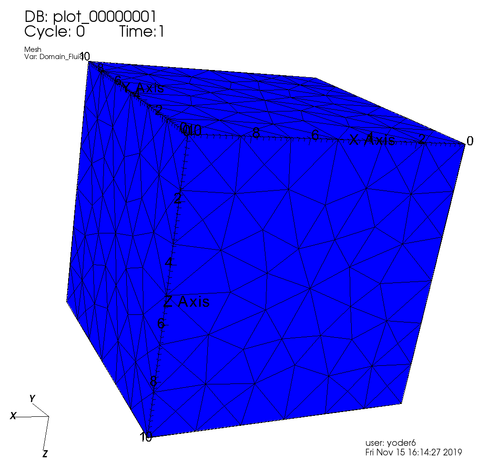

.. _TutorialSinglePhaseFlowExternalMesh:

#########################################
Using an external mesh
#########################################

**Context**

In this tutorial, we use a simple single-phase flow solver (see :ref:`SinglePhaseFlow`)
from GEOSX to solve for pressure propagation on a mesh that we import into GEOSX.
The main goal of this tutorial is to work on importing external meshes,
an important feature to use GEOSX on meshes representing realistic models.

**Objectives**

At the end of this tutorial you will know:

  - the syntax and format of input meshes,
  - how to input external files into a GEOSX input XML file,
  - how to use and visualize hexahedral and tetrahedral meshes.

**Input file**

This tutorial uses external input files. You will need a GEOSX XML file and a mesh file.
The xml input file for this test case is located at:

.. code-block:: console

  src/coreComponents/physicsSolvers/fluidFlow/integratedTests/singlePhaseFlow/3D_10x10x10_compressible.xml

.. _ExternalHexahedral:
.. _2_ImportingExternalMesh:

---------------------------------------------
Externally Generated - hexahedral elements
---------------------------------------------

GEOSX comes with a suite of simple data sets to get you started.
We will explore simple data sets with different geometrical objects.
All meshes will be imported from external files using a tool called **PAMELA** (Parallel Meshing Library) as the importer.
The first flow simulations will be single-phase displacements:

  #. Cube made with externally-specified :ref:`**hexahedral** <ExternalHexahedral>` elements,
  #. Cube made with externally-specified :ref:`**tetrahedral** <ExternalTetrahedral>` elements.

This example consists of a simple sugar-cube stack of size 10x10x10.

Problem description
------------------------

We propagate fluid from one vertical face of a cube to the opposite side.
The displacement is single phase, compressible, subject to gravity forces.
We use GEOSX to compute the pressure inside each grid block.

Looking at the XML file
------------------------

We are going to inspect blocks in the following XML file:
``src\coreComponents\physicsSolvers\integratedTests\singlePhaseFlow\pamela_test\3D_10x10x10_compressible_pamela_hex_gravity.xml``

The file contains a number of XML blocks.
We will describe the most important of them.

External mesh specification
-----------------------------

Now, we specify the source of our mesh.
In this example, the mesh is imported using PAMELA from
an existing file called ``cube_10x10x10_hex.msh``.
This file is a file contain grid information in the
`GMSH <http://gmsh.info>`_
format.

.. literalinclude:: ../../../../coreComponents/physicsSolvers/fluidFlow/integratedTests/singlePhaseFlow/pamela_test/3D_10x10x10_compressible_pamela_hex_gravity.xml
  :language: xml
  :start-after: <!-- SPHINX_TUT_EXT_HEX_MESH -->
  :end-before: <!-- SPHINX_TUT_EXT_HEX_MESH_END -->

The mesh looks like this:

.. image:: HexCube.png
   :width: 250px

Element Regions
-----------------------------

This block defines regions.
Here, the entire field is one region called ``Domain``,
and contains ``water`` and ``rock`` only.

.. literalinclude:: ../../../../coreComponents/physicsSolvers/fluidFlow/integratedTests/singlePhaseFlow/pamela_test/3D_10x10x10_compressible_pamela_hex_gravity.xml
  :language: xml
  :start-after: <!-- SPHINX_TUT_EXT_HEX_ELEM_REGIONS -->
  :end-before: <!-- SPHINX_TUT_EXT_HEX_ELEM_REGIONS_END -->

Running GEOSX
^^^^^^^^^^^^^^^^^^^^^^

The command to run GEOSX is

``path/to/geosx -i path/to/this/xml_file.xml``

Note that all paths for files included in the XML file are relative
to this XML file, not to the GEOSX executable.

When running GEOSX, console messages will provide indications regarding the
status of the simulation.

In our case, the first lines are:

.. code-block:: sh

  GEOS must be configured to use Python to use parameters, symbolic math, etc. in input files
  Adding Solver of type SinglePhaseFlow, named SinglePhaseFlow
  Adding Mesh: PAMELAMeshGenerator, CubeHex
  Adding Geometric Object: Box, all
  Adding Geometric Object: Box, left
  Adding Event: PeriodicEvent, solverApplications
  Adding Event: PeriodicEvent, outputs
  Adding Event: PeriodicEvent, restarts
  Adding Output: Silo, siloWellPump
  Adding Output: Restart, restartOutput
  Adding Object CellElementRegion named Domain from ObjectManager::Catalog.

This indicates initialization of GEOSX.
The mesh preprocessing tool PAMELA is launched next,
with console messages as follows.

  .. code-block:: console
  

    0 >>> **********************************************************************
    0 >>>                          PAMELA Library Import tool
    0 >>> **********************************************************************
    0 >>> GMSH FORMAT IDENTIFIED
    0 >>> *** Importing Gmsh mesh format...
    0 >>> Reading nodes...
    0 >>> Done0
    0 >>> Reading elements...
    0 >>> Number of nodes = 1331
    0 >>> Number of triangles = 0
    0 >>> Number of quadrilaterals = 0
    0 >>> Number of tetrahedra = 0
    0 >>> Number of hexahedra = 1000
    0 >>> Number of pyramids = 0
    0 >>> Number of prisms = 0
    0 >>> *** Done
    0 >>> *** Creating Polygons from Polyhedra...
    0 >>> 3300 polygons have been created
    0 >>> *** Done
    0 >>> *** Perform partitioning...
    0 >>> TRIVIAL partioning...
    0 >>> Ghost elements...
    0 >>> Clean mesh...
    0 >>> *** Done...
    0 >>> Clean Adjacency...
    0 >>> *** Done...
    Writing into the GEOSX mesh data structure
    Running simulation

The console should display initialization messages,
and then step into the simulation with the specified time-step increments.

At the end of your simulation, you should see something like:

.. code-block:: sh

  Time: 99s, dt:1s, Cycle: 99
  Cleaning up events
  Writing out restart file at 3D_10x10x10_compressible_pamela_hex_gravity_restart_000000100/rank_0000000.hdf5

  init time = 0.081181s, run time = 5.4595s

Visualization of results in VisIt
^^^^^^^^^^^^^^^^^^^^^^^^^^^^^^^^^^^^^

All results are written in a format compatible with `VisIt
<https://wci.llnl.gov/simulation/computer-codes/visit/>`_.

.. _ExternalTetrahedral:

------------------------------------------------
Externally Generated - tetrahedral elements
------------------------------------------------

This example consists of a simple stack of tetrahedral elements.

Problem description
-------------------------

We propagate fluid from one vertical face of a cube to the opposite side.
The displacement is single phase, compressible, subject to gravity forces.
We use GEOSX to compute the pressure inside each grid block.

Looking at the XML file
-------------------------

We are going to inspect blocks in the following XML file:
``src\CoreComponents\physicsSolvers\integratedTests\singlePhaseFlow\pamela_test\3D_10x10x10_compressible_pamela_tetra_gravity.xml``

The file contains a number of XML blocks.
We will describe the most important of them.

External mesh specification
-----------------------------

Now, we specify the source of our mesh.
In this example, the mesh is imported using PAMELA from
an existing file called ``cube_10x10x10_hex.msh``.
This file is a file contain grid information in the
`GMSH <http://gmsh.info>`_
format.

.. literalinclude:: ../../../../coreComponents/physicsSolvers/fluidFlow/integratedTests/singlePhaseFlow/pamela_test/3D_10x10x10_compressible_pamela_tetra_gravity.xml
  :language: xml
  :start-after: <!-- SPHINX_TUT_EXT_TETRA_MESH -->
  :end-before: <!-- SPHINX_TUT_EXT_TETRA_MESH_END -->

The mesh looks like this:

Element Regions
-----------------------------

This block defines regions.
Here, the entire field is one region called ``Domain``,
and contains ``water`` and ``rock`` only.

.. literalinclude:: ../../../../coreComponents/physicsSolvers/fluidFlow/integratedTests/singlePhaseFlow/pamela_test/3D_10x10x10_compressible_pamela_tetra_gravity.xml
  :language: xml
  :start-after: <!-- SPHINX_TUT_EXT_TETRA_ELEM_REGIONS -->
  :end-before: <!-- SPHINX_TUT_EXT_TETRA_ELEM_REGIONS_END -->

Running GEOSX
^^^^^^^^^^^^^^^^^^^^^^^^^^^^^^^^^^^^^

The command to run GEOSX is

``path/to/geosx -i path/to/this/xml_file.xml``

Note that all paths for files included in the XML file are relative
to this XML file, not to the GEOSX executable.

When running GEOSX, console messages will provide indications regarding the
status of the simulation.

In our case, the first lines are:

.. code-block:: sh

  GEOS must be configured to use Python to use parameters, symbolic math, etc. in input files
  Adding Solver of type SinglePhaseFlow, named SinglePhaseFlow
  Adding Mesh: PAMELAMeshGenerator, CubeTetra
  Adding Geometric Object: Box, all
  Adding Geometric Object: Box, left
  Adding Event: PeriodicEvent, solverApplications
  Adding Event: PeriodicEvent, outputs
  Adding Event: PeriodicEvent, restarts
  Adding Output: Silo, siloWellPump
  Adding Output: Restart, restartOutput
  Adding Object CellElementRegion named Domain from ObjectManager::Catalog.

Followed by:

.. code-block:: sh

  0 >>> **********************************************************************
  0 >>>                          PAMELA Library Import tool
  0 >>> **********************************************************************
  0 >>> GMSH FORMAT IDENTIFIED
  0 >>> *** Importing Gmsh mesh format...
  0 >>> Reading nodes...
  0 >>> Done0
  0 >>> Reading elements...
  0 >>> Number of nodes = 366
  0 >>> Number of triangles = 624
  0 >>> Number of quadrilaterals = 0
  0 >>> Number of tetrahedra = 1153
  0 >>> Number of hexahedra = 0
  0 >>> Number of pyramids = 0
  0 >>> Number of prisms = 0
  0 >>> *** Done
  0 >>> *** Creating Polygons from Polyhedra...
  0 >>> 1994 polygons have been created
  0 >>> *** Done
  0 >>> *** Perform partitioning...
  0 >>> TRIVIAL partioning...
  0 >>> Ghost elements...
  0 >>> Clean mesh...
  0 >>> *** Done...
  0 >>> Clean Adjacency...
  0 >>> *** Done...
  Writing into the GEOSX mesh data structure

And finally, the simulation is run:

.. code-block:: sh

  Running simulation
  Time: 0s, dt:1s, Cycle: 0
  Time: 1s, dt:1s, Cycle: 1
  Time: 2s, dt:1s, Cycle: 2
  Time: 3s, dt:1s, Cycle: 3
  Time: 4s, dt:1s, Cycle: 4
  Time: 5s, dt:1s, Cycle: 5
  Time: 6s, dt:1s, Cycle: 6
  Time: 7s, dt:1s, Cycle: 7
  Time: 8s, dt:1s, Cycle: 8
  Time: 9s, dt:1s, Cycle: 9
  Time: 10s, dt:1s, Cycle: 10
  ...
  Time: 96s, dt:1s, Cycle: 96
  Time: 97s, dt:1s, Cycle: 97
  Time: 98s, dt:1s, Cycle: 98
  Time: 99s, dt:1s, Cycle: 99
  Cleaning up events
  Writing out restart file at 3D_10x10x10_compressible_pamela_tetra_gravity_restart_000000100/rank_0000000.hdf5

  init time = 0.074377s, run time = 5.4331s

Visualization of results in VisIt
^^^^^^^^^^^^^^^^^^^^^^^^^^^^^^^^^^^^^

.. image:: ExtTetResults.png
  :width: 400px

All results are written in a format compatible with `VisIt
<https://wci.llnl.gov/simulation/computer-codes/visit/>`_.
