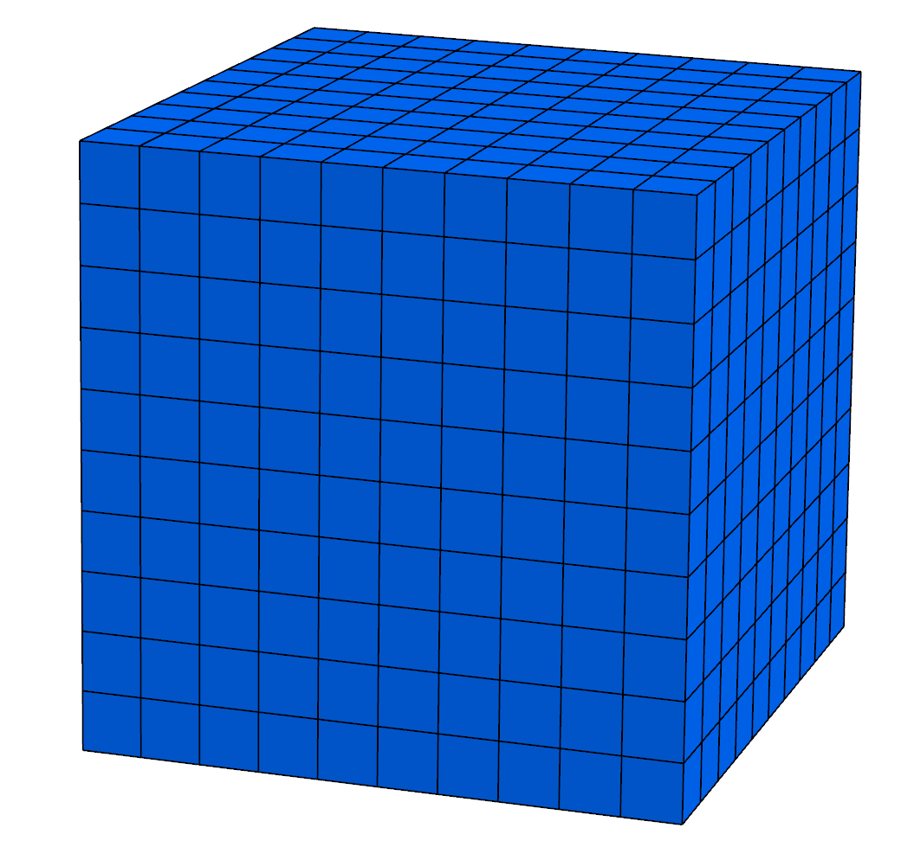

.. _TutorialSinglePhaseFlowExternalMesh:

#########################################
Tutorial 2: Using an external mesh
#########################################

**Context**

In this tutorial, we use a simple single-phase flow solver (see :ref:`SinglePhaseFlow`)
from GEOSX to solve for pressure propagation on a mesh that we import into GEOSX.
The main goal of this tutorial is to work on importing external meshes,
an important feature to use GEOSX on meshes representing realistic models.

**Objectives**

At the end of this tutorial you will know:

  - the syntax and format of input meshes,
  - how to input external files into a GEOSX input XML file,
  - how to use and visualize hexahedral and tetrahedral meshes.

**Input Files**

This tutorial uses an XML file containing the main input for GEOSX
and a separate file with all the mesh information.
As we will see later, the main XML file points to the external
mesh file with an `include` statement.
The XML input file for this test case is located at:

.. code-block:: console

  src/coreComponents/physicsSolvers/fluidFlow/integratedTests/singlePhaseFlow/pamela_test/3D_10x10x10_compressible_pamela_hex_gravity.xml

The mesh file format used in this tutorial is called `MSH
<https://gmsh.info/doc/texinfo/gmsh.html#MSH-file-format>`_.
This format is a standard scientific meshing format not specific to GEOSX.
It is maintained as the native format of the meshing tool Gmsh.
MSH is designed for unstructured meshes and contains a
compact and complete representation of the mesh geometry and of its properties.
The mesh file used here is human-readable ASCII.
It contains a list of nodes with their (x,y,z) coordinates,
and a list of elements that are constructed from these nodes.

.. _ExternalHexahedral:
.. _2_ImportingExternalMesh:

---------------------------------------------
Hexahedral elements
---------------------------------------------

In the first part of the tutorial, we will run flow simulations
on a mesh made of hexahedral elements. These types of elements
are used in classical cartesian grids (sugar cubes)
or corner-point grids or pillar grids.

Brief discussion about hexahedral meshes in GEOSX
------------------------------------------------------------------------

Although closely related, the hexahedral grids that GEOSX
can process are slightly different
than either structured grid or corner-point grids.
The differences are worth pointing out here. In GEOSX:

 - **hexahedra can have irregular shapes**: no pillars are needed and
   vertices can be anywhere in space. This is useful for grids that turn, fold,
   or are heavily bent. Hexahedral blocks should nevertheless not be deprecated
   and have 8 distinct vertices.
   Some tolerance exists for deprecation to wedges or prisms
   in some solvers (finite element solvers), but it is best to avoid such situations
   and label elements according to their actual shape.
   Butterfly cells, flat cells, negative or zero volume cells will cause problems.
 - **the mesh needs to be conformal:** in 3D, this means that neighboring
   grid blocks have to share exactly a complete face. Note that corner-point
   grids do not have this requirement and their blocks can be shifted. When importing grids
   from usual geomodeling packages, this is an important consideration. This
   problem is solved by splitting shifted grid blocks to restore conformity.
   The advantages
   of conformal grids used here are worth the trouble: by using conformal grids
   we can run finite elements and finite volume simulations on the same mesh
   without problems (a key to multiphysics simulation).
 - **there is no assumption of overall structure**: GEOSX does not need to know
   a number of block in the X, Y, Z direction and does not assume that the
   mesh is a full cartesian domain where the reservoir must be carved out from.
   Blocks are numbered by indices that assume
   nothing about spatial positioning and there is no concept of (i,j,k).
   This approach also implies that
   no logical "masks" are needed to remove inactive or dead cells, as often done
   in cartesian grids to get the actual reservoir contours from a bounding box,
   and here we only need to specify grid blocks that are active.

Problem description
------------------------

In this first part of the tutorial, we use a hexahedral mesh provided with GEOSX.
This hexahedral mesh is strictly identical to the grid used in the first tutorial (:ref:`TutorialSinglePhaseFlowWithInternalMesh`), but instead of using
the internal grid generator GEOSX, we specify it with spatial node coordinates in MSH format.

The process by which grids are imported into GEOSX is worth explaining.
To import external grid into GEOSX, we use an external component (submodule) called **PAMELA**.
PAMELA (Parallel Meshing Library) was developed as a stand-alone utility to import grids
in multiple formats and write them into memory for GEOSX to consume.
Although PAMELA is not necessary to run GEOSX (the internal grid
generator of GEOSX has plenty of interesting features), you do need
PAMELA if you want to import external grids and not be limited by the internal grid generator.

So here, our mesh consists of a simple sugar-cube stack of size 10x10x10.
We inject fluid from one vertical face of a cube, and produce it from the opposite side.
The displacement is single phase, compressible, subject to gravity forces.
We use GEOSX to compute the pressure inside each grid block.

Looking at the XML file
------------------------

We are going to inspect blocks in the following XML file:
``src/coreComponents/physicsSolvers/integratedTests/singlePhaseFlow/pamela_test/3D_10x10x10_compressible_pamela_hex_gravity.xml``

The file contains a number of XML blocks.
We will describe the most important of them.

External mesh specification
-----------------------------

Now, we specify the source of our mesh.
In this example, the mesh is imported using PAMELA from
an existing file called ``cube_10x10x10_hex.msh``.
This file is a file contain grid information in the
`GMSH <http://gmsh.info>`_
format.

.. literalinclude:: ../../../../coreComponents/physicsSolvers/fluidFlow/integratedTests/singlePhaseFlow/pamela_test/3D_10x10x10_compressible_pamela_hex_gravity.xml
  :language: xml
  :start-after: <!-- SPHINX_TUT_EXT_HEX_MESH -->
  :end-before: <!-- SPHINX_TUT_EXT_HEX_MESH_END -->

The mesh looks like this:

Element Regions
-----------------------------

This block defines regions.
Here, the entire field is one region called ``Domain``,
and contains ``water`` and ``rock`` only.

.. literalinclude:: ../../../../coreComponents/physicsSolvers/fluidFlow/integratedTests/singlePhaseFlow/pamela_test/3D_10x10x10_compressible_pamela_hex_gravity.xml
  :language: xml
  :start-after: <!-- SPHINX_TUT_EXT_HEX_ELEM_REGIONS -->
  :end-before: <!-- SPHINX_TUT_EXT_HEX_ELEM_REGIONS_END -->

Running GEOSX
^^^^^^^^^^^^^^^^^^^^^^

The command to run GEOSX is

``path/to/geosx -i path/to/this/xml_file.xml``

Note that all paths for files included in the XML file are relative
to this XML file, not to the GEOSX executable.

When running GEOSX, console messages will provide indications regarding the
status of the simulation.

In our case, the first lines are:

.. code-block:: sh

  GEOS must be configured to use Python to use parameters, symbolic math, etc. in input files
  Adding Solver of type SinglePhaseFlow, named SinglePhaseFlow
  Adding Mesh: PAMELAMeshGenerator, CubeHex
  Adding Geometric Object: Box, all
  Adding Geometric Object: Box, left
  Adding Event: PeriodicEvent, solverApplications
  Adding Event: PeriodicEvent, outputs
  Adding Event: PeriodicEvent, restarts
  Adding Output: Silo, siloWellPump
  Adding Output: Restart, restartOutput
  Adding Object CellElementRegion named Domain from ObjectManager::Catalog.

This indicates initialization of GEOSX.
The mesh preprocessing tool PAMELA is launched next,
with console messages as follows.

  .. code-block:: console
  

    0 >>> **********************************************************************
    0 >>>                          PAMELA Library Import tool
    0 >>> **********************************************************************
    0 >>> GMSH FORMAT IDENTIFIED
    0 >>> *** Importing Gmsh mesh format...
    0 >>> Reading nodes...
    0 >>> Done0
    0 >>> Reading elements...
    0 >>> Number of nodes = 1331
    0 >>> Number of triangles = 0
    0 >>> Number of quadrilaterals = 0
    0 >>> Number of tetrahedra = 0
    0 >>> Number of hexahedra = 1000
    0 >>> Number of pyramids = 0
    0 >>> Number of prisms = 0
    0 >>> *** Done
    0 >>> *** Creating Polygons from Polyhedra...
    0 >>> 3300 polygons have been created
    0 >>> *** Done
    0 >>> *** Perform partitioning...
    0 >>> TRIVIAL partioning...
    0 >>> Ghost elements...
    0 >>> Clean mesh...
    0 >>> *** Done...
    0 >>> Clean Adjacency...
    0 >>> *** Done...
    Writing into the GEOSX mesh data structure
    Running simulation

The console should display initialization messages,
and then step into the simulation with the specified time-step increments.

At the end of your simulation, you should see something like:

.. code-block:: sh

  Time: 99s, dt:1s, Cycle: 99
  Cleaning up events
  Writing out restart file at 3D_10x10x10_compressible_pamela_hex_gravity_restart_000000100/rank_0000000.hdf5

  init time = 0.081181s, run time = 5.4595s

Visualization of results in VisIt
^^^^^^^^^^^^^^^^^^^^^^^^^^^^^^^^^^^^^

.. image:: ExtHexResults.png
    :width: 400px

All results are written in a format compatible with `VisIt
<https://wci.llnl.gov/simulation/computer-codes/visit/>`_.

.. _ExternalTetrahedral:

------------------------------------------------
Externally Generated - tetrahedral elements
------------------------------------------------

In the second part of the tutorial, we use the same domain but this time discretized
into tetrahedral elements. Tetrahedral meshes are not common in geomodeling (yet!)
and thus are less prone to legacy format assumptions. In GEOSX, these meshes also needs to be conformal.

Problem description
-------------------------

We propagate fluid from one vertical face of a cube to the opposite side.
The displacement is single phase, compressible, subject to gravity forces.
We use GEOSX to compute the pressure inside each grid block.

Looking at the XML file
-------------------------

We are going to inspect blocks in the following XML file:
``src\CoreComponents\physicsSolvers\integratedTests\singlePhaseFlow\pamela_test\3D_10x10x10_compressible_pamela_tetra_gravity.xml``

The file contains a number of XML blocks.
We will describe the most important of them.

External mesh specification
-----------------------------

Now, we specify the source of our mesh.
In this example, the mesh is imported using PAMELA from
an existing file called ``cube_10x10x10_hex.msh``.
This file is a file contain grid information in the
`GMSH <http://gmsh.info>`_
format.

.. literalinclude:: ../../../../coreComponents/physicsSolvers/fluidFlow/integratedTests/singlePhaseFlow/pamela_test/3D_10x10x10_compressible_pamela_tetra_gravity.xml
  :language: xml
  :start-after: <!-- SPHINX_TUT_EXT_TETRA_MESH -->
  :end-before: <!-- SPHINX_TUT_EXT_TETRA_MESH_END -->

The mesh looks like this:

.. image:: TetCube.png
  :width: 250px

Element Regions
-----------------------------

This block defines regions.
Here, the entire field is one region called ``Domain``,
and contains ``water`` and ``rock`` only.

.. literalinclude:: ../../../../coreComponents/physicsSolvers/fluidFlow/integratedTests/singlePhaseFlow/pamela_test/3D_10x10x10_compressible_pamela_tetra_gravity.xml
  :language: xml
  :start-after: <!-- SPHINX_TUT_EXT_TETRA_ELEM_REGIONS -->
  :end-before: <!-- SPHINX_TUT_EXT_TETRA_ELEM_REGIONS_END -->

Running GEOSX
^^^^^^^^^^^^^^^^^^^^^^^^^^^^^^^^^^^^^

The command to run GEOSX is

``path/to/geosx -i path/to/this/xml_file.xml``

Note that all paths for files included in the XML file are relative
to this XML file, not to the GEOSX executable.

When running GEOSX, console messages will provide indications regarding the
status of the simulation.

In our case, the first lines are:

.. code-block:: sh

  GEOS must be configured to use Python to use parameters, symbolic math, etc. in input files
  Adding Solver of type SinglePhaseFlow, named SinglePhaseFlow
  Adding Mesh: PAMELAMeshGenerator, CubeTetra
  Adding Geometric Object: Box, all
  Adding Geometric Object: Box, left
  Adding Event: PeriodicEvent, solverApplications
  Adding Event: PeriodicEvent, outputs
  Adding Event: PeriodicEvent, restarts
  Adding Output: Silo, siloWellPump
  Adding Output: Restart, restartOutput
  Adding Object CellElementRegion named Domain from ObjectManager::Catalog.

Followed by:

.. code-block:: sh

  0 >>> **********************************************************************
  0 >>>                          PAMELA Library Import tool
  0 >>> **********************************************************************
  0 >>> GMSH FORMAT IDENTIFIED
  0 >>> *** Importing Gmsh mesh format...
  0 >>> Reading nodes...
  0 >>> Done0
  0 >>> Reading elements...
  0 >>> Number of nodes = 366
  0 >>> Number of triangles = 624
  0 >>> Number of quadrilaterals = 0
  0 >>> Number of tetrahedra = 1153
  0 >>> Number of hexahedra = 0
  0 >>> Number of pyramids = 0
  0 >>> Number of prisms = 0
  0 >>> *** Done
  0 >>> *** Creating Polygons from Polyhedra...
  0 >>> 1994 polygons have been created
  0 >>> *** Done
  0 >>> *** Perform partitioning...
  0 >>> TRIVIAL partioning...
  0 >>> Ghost elements...
  0 >>> Clean mesh...
  0 >>> *** Done...
  0 >>> Clean Adjacency...
  0 >>> *** Done...
  Writing into the GEOSX mesh data structure

And finally, the simulation is run:

.. code-block:: sh

  Running simulation
  Time: 0s, dt:1s, Cycle: 0
  Time: 1s, dt:1s, Cycle: 1
  Time: 2s, dt:1s, Cycle: 2
  Time: 3s, dt:1s, Cycle: 3
  Time: 4s, dt:1s, Cycle: 4
  Time: 5s, dt:1s, Cycle: 5
  Time: 6s, dt:1s, Cycle: 6
  Time: 7s, dt:1s, Cycle: 7
  Time: 8s, dt:1s, Cycle: 8
  Time: 9s, dt:1s, Cycle: 9
  Time: 10s, dt:1s, Cycle: 10
  ...
  Time: 96s, dt:1s, Cycle: 96
  Time: 97s, dt:1s, Cycle: 97
  Time: 98s, dt:1s, Cycle: 98
  Time: 99s, dt:1s, Cycle: 99
  Cleaning up events
  Writing out restart file at 3D_10x10x10_compressible_pamela_tetra_gravity_restart_000000100/rank_0000000.hdf5

  init time = 0.074377s, run time = 5.4331s

Visualization of results in VisIt
^^^^^^^^^^^^^^^^^^^^^^^^^^^^^^^^^^^^^

All results are written in a format compatible with `VisIt
<https://wci.llnl.gov/simulation/computer-codes/visit/>`_.
