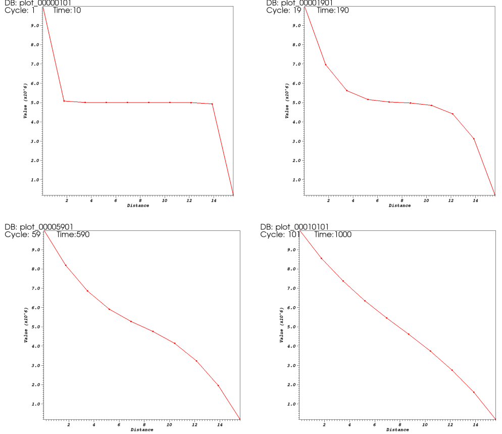

.. _TutorialSinglePhaseFlowWithInternalMesh:

.. role:: verbatim(code)
   :language: bash
   
#####################################################
First steps with GEOSX: the single-phase flow solver
#####################################################

**Context**

In this tutorial, we use a single-phase flow solver (see :ref:`SinglePhaseFlow`)
from GEOSX to solve for pressure propagation on a simple discretized 10x10x10 cube mesh.
A pressure source term will be set in the top-right corner block of the cube,
and a sink pressure term will be set in the bottom-left corner block.

**Objectives**

At the end of this tutorial you will know:

  - the structure of the XML input files used by GEOSX,
  - how to run GEOSX on a simple case requiring no external input files,
  - the basic syntax of a solver block for single-phase problems,
  - how to export and visualize results.

**Input file**

This tutorial uses no external input files and everything required is contained within the GEOSX input file.
The xml input file for this test case is located at:

.. code-block:: console

  src/coreComponents/physicsSolvers/fluidFlow/integratedTests/singlePhaseFlow/3D_10x10x10_compressible.xml

------------------------------------
GEOSX input files
------------------------------------

GEOSX runs by reading user input information from one or multiple XML files.
For instance, if everything we need to run is contained in a file called :verbatim:`my_input.xml`,
GEOSX runs this file by executing:

.. code-block:: console

  /your/path/to/GEOSX -i my_input.xml
  
The :verbatim:`-i` flag indicates the path to the XML input file.

XML files store information in a tree-like structure using nested blocks of information called *elements*.
In GEOSX, the root of the tree structure is an element called *Problem* (it defines the problem we wish to solve).
All elements in an XML file have names (commonly called *tags*) and properties (commonly called *attributes*).
A typical GEOSX input file contains the following XML tags:

 #. :ref:`Solver <Solver_tag_singlephaseinternal>`
 #. :ref:`Mesh <Mesh_tag_singlephaseinternal>`
 #. :ref:`Geometry <Geometry_tag_singlephaseinternal>`
 #. :ref:`Events <Events_tag_singlephaseinternal>`
 #. :ref:`NumericalMethods <NumericalMethods_tag_singlephaseinternal>`
 #. :ref:`ElementRegions <ElementRegions_tag_singlephaseinternal>`
 #. :ref:`Constitutive <Constitutive_tag_singlephaseinternal>`
 #. :ref:`FieldSpecifications <FieldSpecifications_tag_singlephaseinternal>`
 #. :ref:`Functions and Partition <Functions_tag_singlephaseinternal>`
 #. :ref:`Outputs <Outputs_tag_singlephaseinternal>`

In addition to the data required to solve the problem we wish to address,
it is a best practice to start an XML files with a convention (called a *schema*)
to specify the types of writing conventions used in the XML file.

.. literalinclude:: ../../../../coreComponents/physicsSolvers/fluidFlow/integratedTests/singlePhaseFlow/3D_10x10x10_compressible.xml
  :language: xml
  :start-after: <!-- SPHINX_TUT_INT_HEX_PROBLEM_OPEN -->
  :end-before: <!-- SPHINX_TUT_INT_HEX_PROBLEM_OPEN_END -->

The attributes ``xmlns:xsi`` and ``xsi:noNamespaceSchemaLocation`` are used to define the file format and schema.
While optional, they may be used to configure various xml validation tools.

.. _Solver_tag_singlephaseinternal:

Solvers tag
------------

The Solvers tag defines the particular physics solver we will use.
Here, we will use a standard Two-Point Flux Approximation (TPFA) finite volume scheme.
This is done using ``singlePhaseTPFA`` value for the discretization node.

.. literalinclude:: ../../../../coreComponents/physicsSolvers/fluidFlow/integratedTests/singlePhaseFlow/3D_10x10x10_compressible.xml
  :language: xml
  :start-after: <!-- SPHINX_TUT_INT_HEX_SOLVERS -->
  :end-before: <!-- SPHINX_TUT_INT_HEX_SOLVERS_END -->

.. _Mesh_tag_singlephaseinternal:

Mesh tag
-------------
GEOSX  allows you to either internally build your mesh or import it from a compatible format thanks to PAMELA (see :ref:`ImportingExternalMesh`).
For this test case, we will use an internally generated 10x10x10 uniform regular mesh

.. literalinclude:: ../../../../coreComponents/physicsSolvers/fluidFlow/integratedTests/singlePhaseFlow/3D_10x10x10_compressible.xml
  :language: xml
  :start-after: <!-- SPHINX_TUT_INT_HEX_MESH -->
  :end-before: <!-- SPHINX_TUT_INT_HEX_MESH_END -->

.. _Geometry_tag_singlephaseinternal:

Geometry tag
-----------------
On the Geometry side, we will define and name our boxes for source and sink pressure terms.

.. literalinclude:: ../../../../coreComponents/physicsSolvers/fluidFlow/integratedTests/singlePhaseFlow/3D_10x10x10_compressible.xml
  :language: xml
  :start-after: <!-- SPHINX_TUT_INT_HEX_GEOMETRY -->
  :end-before: <!-- SPHINX_TUT_INT_HEX_GEOMETRY_END -->

One could also define surfaces on which to specified a Dirichlet boundary condition.

.. _Events_tag_singlephaseinternal:

Events tag
---------------
The Event tag includes the final time of our simulation under ``maxTime`` node. Under *PeriodicEvent* embededd tags, we can set:

 #. which solver has to be called (among the child tag defined under the above mentinoned *Solver* tag) with its initial time step defined as the ``forceDt`` node value.
 #. under which ``timeFrequency`` will we need to output results (targeting the settings defined under some child tag of the below explained *Output* tag).

.. literalinclude:: ../../../../coreComponents/physicsSolvers/fluidFlow/integratedTests/singlePhaseFlow/3D_10x10x10_compressible.xml
  :language: xml
  :start-after: <!-- SPHINX_TUT_INT_HEX_EVENTS -->
  :end-before: <!-- SPHINX_TUT_INT_HEX_EVENTS_END -->

.. _NumericalMethods_tag_singlephaseinternal:

NumericalMethods tag
------------------------

The two-point flux approximation, which was first introduced under the *Solver>SinglePhaseFlow* child tag as the value of ``discretization`` node, is defined here.

.. literalinclude:: ../../../../coreComponents/physicsSolvers/fluidFlow/integratedTests/singlePhaseFlow/3D_10x10x10_compressible.xml
  :language: xml
  :start-after: <!-- SPHINX_TUT_INT_HEX_NUM_METHODS -->
  :end-before: <!-- SPHINX_TUT_INT_HEX_NUM_METHODS_END -->

Here the ``boundaryFieldName`` node specifies that for Dirichlet boundary conditions the face located value is considered. The ``coefficientName`` node refers to the field which has to be considered in the stencil computation.

.. _ElementRegions_tag_singlephaseinternal:

Element Regions tag
---------------------

This block defines regions.
Here, the entire field is one region called ``Domain``,
and contains ``water`` and ``rock`` only.

.. literalinclude:: ../../../../coreComponents/physicsSolvers/fluidFlow/integratedTests/singlePhaseFlow/3D_10x10x10_compressible.xml
  :language: xml
  :start-after: <!-- SPHINX_TUT_INT_HEX_ELEM_REGIONS -->
  :end-before: <!-- SPHINX_TUT_INT_HEX_ELEM_REGIONS_END -->

.. _Constitutive_tag_singlephaseinternal:

Constitutive tag
---------------------

The physical properties of ``water`` and ``rock`` elements can be found and set under this tag.

.. literalinclude:: ../../../../coreComponents/physicsSolvers/fluidFlow/integratedTests/singlePhaseFlow/3D_10x10x10_compressible.xml
  :language: xml
  :start-after: <!-- SPHINX_TUT_INT_HEX_CONSTITUTIVE -->
  :end-before: <!-- SPHINX_TUT_INT_HEX_CONSTITUTIVE_END -->

.. _FieldSpecifications_tag_singlephaseinternal:

FieldSpecifications tag
---------------------------
Here, fields such as porosity, permeability, source and sink terms or initial field values are specified. Our test case exhibits an anisotropic homogeneous permeability which components are so that:
  - permeability in the x-direction: ``permx``, constant value of 1.0e-12 m\ :sup:`2` (100 mD), and is considered the 0\ :sup:`th` component of the ``permeability`` vector,
  - permeability in the y-direction: ``permy``, constant value of 1.0e-12 m\ :sup:`2` (100 mD),
  - a lower permeability in the z-direction: ``permz``, constant value of 1.0e-15 m\ :sup:`2` (10 mD)

The ``setNames`` node value specifies the geometric zone where the value should be applied.
These directional permeabilities are followed by all the other field initializations. Please note the change in ``component`` node value as we are dealing with a permeability diagonal tensor.
The other fields to be specified are a constant homogenious reference porosity for the whole domain, initial pressure, and source and sink term pressures.

.. literalinclude:: ../../../../coreComponents/physicsSolvers/fluidFlow/integratedTests/singlePhaseFlow/3D_10x10x10_compressible.xml
  :language: xml
  :start-after: <!-- SPHINX_TUT_INT_HEX_FIELDS -->
  :end-before: <!-- SPHINX_TUT_INT_HEX_FIELDS_END -->

.. _Functions_tag_singlephaseinternal:

Here we leave ``Functions`` and ``Partition`` tags unspecified as the description of their use are detailed in other tutorials.

.. literalinclude:: ../../../../coreComponents/physicsSolvers/fluidFlow/integratedTests/singlePhaseFlow/3D_10x10x10_compressible.xml
  :language: xml
  :start-after: <!-- SPHINX_TUT_INT_HEX_BLANKS -->
  :end-before: <!-- SPHINX_TUT_INT_HEX_BLANKS_END -->

.. _Outputs_tag_singlephaseinternal:

Outputs tag
----------------
In order to get the results from simulation written to file, we specify the output path:

.. literalinclude:: ../../../../coreComponents/physicsSolvers/fluidFlow/integratedTests/singlePhaseFlow/3D_10x10x10_compressible.xml
  :language: xml
  :start-after: <!-- SPHINX_TUT_INT_HEX_OUTPUTS -->
  :end-before: <!-- SPHINX_TUT_INT_HEX_OUTPUTS_END -->

And this concludes our XML file:

.. literalinclude:: ../../../../coreComponents/physicsSolvers/fluidFlow/integratedTests/singlePhaseFlow/3D_10x10x10_compressible.xml
  :language: xml
  :start-after: <!-- SPHINX_TUT_INT_HEX_PROBLEM_CLOSE -->
  :end-before: <!-- SPHINX_TUT_INT_HEX_PROBLEM_CLOSE_END -->

------------------------------------
Runnning GEOSX
------------------------------------

The command to run GEOSX is

``path/to/geosx -i path/to/this/xml_file.xml``

Note that all paths for files included in the XML file are relative to this XML file. While running GEOSX, it will log status info in the console output.

For internal mesh generation,

.. code-block:: sh

  GEOS must be configured to use Python to use parameters, symbolic math, etc. in input files
  Adding Solver of type SinglePhaseFlow, named SinglePhaseFlow
  Adding Mesh: InternalMesh, mesh1
  Adding Geometric Object: Box, source
  Adding Geometric Object: Box, sink
  Adding Event: PeriodicEvent, solverApplications
  Adding Event: PeriodicEvent, outputs
  Adding Output: Silo, siloOutput
  Adding Object CellElementRegion named Region2 from ObjectManager::Catalog.

The time iteration are then logged until the end of the simulation

.. code-block:: sh

  Running simulation
  Time: 0s, dt:20s, Cycle: 0
  Attempt: 0, Newton: 0, R = 5.6703
  Attempt: 0, Newton: 1, R = 0.000207606
  Attempt: 0, Newton: 2, R = 9.87966e-11
  Time: 20s, dt:20s, Cycle: 1
  Attempt: 0, Newton: 0, R = 0.0680544
  Attempt: 0, Newton: 1, R = 5.30163e-05
  Attempt: 0, Newton: 2, R = 5.0784e-12
  Time: 4960s, dt:20s, Cycle: 248
  Attempt: 0, Newton: 0, R = 9.33817e-07
  Time: 4980s, dt:20s, Cycle: 249
  Attempt: 0, Newton: 0, R = 9.33817e-07
  Cleaning up events

  init time = 0.043643s, run time = 4.0304s

------------------------------------
Visualization of results
------------------------------------

All results are written in a format compatible with `VisIt
<https://wci.llnl.gov/simulation/computer-codes/visit/>`_.

For instance, here are reported diagonal pressure profile from sink to source blocks with the time being increased (on the left) and the 3D plot of the transient pressure gradient to the linear solution (on the right)

.. image:: IntHexMovie.mpg
   :width: 500px

All results are written in a format compatible with `VisIt
<https://wci.llnl.gov/simulation/computer-codes/visit/>`_.

For more details on the single-phase flow solvers, please see :ref:`SinglePhaseFlow`.
