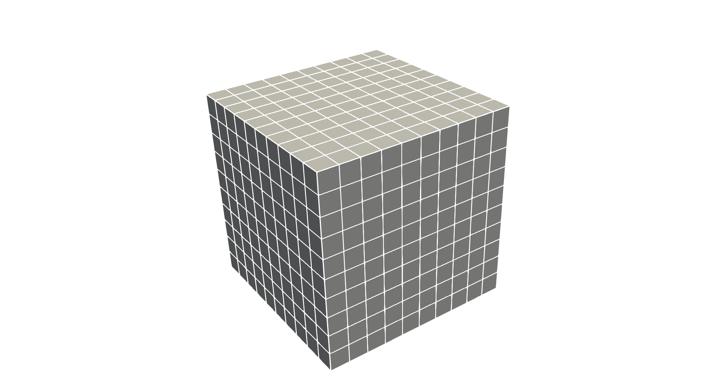
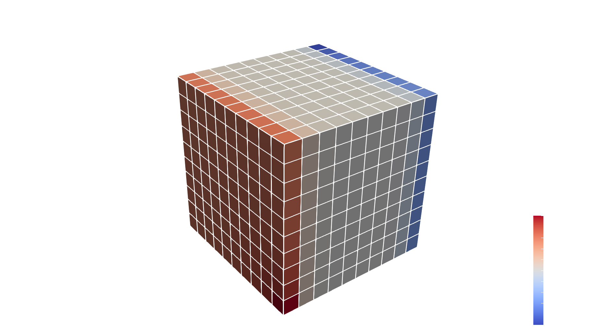
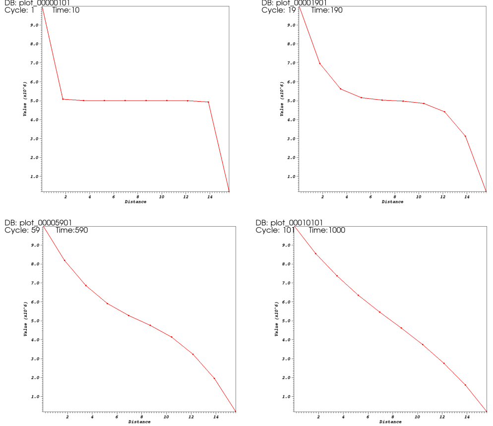
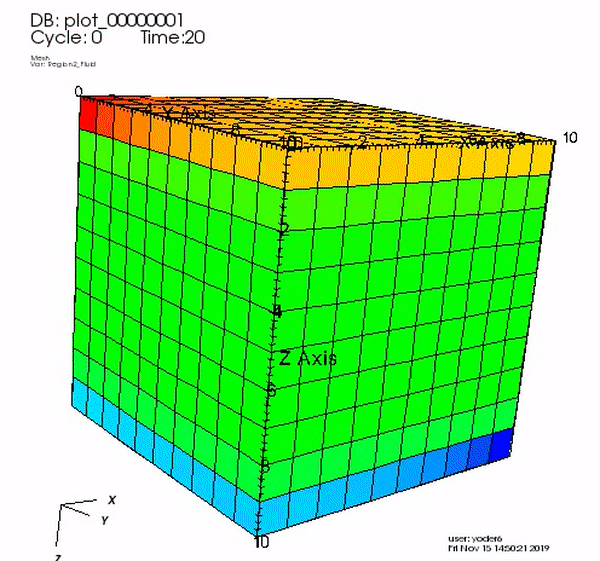

.. _TutorialSinglePhaseFlowWithInternalMesh:

#####################################################
First Steps 
#####################################################

**Context**

In this tutorial, we use a single-phase flow solver (see :ref:`SinglePhaseFlow`)
from GEOSX to solve for pressure propagation on a simple 10x10x10 cube mesh
with an anisotropic permeability.
A pressure source term will be set in one corner of the cube, and
a pressure sink term will be set in the opposite corner of the cube.

**Objectives**

At the end of this tutorial you will know:

  - the basic structure of XML input files used by GEOSX,
  - how to run GEOSX on a simple case requiring no external input files,
  - the basic syntax of a solver block for single-phase problems,
  - how to control output and visualize results.

**Input file**

This tutorial uses no external input files and everything required is
contained within a single GEOSX input file.
The xml input file for this test case is located at:

.. code-block:: console

  src/coreComponents/physicsSolvers/fluidFlow/integratedTests/singlePhaseFlow/3D_10x10x10_compressible.xml

**Validation tools**

If you have not already done so, please use or enable an xml validation tool (see **User Guide/Input Files/Input Validation**).
This will help you identify common issues that may occur when working with input file.

GEOSX runs by reading user input information from one or more XML files.
For instance, if everything we need to run is contained in a file called ``my_input.xml``,
GEOSX runs this file by executing:

.. code-block:: console

  /path/to/GEOSX -i /path/to/my_input.xml
  
The ``-i`` flag indicates the path to the XML input file.

XML files store information in a tree-like structure using nested blocks of information called *elements*.
In GEOSX, the root of this tree structure is an element called *Problem*. It defines the problem we wish to solve.
All elements in an XML file have names (commonly called *tags*) and properties (commonly called *attributes*).
A typical GEOSX input file contains the following XML tags:

 #. :ref:`Solver <Solver_tag_single_phase_internal_mesh>`
 #. :ref:`Mesh <Mesh_tag_single_phase_internal_mesh>`
 #. :ref:`Geometry <Geometry_tag_single_phase_internal_mesh>`
 #. :ref:`Events <Events_tag_single_phase_internal_mesh>`
 #. :ref:`NumericalMethods <NumericalMethods_tag_single_phase_internal_mesh>`
 #. :ref:`ElementRegions <ElementRegions_tag_single_phase_internal_mesh>`
 #. :ref:`Constitutive <Constitutive_tag_single_phase_internal_mesh>`
 #. :ref:`FieldSpecifications <FieldSpecifications_tag_single_phase_internal_mesh>`
 #. :ref:`Outputs <Outputs_tag_single_phase_internal_mesh>`

.. _Solver_tag_single_phase_internal_mesh:

-------------------
Single-phase solver 
-------------------

GEOSX is a multi-physics tool. To find the solution to different physical problems
(diffusion, deformation, etc.), GEOSX uses one or more physics solvers.
The XML **Solvers** tag is used to list and parameterize these solvers.
Note that different combinations of solvers can be applied
in different regions of the mesh at different moments of the simulation.

Here, to keep things simple, we use one type of solver in the entire domain and
for the entire duration of the simulation.
The solver we are specifying here is a single-phase flow solver.
In GEOSX, such a solver is identified by a **SinglePhaseFVM** element (part of a family of cell-centered single-phase finite volume methods).

The XML block used to define this single-phase finite volume solver is shown here:

.. literalinclude:: ../../../../coreComponents/physicsSolvers/fluidFlow/integratedTests/singlePhaseFlow/3D_10x10x10_compressible.xml
  :language: xml
  :start-after: <!-- SPHINX_TUT_INT_HEX_SOLVERS -->
  :end-before: <!-- SPHINX_TUT_INT_HEX_SOLVERS_END -->

Each type of solver has a specific set of parameters that are required and
some parameters that are optional. Optional values are usually set with sensible default values.

To start, we see that our solver is registered with a user-chosen name
(here ``SinglePhaseFlow``, but it could be anything).
This is a common practice in GEOSX: users need to give names to objects they define.
From now on, this unique name will be used as the *handle* to this specific flow solver instance.
This handle will also be used inside the code
to point to this specific instance of a SinglePhaseFVM solver.

Then, we set a solver-specific level of console logging (``logLevel`` set to 1 here).
Higher values will lead to more console output and/or intermediate results saved to files.
When debugging, higher verbosity is useful, while in production runs you may want to suppress
most of the output.

For solvers of the ``SinglePhaseFVM`` family, we must specify a discretization scheme.
Here, we use a Two-Point Flux Approximation (TPFA) finite volume discretization scheme, a typical discretization scheme
used in finite volume methods.

We have also specified a collection of fluids, rocks, and
target regions of the mesh on which this solver will be applied (``mainRegion``).
Curly brackets are used in GEOSX inputs to indicate collections of values (sets or lists).
The curly brackets used here are necessary, even if the collection contains a single value.

Finally, note that other XML elements can be nested inside the ``Solvers`` element.
Here, we use specific XML elements to set values for numerical tolerances
(the solver has converged when numerical residuals are smaller than these tolerances)
and for the maximum number of iterations allowed to reach convergence.

.. _Mesh_tag_single_phase_internal_mesh:

------
Mesh
------

We need to define a mesh (or grid) to perform numerical calculations on.
The **Mesh** element allows users to specify this grid.

There are two approaches to specifying meshes in GEOSX: internal or external.
The external approach consists of importing mesh files created outside of GEOSX, such as a
corner-point grids or generic unstructured grids.
This external approach is generally used when using real data and
geological models with complex shapes and structures.

The internal approach uses a simple internal mesh generator.
The internal mesh generator creates geometric grids directly inside GEOSX
from a small number of parameters. It does not require any external file information.
The geometric complexity available is obviously limited, but many practical problems
can be solved on relatively simple grids.

In this tutorial, to keep things self-contained,
we use the internal mesh generator. We parameterize it with the **InternalMesh** element.

.. literalinclude:: ../../../../coreComponents/physicsSolvers/fluidFlow/integratedTests/singlePhaseFlow/3D_10x10x10_compressible.xml
  :language: xml
  :start-after: <!-- SPHINX_TUT_INT_HEX_MESH -->
  :end-before: <!-- SPHINX_TUT_INT_HEX_MESH_END -->

We create a mesh registered as ``mesh1``.
Just like for solvers, this registration name is chosen by the user.

Then, we specify the collection of elements *types* that this mesh contains.
Tetrahedra, hexahedra, wedges, prisms are examples of element types.
If a mesh contains different types of elements (a hybrid mesh),
we should indicate this here by listing all unique types of elements in curly brackets.
Keeping things simple, our element collection has only one type of element: a ``C3D8`` type.
This nomenclature is taken from the finite
element community. It represents a hexahedral element.

Last, we specify the spatial arrangement of the mesh elements.
The mesh defined here goes from coordinate x=0 to x=10 in the x-direction, with ``nx=10`` subdivisions along this segment.
The same is true for the y-dimension and the z-dimension.
We therefore have a cube of 10x10x10 elements with a bounding box defined by corner coordinates (0,0,0) and (10,10,10).

.. _Geometry_tag_single_phase_internal_mesh:

---------
Geometry 
---------

The **Geometry** tag is useful to define specific parts of a mesh and assign properties to them.
Here, for instance, we use two **Box** elements to specify where our source and sink pressure terms are located.
We want the source to be the element in the x=0, y=0, z=0 corner of the domain, and the sink to be the element in the opposite corner.
Later in the file, we will assign a high pressure to the source box, and a low pressure to the sink box.

Note that for an element to be considered **inside** a geometric region, it needs to have all its vertices inside the region.
This explains why we need to extend the geometry limits to 0.01 beyond the coordinates of the elements, to be sure to catch all vertices.

.. literalinclude:: ../../../../coreComponents/physicsSolvers/fluidFlow/integratedTests/singlePhaseFlow/3D_10x10x10_compressible.xml
  :language: xml
  :start-after: <!-- SPHINX_TUT_INT_HEX_GEOMETRY -->
  :end-before: <!-- SPHINX_TUT_INT_HEX_GEOMETRY_END -->

There are several methods to achieve similar conditions (Dirichlet boundary condition on faces, etc.).
The **Box** defined here is one of the simplest approaches.
Just like meshes and solvers, boxes are named objects and will be registered and used using their handle (``source`` and ``sink``).
We can refer to their handle later in the input file when assigning property values to them.

.. _Events_tag_single_phase_internal_mesh:

--------
Events
--------

In GEOSX, we call **Events** anything that happens at a set time, or a set frequency (**PeriodicEvents**).
Events are a central element in GEOSX,
and a dedicated section just for events is necessary to give them the treatment they deserve.

For now, we focus on three simple events: the time at which we wish the simulation to end (``maxTime``),
the times at which we want the solver to perform updates,
and the times we wish to have simulation output values reported.

In GEOSX, all times are specified in **seconds**, so here ``maxTime=5000.0`` means that the simulation will run from time 0 to time 5,000 seconds.

If we focus on the two periodic events, we see :

 #. A periodic solver application: this event is registered here as ``solverApplications`` (user-defined name). With the attribute ``forceDt=20``, it forces the solver to compute results at 20-second time intervals. We know what this event does by looking at its ``target`` attribute: here, from time 0 to ``maxTime`` and with a forced time step of 20 seconds, we instruct GEOSX to call the solver registered as ``SinglePhaseFlow``. Note the hierarchical structure of the target formulation, using '/' to indicate a specific named instance (``SinglePhaseFlow``) of an element (``Solvers``). Also note that if the solver needs to take smaller time steps than 20 seconds (for numerical convergence, for instance) it is allowed to do so. But it will have to compute results for every 20-second increments between time zero and ``maxTime`` regardless of possible intermediate time steps required.
 #. An output event: this event is used for reporting purposes and forces GEOSX to write out results at specific frequencies. Here, we need to see results at every 100-second increment. The ``targetExactTimestep=1`` flag is used to instruct GEOSX that this output event must be always be done jointly with a full application of solvers at the output time, even if the solvers were not synchronized with the outputs. In other words, with this flag set to 1, an output event will force an application of solvers, possibly in addition to the periodic events requested directly by solvers.

.. literalinclude:: ../../../../coreComponents/physicsSolvers/fluidFlow/integratedTests/singlePhaseFlow/3D_10x10x10_compressible.xml
  :language: xml
  :start-after: <!-- SPHINX_TUT_INT_HEX_EVENTS -->
  :end-before: <!-- SPHINX_TUT_INT_HEX_EVENTS_END -->

.. _NumericalMethods_tag_single_phase_internal_mesh:

------------------
Numerical methods
------------------

GEOSX comes with a number of useful numerical methods.
Here, for instance, in the Solvers elements, we have specified that we use a two-point flux approximation
as discretization scheme for the finite volume single-phase solver.
To use this scheme, we need to supply more details in the **NumericalMethods** element.

.. literalinclude:: ../../../../coreComponents/physicsSolvers/fluidFlow/integratedTests/singlePhaseFlow/3D_10x10x10_compressible.xml
  :language: xml
  :start-after: <!-- SPHINX_TUT_INT_HEX_NUM_METHODS -->
  :end-before: <!-- SPHINX_TUT_INT_HEX_NUM_METHODS_END -->

Briefly, the ``fieldName`` attribute specifies which property will be used for flux computations,
and also specifies that for Dirichlet boundary conditions, the pressure value at the element face is used.
Last, the ``coefficientName`` attribute is used for the stencil transmissibility computations.

Note that in GEOSX, there is a difference between physics solvers and numerical methods,
hence their parameterizations are independent. We can thus solve have
multiple solvers using the same numerical scheme, but with different tolerances, for instance.

.. _ElementRegions_tag_single_phase_internal_mesh:

--------
Regions
--------

Regions are important in GEOSX to specify the material properties of elements.
The **ElementRegions** element is used here to list all the regions used in the simulation.
Here we use only a single region to represent the entire domain (named ``mainRegion``),
with a collection of elements containing only the ``cb1`` blocks defined in the mesh section.
We must also specify the material contained in that region (here, two materials are used: ``water`` and ``rock``; their properties will be defined next).

.. literalinclude:: ../../../../coreComponents/physicsSolvers/fluidFlow/integratedTests/singlePhaseFlow/3D_10x10x10_compressible.xml
  :language: xml
  :start-after: <!-- SPHINX_TUT_INT_HEX_ELEM_REGIONS -->
  :end-before: <!-- SPHINX_TUT_INT_HEX_ELEM_REGIONS_END -->

.. _Constitutive_tag_single_phase_internal_mesh:

---------------------
Constitutive models
---------------------

The **Constitutive** element lists all materials
contained in the simulated domain,
and assigns physical properties to them: density, viscosity, compressibility...

In this tutorial, the physical properties of the materials
defined as ``water``, ``rock`` and ``rockPerm`` are provided here,
each material being derived from a different material type:
``CompressibleSinglePhaseFluid``
for the water, ``PoreVolumeCompressibleSolid`` for the rock, and
``ConstantPermeability`` for rock permeability.
The list of attributes differs between these constitutive materials.

The names ``water``, ``rock`` and ``rockPerm`` are defined by the user
as handles to specific instances of physical materials.
GEOSX uses S.I. units throughout, not field units.
Pressures, for instance, are in Pascal, not psia.

Note that we had used the handles ``water``, ``rock`` and ``rockPerm`` in the input file
in the ElementRegions section of the XML file,
before the registration of these materials took place here, in Constitutive element.
This highlights an important aspect of using XML in GEOSX:
the order in which objects are registered and used in the XML file is not important.

.. literalinclude:: ../../../../coreComponents/physicsSolvers/fluidFlow/integratedTests/singlePhaseFlow/3D_10x10x10_compressible.xml
  :language: xml
  :start-after: <!-- SPHINX_TUT_INT_HEX_CONSTITUTIVE -->
  :end-before: <!-- SPHINX_TUT_INT_HEX_CONSTITUTIVE_END -->

.. _FieldSpecifications_tag_single_phase_internal_mesh:

--------------------
Defining properties 
--------------------

In the **FieldSpecifications** section, properties such as porosity,
permeability, source and sink pressures are set. GEOSX offers
a lot of flexibility to specify field values through space and time.

Spatially, in GEOSX, all field specifications are associated
to a target object on which the field values are mounted.
This allows for a lot of freedom in defining fields:
for instance, one can have volume property values attached to
a subset of volume elements of the mesh,
or surface properties attached to faces of a subset of elements.

In time, GEOSX makes no distinction between
initial properties and time-varying properties.
The notions of static fields or recurrent fields
are thus irrelevant. Every field can change at any time,
either because it is modified internally by a solver
or because it is specified externally by the user.
This makes it possible, for instance, to externally assign pressure values
on a set of elements at a specific time and
override pressure values computed internally.
In another use case, this allows for fields usually considered
static to be modified by physical solvers.

By default, if fields are specified without begin and end times, GEOSX assumes
that these field values are to be imposed at all simulated times, effectively making this property static.
To avoid this behavior and make it simple to define initial values for properties
that can then evolve with time, the ``initialCondition`` flag was created. If this flag is set to 1,
the values of this field are set at time 0, and are left free to change during the simulation.

Here, to keep things simple, we specify porosity values,
x-, y- and z-permeability values (defined as three components of a permeability vector),
and pressure on all cell elements of our domain.
We also specify a constant pressure boundary condition
on the regions identified as ``source`` and ``sink`` (notice the absence of ``initialCondition``
flag for this constant boundary condition).

All units again are S.I. units.  The x- and y-permeability are set to 1.0e-12 m\ :sup:`2` (corresponding to approximately to 1 Darcy).
It is important to notice that the permeability is anisotropic, and z-permeability is two orders of magnitude smaller.

.. literalinclude:: ../../../../coreComponents/physicsSolvers/fluidFlow/integratedTests/singlePhaseFlow/3D_10x10x10_compressible.xml
  :language: xml
  :start-after: <!-- SPHINX_TUT_INT_HEX_FIELDS -->
  :end-before: <!-- SPHINX_TUT_INT_HEX_FIELDS_END -->

.. _Outputs_tag_single_phase_internal_mesh:

-------
Output
-------

In order to get the results from simulation written to visualization and post-processing files,
we need to instantiate an output object that will serve as our container for output information.
We have actually referred to this object before in the Events section as the target of a periodic output event called ``outputs``.
We are now registering this output object as an instance of the **Outputs** class called ``siloOutput`` (user-defined name).
You can verify that the Events section is using this object as a target, and it does so by pointing to ``/Outputs/siloOutput``.

GEOSX currently supports outputs that are readable by `VisIt
<https://wci.llnl.gov/simulation/computer-codes/visit/>`_ and Kitware's Paraview, as well as other visualization tools.
In this example, we only request a Silo format compatible with VisIt.

.. literalinclude:: ../../../../coreComponents/physicsSolvers/fluidFlow/integratedTests/singlePhaseFlow/3D_10x10x10_compressible.xml
  :language: xml
  :start-after: <!-- SPHINX_TUT_INT_HEX_OUTPUTS -->
  :end-before: <!-- SPHINX_TUT_INT_HEX_OUTPUTS_END -->

All elements are now in place to run GEOSX.

------------------------------------
Running GEOSX
------------------------------------

The command to run GEOSX is

``path/to/geosx -i path/to/this/xml_file.xml``

Note that all paths for files included in the XML file are relative to this XML file.

While running GEOSX, it logs status information on the console output with a verbosity
that is controlled at the object level, and
that can be changed using the ``logLevel`` flag.

The first few lines appearing to the console are indicating that the XML elements are read and registered correctly:

.. code-block:: sh

  Adding Solver of type SinglePhaseFVM, named SinglePhaseFlow
  Adding Mesh: InternalMesh, mesh1
  Adding Geometric Object: Box, source
  Adding Geometric Object: Box, sink
  Adding Event: PeriodicEvent, solverApplications
  Adding Event: PeriodicEvent, outputs
  Adding Event: PeriodicEvent, outputs
  Adding Output: Silo, siloOutput
  Adding Object CellElementRegion named Region2 from ObjectManager::Catalog.
  Running simulation

When ``Running simulation`` is shown, we are done with the case set up and go into the execution of the simulation itself:

.. code-block:: sh

  Running simulation
  Time: 0s, dt:20s, Cycle: 0
      Attempt:  0, NewtonIter:  0 ; ( Rfluid ) = (5.68e+00) ;
      Attempt:  0, NewtonIter:  1 ; ( Rfluid ) = (2.08e-04) ; Last LinSolve(iter,tol) = ( 1, 1.00e-16) ;
      Attempt:  0, NewtonIter:  2 ; ( Rfluid ) = (9.91e-11) ; Last LinSolve(iter,tol) = ( 1, 1.00e-16) ;

Each time iteration at every 20s interval is logged to console, until the end of the simulation at ``maxTime=5000``:

.. code-block:: sh

  Time: 4940s, dt:20s, Cycle: 247
      Attempt:  0, NewtonIter:  0 ; ( Rfluid ) = (5.06e-09) ;
      Attempt:  0, NewtonIter:  1 ; ( Rfluid ) = (2.33e-14) ; Last LinSolve(iter,tol) = ( 1, 1.00e-16) ;
  SinglePhaseFlow: Newton solver converged in less than 4 iterations, time-step required will be doubled.
  Time: 4960s, dt:20s, Cycle: 248
      Attempt:  0, NewtonIter:  0 ; ( Rfluid ) = (4.91e-09) ;
      Attempt:  0, NewtonIter:  1 ; ( Rfluid ) = (2.16e-14) ; Last LinSolve(iter,tol) = ( 1, 1.00e-16) ;
  SinglePhaseFlow: Newton solver converged in less than 4 iterations, time-step required will be doubled.
  Time: 4980s, dt:20s, Cycle: 249
      Attempt:  0, NewtonIter:  0 ; ( Rfluid ) = (4.77e-09) ;
      Attempt:  0, NewtonIter:  1 ; ( Rfluid ) = (2.13e-14) ; Last LinSolve(iter,tol) = ( 1, 1.00e-16) ;
  SinglePhaseFlow: Newton solver converged in less than 4 iterations, time-step required will be doubled.
  Cleaning up events

  init time = 0.031966s, run time = 3.2274s
  Umpire            HOST high water mark:    8.7 MB

Note that by default a direct linear solver is used, so the ``LinSolve`` information is not so meaningful.
Information on run times, initialization times, and maximum amounts of
memory (high water mark) are given at the end of the simulation, if successful.

Congratulations on completing this first run!

------------------------------------
Visualization
------------------------------------

Here, we have requested results to be written in Silo, a format compatible with `VisIt
<https://wci.llnl.gov/simulation/computer-codes/visit/>`_. To visualize results, you can open VisIt
and load the database of simulation output files. For more help on how to use VisIt, please check their website directly.

For instance, here are reported diagonal pressure profile from sink to source blocks with the time being increased (on the left) and the 3D plot of the transient pressure gradient to the linear solution (on the right)

.. note::
  The data extraction to plot this pressure profile can be done using the *Time History* feature as shown in :ref:`TutorialDeadOilBottomLayersSPE10` 

------------------------------------
To go further
------------------------------------

**Feedback on this tutorial**

This concludes the single-phase internal mesh tutorial.
For any feedback on this tutorial, please submit a `GitHub issue on the project's GitHub page <https://github.com/GEOSX/GEOSX/issues>`_.

**For more details**

  - More on single-phase flow solvers, please see :ref:`SinglePhaseFlow`.
  - More on meshes, please see :ref:`Meshes`.
  - More on events, please see :ref:`EventManager`.
