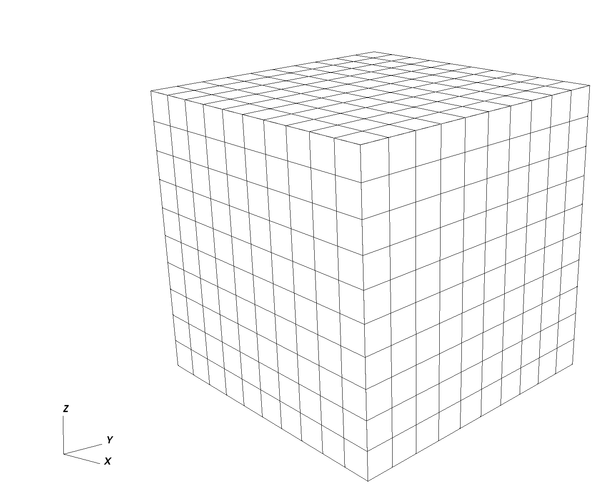

.. _TutorialSinglePhaseFlowWithInternalMesh:

#####################################################
Tutorial 1: First Steps
#####################################################

**Context**

In this tutorial, we use a single-phase flow solver (see :ref:`SinglePhaseFlow`)
to solve for pressure propagation on a 10x10x10 cube mesh
with anisotropic permeability values.
The pressure source is the lowest-left corner element, and the pressure sink sits at the opposite top corner.

**Objectives**

At the end of this tutorial you will know:

  - the basic structure of XML input files used by GEOS,
  - how to run GEOS on a simple case requiring no external input files,
  - the basic syntax of a solver block for single-phase problems,
  - how to control output and visualize results.

**Input file**

GEOS runs by reading user input information from one or more XML files.
For this tutorial, we only need a single GEOS input file located at:

.. code-block:: console

    inputFiles/singlePhaseFlow/3D_10x10x10_compressible_smoke.xml

**Running GEOS**

If our XML input file is called ``my_input.xml``, GEOS runs this file by executing:

.. code-block:: console

  /path/to/geosx -i /path/to/my_input.xml

The ``-i`` flag indicates the path to the XML input file.
To get help on what other command line input flags GEOS supports, run ``geosx --help``.

**Input file structure**

XML files store information in a tree-like structure using nested blocks of information called *elements*.
In GEOS, the root of this tree structure is the element called ``Problem``.
All elements in an XML file are defined by an opening *tag* (``<ElementName>``) and end by a corresponding closing tag (``</ElementName>``). Elements can have properties defined as *attributes* with ``key="value"`` pairs.
A typical GEOS input file contains the following tags:

 #. :ref:`Solver <Solver_tag_single_phase_internal_mesh>`
 #. :ref:`Mesh <Mesh_tag_single_phase_internal_mesh>`
 #. :ref:`Geometry <Geometry_tag_single_phase_internal_mesh>`
 #. :ref:`Events <Events_tag_single_phase_internal_mesh>`
 #. :ref:`NumericalMethods <NumericalMethods_tag_single_phase_internal_mesh>`
 #. :ref:`ElementRegions <ElementRegions_tag_single_phase_internal_mesh>`
 #. :ref:`Constitutive <Constitutive_tag_single_phase_internal_mesh>`
 #. :ref:`FieldSpecifications <FieldSpecifications_tag_single_phase_internal_mesh>`
 #. :ref:`Outputs <Outputs_tag_single_phase_internal_mesh>`

**XML validation tools**

If you have not already done so, please use or enable an XML validation tool (see **User Guide/Input Files/Input Validation**).
Such tools will help you identify common issues that may occur when working with XML files.

.. note::
  Common errors come from the fact that XML is case-sensitive, and all opened tags must be properly closed.

.. _Solver_tag_single_phase_internal_mesh:

-------------------
Single-phase solver
-------------------

GEOS is a multiphysics simulator. To find the solution to different physical problems
such as diffusion or mechanical deformation, GEOS uses one or more physics solvers.
The ``Solvers`` tag is used to define and parameterize these solvers.
Different combinations of solvers can be applied
in different regions of the domain at different moments of the simulation.

In this first example, we use one type of solver in the entire domain and
for the entire duration of the simulation.
The input file for this tutorial can be found in the repository at
`inputFiles/singlePhaseFlow/3D_10x10x10_compressible_smoke.xml <https://github.com/GEOS-DEV/GEOS/blob/6dd40e776556ec1235ba183e00796f2eedc035ac/inputFiles/singlePhaseFlow/3D_10x10x10_compressible_smoke.xml>`_, which also includes
`inputFiles/singlePhaseFlow/3D_10x10x10_compressible_base.xml <https://github.com/GEOS-DEV/GEOS/blob/6dd40e776556ec1235ba183e00796f2eedc035ac/inputFiles/singlePhaseFlow/3D_10x10x10_compressible_base.xml>`_.
The solver we are specifying here is a single-phase flow solver.
In GEOS, such a solver is created using a ``SinglePhaseFVM`` element.
This type of solver is one among several cell-centered single-phase finite volume methods.

The XML block used to define this single-phase finite volume solver is shown here:

.. literalinclude:: ../../../../../inputFiles/singlePhaseFlow/3D_10x10x10_compressible_base.xml
  :language: xml
  :start-after: <!-- SPHINX_TUT_INT_HEX_SOLVERS -->
  :end-before: <!-- SPHINX_TUT_INT_HEX_SOLVERS_END -->

Each type of solver has a specific set of parameters that are required and
some parameters that are optional. Optional values are usually set with sensible default values.

**name**

First, we register a solver of type ``SinglePhaseFVM`` with a user-chosen name,
here ``SinglePhaseFlow``. This unique user-defined name can be almost anything.
However, some symbols are known to cause issues in names : avoid commas, slashes, curly braces.
GEOS is case-sensitive: it makes a distinction between two ``SinglePhaseFVM`` solvers called ``mySolver`` and ``MySolver``.
Giving elements a name is a common practice in GEOS:
users need to give unique identifiers to objects they define.
That name is the handle to this instance of a solver class.

**logLevel**

Then, we set a solver-specific level of console logging (``logLevel`` set to 1 here).
Notice that the value (1) is between double-quotes.
This is a general convention for all attributes:
we write ``key="value"`` regardless of the value type (integers, strings, lists, etc.).

For ``logLevel``, higher values lead to more console output or intermediate results saved to files.
When debugging, higher ``logLevel`` values is often convenient.
In production runs, you may want to suppress most console output.

**discretization**

For solvers of the ``SinglePhaseFVM`` family, one required attribute is a discretization scheme.
Here, we use a Two-Point Flux Approximation (TPFA) finite volume discretization scheme called ``singlePhaseTPFA``.
To know the list of admissible values of an attribute, please see `GEOS's XML schema <https://geosx-geosx.readthedocs-hosted.com/en/latest/docs/sphinx/CompleteXMLSchema.html#>`_.
This discretization type must know how to find permeability values that it uses internally to compute transmissibilities.
The ``permeabilityNames`` attribute tells the solver the user-defined name (the *handle*)
of the permeability values that will be defined elsewhere in the input file.
Note that the order of attributes inside an element is not important.

**fluidNames, solidNames, targetRegions**

Here, we specify a collection of fluids, rocks, and
target regions of the mesh on which the solver will apply.
Curly brackets are used in GEOS inputs to indicate collections of values (sets or lists).
The curly brackets used here are necessary, even if the collection contains a single value.
Commas are used to separate members of a set.

**Nested elements**

Finally, note that other XML elements can be nested inside the ``Solvers`` element.
Here, we use specific XML elements to set values for numerical tolerances.
The solver stops when numerical residuals are smaller than
the specified tolerances (convergence is achieved)
or when the maximum number of iterations allowed is exceeded (convergence not achieved).

.. _Mesh_tag_single_phase_internal_mesh:

------
Mesh
------

To solve this problem, we need to define a mesh for our numerical calculations.
This is the role of the **Mesh** element.

There are two approaches to specifying meshes in GEOS: internal or external.

  * The external approach allows to import mesh files created outside GEOS, such as a corner-point grid or an unstructured grid representing complex shapes and structures.
  * The internal approach uses GEOS's built-in capability to create simple meshes from a small number of parameters. It does not require any external file information. The geometric complexity of internal meshes is limited, but many practical problems can be solved on such simple grids.

In this tutorial, to keep things self-contained,
we use the internal mesh generator. We parameterize it with the **InternalMesh** element.

.. literalinclude:: ../../../../../inputFiles/singlePhaseFlow/3D_10x10x10_compressible_smoke.xml
  :language: xml
  :start-after: <!-- SPHINX_TUT_INT_HEX_MESH -->
  :end-before: <!-- SPHINX_TUT_INT_HEX_MESH_END -->

**name**

Just like for solvers, we register the ``InternalMesh`` element using a unique **name** attribute.
Here the ``InternalMesh`` object is instantiated with the name ``mesh``.

**elementTypes**

We specify the collection of elements types that this mesh contains.
Tetrahedra, hexahedra, and  wedges are examples of element types.
If a mesh contains different types of elements (a hybrid mesh),
we should indicate this here by listing all unique types of elements in curly brackets.
Keeping things simple, our element collection has only one type of element: a ``C3D8`` type representing a hexahedral element (linear 8-node brick).

A mesh can contain several geometrical types of elements.
For numerical convenience, elements are aggregated by types into ``cellBlocks``.
Here, we only linear 8-node brick elements, so the entire domain is one object called ``cellBlock``.

**xCoords, yCoords, zCoords, nx, ny, nz**

This specifies the spatial arrangement of the mesh elements.
The mesh defined here goes from coordinate x=0 to x=10 in the x-direction, with ``nx=10`` subdivisions along this segment.
The same is true for the y-dimension and the z-dimension.
Our mesh is a cube of 10x10x10=1,000 elements with a bounding box defined by corner coordinates (0,0,0) and (10,10,10).

.. _Geometry_tag_single_phase_internal_mesh:

---------
Geometry
---------

The ``Geometry`` tag allows users to capture subregions of a mesh and assign them a unique name.
Here, we name two ``Box`` elements, one for the location of the ``source`` and one for the ``sink``.
Pressure values are assigned to these named regions elsewhere in the input file.

The pressure source is the element in the (0,0,0) corner of the domain, and the sink is the element in the (10,10,10) corner.

For an element to be inside a geometric region,
it must have all its vertices strictly inside that region.
Consequently, we need to extend the geometry limits a small amount beyond the actual coordinates of the elements to catch all vertices. Here, we use a safety padding of 0.01.

.. literalinclude:: ../../../../../inputFiles/singlePhaseFlow/3D_10x10x10_compressible_base.xml
  :language: xml
  :start-after: <!-- SPHINX_TUT_INT_HEX_GEOMETRY -->
  :end-before: <!-- SPHINX_TUT_INT_HEX_GEOMETRY_END -->

There are several methods to achieve similar conditions (Dirichlet boundary condition on faces, etc.).
The ``Box`` defined here is one of the simplest approaches.

.. _Events_tag_single_phase_internal_mesh:

--------
Events
--------

In GEOS, we call ``Events`` anything that happens at a set time or frequency.
Events are a central element for time-stepping in GEOS,
and a dedicated section just for events is necessary to give them the treatment they deserve.

For now, we focus on three simple events: the time at which we wish the simulation to end (``maxTime``),
the times at which we want the solver to perform updates,
and the times we wish to have simulation output values reported.

In GEOS, all times are specified in **seconds**, so here ``maxTime=5000.0`` means that the simulation will run from time 0 to time 5,000 seconds.

If we focus on the ``PeriodicEvent`` elements, we see :

 #. A **periodic solver** application: this event is named ``solverApplications``. With the attribute ``forceDt=20``, it tells the solver to compute results at 20-second time intervals. We know what this event does by looking at its ``target`` attribute: here, from time 0 to ``maxTime`` and with a forced time step of 20 seconds, we instruct GEOS to call the solver registered as ``SinglePhaseFlow``. Note the hierarchical structure of the target formulation, using '/' to indicate a specific named instance (``SinglePhaseFlow``) of an element (``Solvers``). If the solver needs to take smaller time steps, it is allowed to do so, but it will have to compute results for every 20-second increment between time zero and ``maxTime`` regardless of possible intermediate time steps.
 #. An **output event**: this event is used for reporting purposes and instructs GEOS to write out results at specific frequencies. Here, we need to see results at every 100-second increment. This event triggers a full application of solvers, even if solvers were not summoned by the previous event. In other words, an output event will force an application of solvers, possibly in addition to the periodic events requested directly.

.. literalinclude:: ../../../../../inputFiles/singlePhaseFlow/3D_10x10x10_compressible_smoke.xml
  :language: xml
  :start-after: <!-- SPHINX_TUT_INT_HEX_EVENTS -->
  :end-before: <!-- SPHINX_TUT_INT_HEX_EVENTS_END -->

.. _NumericalMethods_tag_single_phase_internal_mesh:

------------------
Numerical methods
------------------

GEOS comes with several useful numerical methods.
In the ``Solvers`` elements, for instance, we had specified to use a two-point flux approximation
as discretization scheme for the finite volume single-phase solver.
Now to use this scheme, we need to supply more details in the ``NumericalMethods`` element.

.. literalinclude:: ../../../../../inputFiles/singlePhaseFlow/3D_10x10x10_compressible_base.xml
  :language: xml
  :start-after: <!-- SPHINX_TUT_INT_HEX_NUM_METHODS -->
  :end-before: <!-- SPHINX_TUT_INT_HEX_NUM_METHODS_END -->

Note that in GEOS, there is a difference between physics solvers and numerical methods.
Their parameterizations are thus independent. We can have
multiple solvers using the same numerical scheme but with different tolerances, for instance.

The available numerical methods and their options are listed in the GEOS XML schema documentation which may be found by using the search function in the documentation.

.. _ElementRegions_tag_single_phase_internal_mesh:

--------
Regions
--------

In GEOS, ``ElementsRegions`` are used to attach material properties
to regions of elements.
Here, we use only one **CellElementRegion** to represent the entire domain (user name: ``mainRegion``).
It contains all the blocks called ``cellBlock`` defined in the mesh section.
We specify the materials contained in that region using a ``materialList``.
Several materials coexist in ``cellBlock``, and we list them using their user-defined names: ``water``, ``rockPorosity``, and ``rockPerm``, etc. What these names mean, and the physical properties that they are attached to are defined next.

.. literalinclude:: ../../../../../inputFiles/singlePhaseFlow/3D_10x10x10_compressible_base.xml
  :language: xml
  :start-after: <!-- SPHINX_TUT_INT_HEX_ELEM_REGIONS -->
  :end-before: <!-- SPHINX_TUT_INT_HEX_ELEM_REGIONS_END -->

.. _Constitutive_tag_single_phase_internal_mesh:

---------------------
Constitutive models
---------------------

The ``Constitutive`` element attaches physical properties to all materials contained in the domain.

The physical properties of the materials
defined as ``water``, ``rockPorosity``,  and ``rockPerm`` are provided here,
each material being derived from a different material type:
``CompressibleSinglePhaseFluid``
for the water, ``PressurePorosity`` for the rock porosity, and
``ConstantPermeability`` for rock permeability.
The list of attributes differs between these constitutive materials.

.. literalinclude:: ../../../../../inputFiles/singlePhaseFlow/3D_10x10x10_compressible_base.xml
  :language: xml
  :start-after: <!-- SPHINX_TUT_INT_HEX_CONSTITUTIVE -->
  :end-before: <!-- SPHINX_TUT_INT_HEX_CONSTITUTIVE_END -->

The names ``water``, ``rockPorosity`` and ``rockPerm`` are defined by the user
as handles to specific instances of physical materials.
GEOS uses S.I. units throughout, not field units.
Pressures, for instance, are in Pascal, not psia.
The x- and y-permeability are set to 1.0e-12 m\ :sup:`2` corresponding to approximately to 1 Darcy.

We have used the handles ``water``, ``rockPorosity`` and ``rockPerm`` in the input file
in the ``ElementRegions`` section of the XML file,
before the registration of these materials took place here, in Constitutive element.

.. note::
  This highlights an important aspect of using XML in GEOS:
  the order in which objects are registered and used in the XML file is not important.

.. _FieldSpecifications_tag_single_phase_internal_mesh:

--------------------
Defining properties
--------------------

In the ``FieldSpecifications`` section, properties such as source and sink pressures are set.
GEOS offers a lot of flexibility to specify field values through space and time.

Spatially, in GEOS, all field specifications are associated
to a target object on which the field values are mounted.
This allows for a lot of freedom in defining fields:
for instance, one can have volume property values attached to
a subset of volume elements of the mesh,
or surface properties attached to faces of a subset of elements.

For each ``FieldSpecification``, we specify a ``name``, a ``fieldName`` (this name is used by solvers or numerical methods), an ``objectPath``, ``setNames`` and a ``scale``. The ``ObjectPath`` is important and it reflects the internal class hierarchy of the code.
Here, for the ``fieldName`` pressure, we assign the value defined by ``scale`` (5e6 Pascal)
to one of the ``ElementRegions`` (class) called ``mainRegions`` (instance).
More specifically, we target the ``elementSubRegions`` called ``cellBlock``
(this contains all the C3D8 elements, effectively all the domain). The ``setNames`` allows to use the elements defined in ``Geometry``, or use everything in the object path (using the ``all``).

.. literalinclude:: ../../../../../inputFiles/singlePhaseFlow/3D_10x10x10_compressible_base.xml
  :language: xml
  :start-after: <!-- SPHINX_TUT_INT_HEX_FIELDS -->
  :end-before: <!-- SPHINX_TUT_INT_HEX_FIELDS_END -->

The image below shows the pressures after the very first time step, with the domain initialized at 5 MPa, the sink at 0 MPa on the top right, and the source in the lower left corner at 10 MPa.

.. _Outputs_tag_single_phase_internal_mesh:

-------
Output
-------

In order to retrieve results from a simulation,
we need to instantiate one or multiple ``Outputs``.

Here, we define a single object of type ``Silo``.
`Silo <https://wci.llnl.gov/simulation/computer-codes/silo>`_ is a library and a format for reading and writing a wide variety of scientific data.
Data in Silo format can be read by `VisIt <https://wci.llnl.gov/simulation/computer-codes/visit/>`_.

This ``Silo`` output object is called ``siloOutput``.
We had referred to this object already in the ``Events`` section:
it was the target of a periodic event named ``outputs``.
You can verify that the Events section is using this object as a target.
It does so by pointing to ``/Outputs/siloOutput``.

.. literalinclude:: ../../../../../inputFiles/singlePhaseFlow/3D_10x10x10_compressible_base.xml
  :language: xml
  :start-after: <!-- SPHINX_TUT_INT_HEX_OUTPUTS -->
  :end-before: <!-- SPHINX_TUT_INT_HEX_OUTPUTS_END -->

GEOS currently supports outputs that are readable by `VisIt
<https://wci.llnl.gov/simulation/computer-codes/visit/>`_ and Kitware's Paraview, as well as other visualization tools.
In this example, we only request a Silo format compatible with VisIt.

All elements are now in place to run GEOS.

------------------------------------
Running GEOS
------------------------------------

The command to run GEOS is

``path/to/geosx -i path/to/this/xml_file.xml``

Note that all paths for files included in the XML file are relative to this XML file.

While running GEOS, it logs status information on the console output with a verbosity
that is controlled at the object level, and
that can be changed using the ``logLevel`` flag.

The first few lines appearing to the console are indicating that the XML elements are read and registered correctly:

.. code-block:: sh

  Adding Solver of type SinglePhaseFVM, named SinglePhaseFlow
  Adding Mesh: InternalMesh, mesh
  Adding Geometric Object: Box, source
  Adding Geometric Object: Box, sink
  Adding Event: PeriodicEvent, solverApplications
  Adding Event: PeriodicEvent, outputs
  Adding Output: Silo, siloOutput
  Adding Object CellElementRegion named mainRegion from ObjectManager::Catalog.
    mainRegion/cellBlock/water is allocated with 1 quadrature points.
    mainRegion/cellBlock/rock is allocated with 1 quadrature points.
    mainRegion/cellBlock/rockPerm is allocated with 1 quadrature points.
    mainRegion/cellBlock/rockPorosity is allocated with 1 quadrature points.
    mainRegion/cellBlock/nullSolid is allocated with 1 quadrature points.

Then, we go into the execution of the simulation itself:

.. code-block:: sh

  Time: 0s, dt:20s, Cycle: 0
      Attempt:  0, NewtonIter:  0
      ( R ) = ( 5.65e+00 ) ;
      Attempt:  0, NewtonIter:  1
      ( R ) = ( 2.07e-04 ) ;
      Last LinSolve(iter,res) = (  63, 8.96e-11 ) ;
      Attempt:  0, NewtonIter:  2
      ( R ) = ( 9.86e-11 ) ;
      Last LinSolve(iter,res) = (  70, 4.07e-11 ) ;

Each time iteration at every 20s interval is logged to console, until the end of the simulation at ``maxTime=5000``:

.. code-block:: sh

  Time: 4980s, dt:20s, Cycle: 249
      Attempt:  0, NewtonIter:  0
      ( R ) = ( 4.74e-09 ) ;
      Attempt:  0, NewtonIter:  1
      ( R ) = ( 2.05e-14 ) ;
      Last LinSolve(iter,res) = (  67, 5.61e-11 ) ;
  SinglePhaseFlow: Newton solver converged in less than 4 iterations, time-step required will be doubled.
  Cleaning up events
  Umpire            HOST sum across ranks:   14.8 MB
  Umpire            HOST         rank max:   14.8 MB
  total time                         5.658s
  initialization time                0.147s
  run time                           3.289s

All newton iterations are logged along with corresponding nonlinear residuals for each time iteration.
In turn, for each newton iteration, ``LinSolve`` provides the number of linear iterations and the final residual reached by the linear solver.
Information on run times, initialization times, and maximum amounts of
memory (high water mark) are given at the end of the simulation, if successful.

Congratulations on completing this first run!

------------------------------------
Visualization
------------------------------------

Here, we have requested results to be written in Silo, a format compatible with `VisIt
<https://wci.llnl.gov/simulation/computer-codes/visit/>`_. To visualize results, open VisIt
and directly load the database of simulation output files.

After a few time step, pressure between the source and sink are in equilibrium, as shown on the representation below.

------------------------------------
To go further
------------------------------------

**Feedback on this tutorial**

This concludes the single-phase internal mesh tutorial.
For any feedback on this tutorial, please submit a `GitHub issue on the project's GitHub page <https://github.com/GEOS-DEV/GEOS/issues>`_.

**For more details**

  - More on single-phase flow solvers, please see :ref:`SinglePhaseFlow`.
  - More on meshes, please see :ref:`Meshes`.
  - More on events, please see :ref:`EventManager`.
