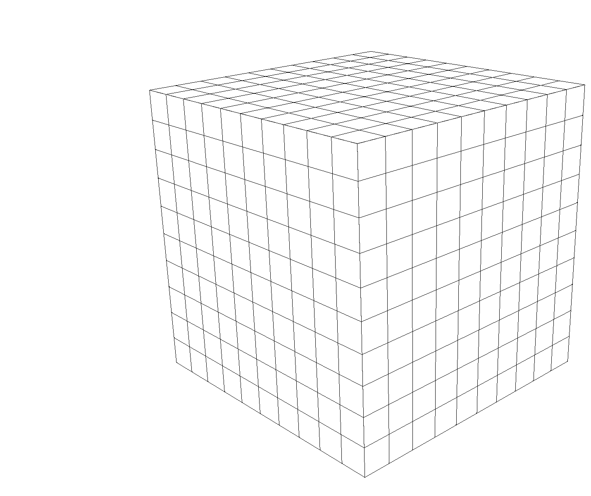
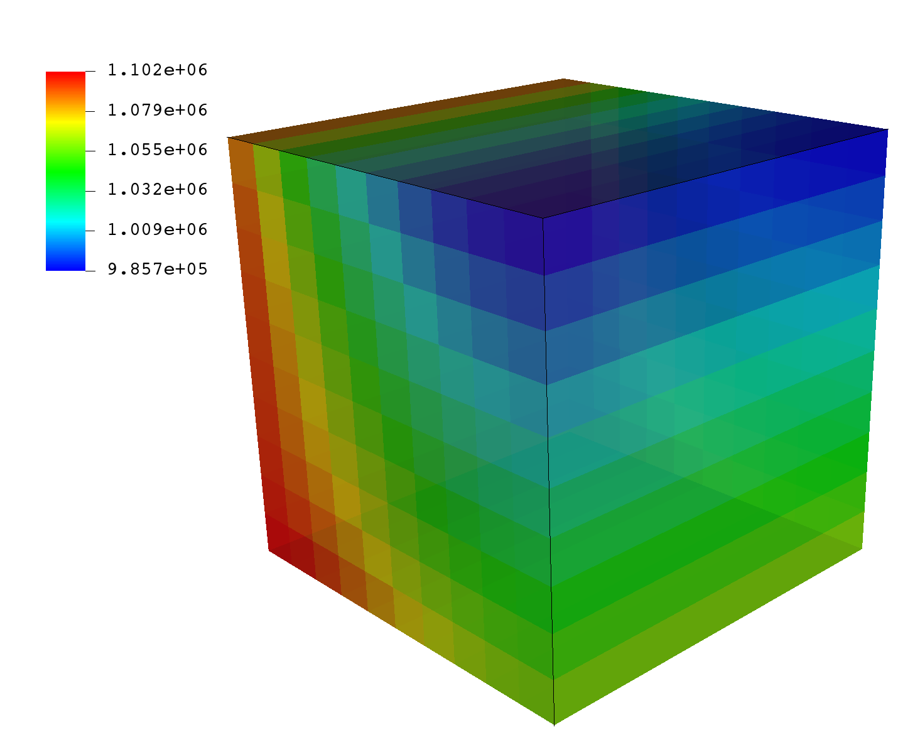
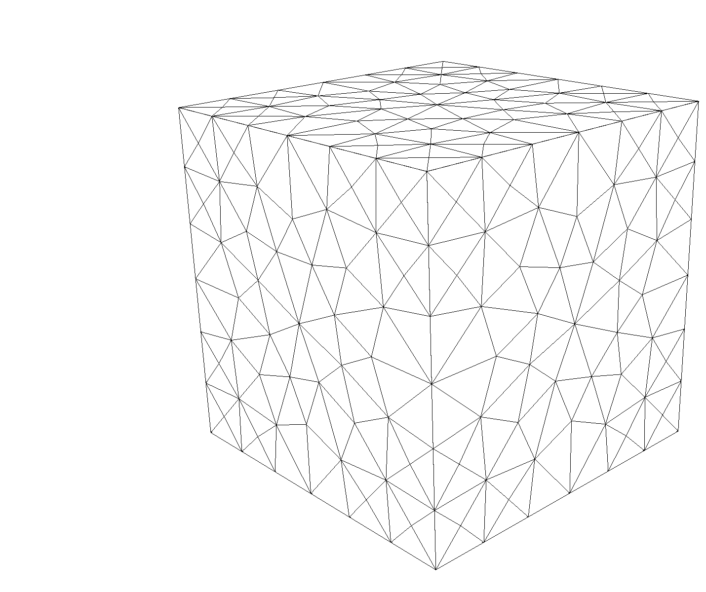
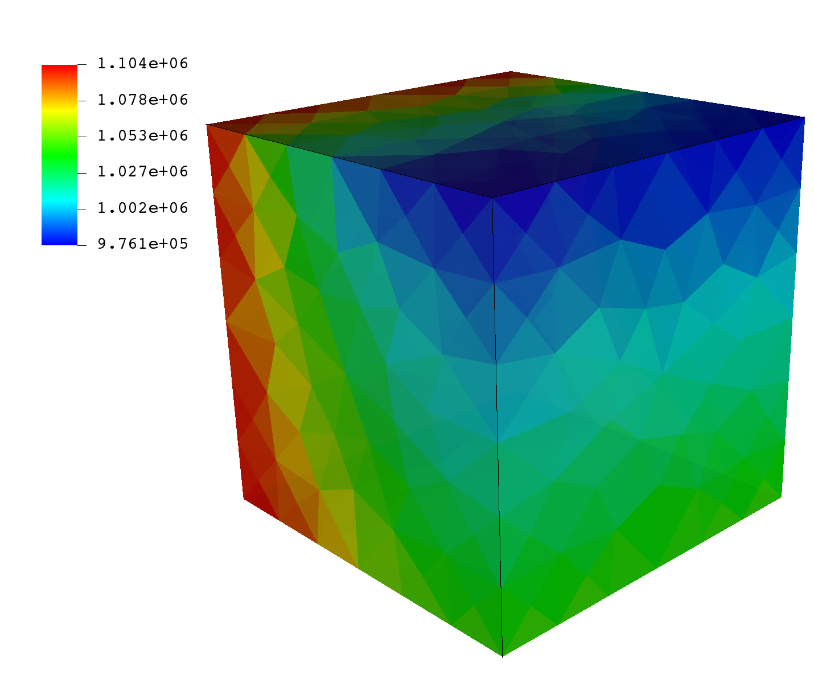

.. _TutorialSinglePhaseFlowExternalMesh:

#########################################
Tutorial 2: External Meshes
#########################################

**Context**

In this tutorial, we use a simple single-phase flow solver (see :ref:`SinglePhaseFlow`)
to solve for pressure propagation on a mesh that is imported into GEOS.
The main goal of this tutorial is to learn how to work with external meshes,
and to learn how easy it is to swap meshes on the same physical problem in GEOS.
This makes GEOS a powerful tool to solve real field applications with complex geometries
and perform assessments of mesh geometry and resolution effects.

**Objectives**

At the end of this tutorial you will know:

  - the syntax and format of input meshes,
  - how to input external files into a GEOS input XML file,
  - how to run the same physical problem with two different meshes,
  - how to use and visualize hexahedral and tetrahedral meshes.

**Input Files**

This tutorial uses an XML file containing the main input for GEOS
and a separate file with all the mesh information.
As we will see later, the main XML file points to the external
mesh file with an ``include`` statement.
The XML input file for this test case is located at:

.. code-block:: console

  inputFiles/singlePhaseFlow/vtk/3D_10x10x10_compressible_hex_gravity_smoke.xml

The mesh file format used in this tutorial is `vtk <https://vtk.org/>`_.
This format is a standard scientific meshing format not specific to GEOS.
``vtk`` is a multi-purpose mesh format (structured, unstructured, serial, parallel, multi-block...) and contains a
compact and complete representation of the mesh geometry and of its properties.
The mesh file used here is human-readable ASCII, and there is a binary storage as well.
It contains a list of nodes with their (x,y,z) coordinates,
and a list of elements that are constructed from these nodes.

.. _ExternalHexahedral:
.. _2_ImportingExternalMesh:

---------------------------------------------
Hexahedral elements
---------------------------------------------

In the first part of the tutorial, we will run flow simulations
on a mesh made of hexahedral elements. These types of elements
are used in classical cartesian grids (sugar cubes)
or corner-point grids or pillar grids.

Brief discussion about hexahedral meshes in GEOS
------------------------------------------------------------------------

Although closely related, the hexahedral grids that GEOS
can process are slightly different
than either structured grid or corner-point grids.
The differences are worth pointing out here. In GEOS:

 - **Hexahedra can have irregular shapes**: no pillars are needed and
   vertices can be anywhere in space. This is useful for grids that turn, fold,
   or are heavily bent. Hexahedral blocks should nevertheless have 8 distinct
   vertices that are not coalesced.
   Some tolerance exists for degeneration to wedges
   in some solvers (finite element solvers), but it is best to avoid such situations
   and label elements according to their actual shape.
   Butterfly cells, flat cells, negative or zero volume cells will cause problems.
 - **The mesh needs to be conformal:** in 3D, this means that neighboring
   grid blocks have to share exactly a complete face. Note that corner-point
   grids do not have this requirement and neighboring blocks can be offset.
   When importing grids
   from commonly-used geomodeling packages, this is an important consideration. This
   problem is solved by splitting shifted grid blocks to restore conformity.
   While it may seem convenient to be able to have offset grid blocks at first,
   the advantages
   of conformal grids used in GEOS are worth the extra meshing effort:
   by using conformal grids,
   GEOS can run finite element and finite volume simulations on the same mesh
   without problems, going seamlessly from one numerical method to the other.
   This is key to enabling multiphysics simulation.
 - **There is no assumption of overall structure**: GEOS does not need to know
   a number of block in the X, Y, Z direction (no NX, NY, NZ) and does not assume that the
   mesh is a full cartesian domain that the interesting parts of the reservoir
   must be carved out from.
   Blocks are numbered by indices that assume
   nothing about spatial positioning and there is no concept of (i,j,k).
   This approach also implies that
   no "masks" are needed to remove inactive or dead cells, as often done
   in cartesian grids to get the actual reservoir contours from a bounding box,
   and here we only need to specify grid blocks that are active.
   For performance and flexibility, this lean approach to meshes is important.

Importing an external mesh with VTK
-----------------------------------

In this first part of the tutorial, we use an hexahedral mesh provided to GEOS.
This hexahedral mesh is strictly identical to the grid used in the first tutorial (:ref:`TutorialSinglePhaseFlowWithInternalMesh`), but instead of using
the internal grid generator GEOS, we specify it with spatial node coordinates in ``vtk`` format.
To import external grid into GEOS, we did develop a component directly using the **vtk** library.

So here, our mesh consists of a simple sugar-cube stack of size 10x10x10.
We inject fluid from one vertical face of a cube (the face corresponding to x=0),
and we let the pressure equilibrate in the closed domain.
The displacement is a single-phase, compressible fluid subject to gravity forces,
so we expect the pressure to be constant on the injection face,
and to be close to hydrostatic on the opposite plane (x=10).
We use GEOS to compute the pressure inside each grid block over a period of time
of 100 seconds.

To see how to import such a mesh,
we inspect the following XML file:

.. code-block:: console

  inputFiles/singlePhaseFlow/vtk/3D_10x10x10_compressible_hex_gravity_smoke.xml

In the XML ``Mesh`` tag, instead of an ``InternalMesh`` tag,
we have a ``VTKMesh`` tag.
We see that a file called ``cube_10x10x10_hex.vtk`` is
imported using ``vtk``, and this object is instantiated with a user-defined ``name`` value.
The file here contains geometric information in `vtk <https://vtk.org/>`__ format
(it can also contain properties, as we will see in the next tutorial).

.. literalinclude::    ../../../../../inputFiles/singlePhaseFlow/vtk/3D_10x10x10_compressible_hex_gravity_smoke.xml
  :language: xml
  :start-after: <!-- SPHINX_TUT_EXT_HEX_MESH -->
  :end-before: <!-- SPHINX_TUT_EXT_HEX_MESH_END -->

Here is the ``vtk`` file :

.. literalinclude::
   ../../../../../inputFiles/singlePhaseFlow/vtk/cube_10x10x10_hex.vtk
   :caption: cube_10x10x10_hex.vtk
   :lines: 1-7

GEOS can run different physical solvers on different regions of the mesh at different times.
Here, to keep things simple, we run one solver (single-phase flow)
on the entire domain throughout the simulation.
To do so, we need to define a region encompassing the entire domain.
We will name it ``Domain``, as refered to in the single-phase flow solver (in its ``targetRegions``),
and list its constitutive models in the ``materialList``, which are ``water`` and ``rock``.
Since we have imported a mesh with only one region, we can set ``cellBlocks`` to ``{ * }``
(we have could also set ``cellBlocks`` to ``{ hexahedra }`` as the mesh has only hexahedral cells).

.. literalinclude:: ../../../../../inputFiles/singlePhaseFlow/vtk/3D_10x10x10_compressible_hex_gravity_base.xml
  :language: xml
  :start-after: <!-- SPHINX_TUT_EXT_HEX_ELEM_REGIONS -->
  :end-before: <!-- SPHINX_TUT_EXT_HEX_ELEM_REGIONS_END -->

.. note::
  If you use a name that is not ``hexahedra`` or ``all`` for this attribute, or if the mesh is
  changed and have not-hexahedral cells, GEOS will throw an error at the beginning of the
  simulation. See :ref:`Meshes` for more information.

Running GEOS
----------------------------------------

The command to run GEOS is

.. code-block:: console

  path/to/geosx -i ../../../../../inputFiles/singlePhaseFlow/vtk/3D_10x10x10_compressible_hex_gravity_smoke.xml

Note that all paths for files included in the XML file are relative
to this XML file, not to the GEOS executable.
When running GEOS, console messages will provide indications regarding the
status of the simulation.

In our case, the first lines are:

.. code-block:: console

  Adding Mesh: VTKMesh, CubeHex
  Adding Event: PeriodicEvent, solverApplications
  Adding Event: PeriodicEvent, outputs
  Adding Event: PeriodicEvent, restarts
  Adding Solver of type SinglePhaseFVM, named SinglePhaseFlow
  Adding Geometric Object: Box, left
  Adding Output: Silo, siloOutput
  Adding Output: Restart, restartOutput
  Adding Object CellElementRegion named Domain from ObjectManager::Catalog.

This indicates initialization of GEOS.
The mesh preprocessing tool ``VTKMesh`` is launched next,
with console messages as follows.

.. code-block:: console

  VTKMesh 'CubeHex': reading mesh from /path/to/inputFiles/singlePhaseFlow/vtk/cube_10x10x10_hex.vtk
  Generating global Ids from VTK mesh
  VTKMesh 'CubeHex': generating GEOS mesh data structure
  Number of nodes: 1331
    Number of elems: 1000
               C3D8: 1000
  Load balancing:  min  avg  max
  (element/rank): 1000 1000 1000

Notice the specification of the number of nodes (1331), and hexahedra (1000).
After the adjacency calculations, GEOS starts the simulation itself.
with the time-step increments specified in the XML file.

At the end of your simulation, you should see something like:

.. code-block:: console

  Time: 96s, dt:2s, Cycle: 48
  Time: 98s, dt:2s, Cycle: 49
  Cleaning up events
  SinglePhaseFlow, number of time steps: 50
  SinglePhaseFlow, number of successful nonlinear iterations: 50
  SinglePhaseFlow, number of successful linear iterations: 450
  SinglePhaseFlow, number of time step cuts: 0
  SinglePhaseFlow, number of discarded nonlinear iterations: 0
  SinglePhaseFlow, number of discarded linear iterations: 0
  Umpire            HOST sum across ranks:    2.6 MB
  Umpire            HOST         rank max:    2.6 MB
  total time                         3.518s
  initialization time                0.132s
  run time                           3.076s

  Process finished with exit code 0

Once this is done, GEOS is finished and we can inspect the outcome.

Visualization of results in VisIt
----------------------------------------

All results are written in a format compatible with `VisIt
<https://wci.llnl.gov/simulation/computer-codes/visit/>`_.
To load the results, point VisIt to the ``database`` file written in the Silo output folder.

We see that the face x=0 shown here in the back of the illustration applies a constant
pressure boundary condition (colored in red), whereas the face across from it
displays a pressure field under gravity effect, equilibrated and hydrostatic.
These results are consistent with what we expect.

Let us now see if a tetrahedral mesh, under the same exact physical conditions,
can reproduce these results.

.. _ExternalTetrahedral:

------------------------------------------------
Externally Generated Tetrahedral Elements
------------------------------------------------

In the second part of the tutorial, we discretize the
same cubic domain but with tetrahedral elements.
Tetrahedral meshes are not yet common in geomodeling
but offer tremendous flexibility
in modeling fracture planes, faults, complex reservoir
horizons and boundaries.
Just like for hexahedral meshes,
and for the same reasons (compatibility with finite volume and finite element methods),
tetrahedral meshes in GEOS must be conformal.

As stated previously, the problem we wish to solve here
is the exact same physical problem as with hexahedral grid blocks.
We apply a constant pressure condition (injection)
from the x=0 vertical face of the domain, and we let pressure
equilibrate over time. We observe the opposite side of the cube and expect
to see hydrostatic pressure profiles because of the gravitational effect.
The displacement is a single phase, compressible flow subject to gravity forces.
We use GEOS to compute the pressure inside each grid block.

The set-up for this problem is almost identical to
the hexahedral mesh set-up. We simply point our ``Mesh`` tag to
include a tetrahedral grid. The interest of not relying on I,J,K indices
for any property specification or well trajectory
makes it **easy to try different meshes for the same physical problems with GEOS**.
Swapping out meshes without requiring other modifications
to the input files makes mesh refinement studies easy to perform with GEOS.

Like before, the XML file for this problem is the following:

.. code-block:: console

   inputFiles/singlePhaseFlow/vtk/3D_10x10x10_compressible_tetra_gravity_smoke.xml

The only difference, is that now, the ``Mesh`` tag points GEOS to
a different mesh file called ``cube_10x10x10_tet.vtk``.
This file contains nodes and tetrahedral elements in `vtk`_ format,
representing a different discretization of the exact same 10x10x10 cubic domain.

.. literalinclude:: ../../../../../inputFiles/singlePhaseFlow/vtk/3D_10x10x10_compressible_tetra_gravity_smoke.xml
  :language: xml
  :start-after: <!-- SPHINX_TUT_EXT_TETRA_MESH -->
  :end-before: <!-- SPHINX_TUT_EXT_TETRA_MESH_END -->

The mesh now looks like this:

And the ``vtk`` file starts as follows (notice the tetrahedral point coordinates as real numbers):

.. literalinclude::
   ../../../../../inputFiles/singlePhaseFlow/vtk/cube_10x10x10_tet.vtk
   :caption: cube_10x10x10_tet.vtk
   :lines: 1-20

Again, the entire field is one region called ``Domain`` which contains ``water`` and ``rock``.
Since we have imported a mesh with only one region, we can again set ``cellBlocks`` to ``{ * }``
(we have could also set ``cellBlocks`` to ``{ tetrahedra }`` as the mesh has only tetrahedric cells).

.. literalinclude:: ../../../../../inputFiles/singlePhaseFlow/vtk/3D_10x10x10_compressible_tetra_gravity_base.xml
  :language: xml
  :start-after: <!-- SPHINX_TUT_EXT_TETRA_ELEM_REGIONS -->
  :end-before: <!-- SPHINX_TUT_EXT_TETRA_ELEM_REGIONS_END -->

Running GEOS
-------------------------

The command to run GEOS is

.. code-block:: console

  path/to/geosx -i ../../../../../inputFiles/singlePhaseFlow/vtk/3D_10x10x10_compressible_tetra_gravity_smoke.xml

Again, all paths for files included in the XML file are relative
to this XML file, not to the GEOS executable.
When running GEOS, console messages will provide indications regarding the
status of the simulation.
In our case, the first lines are:

.. code-block:: console

  Adding Mesh: VTKMesh, CubeTetra
  Adding Event: PeriodicEvent, solverApplications
  Adding Event: PeriodicEvent, outputs
  Adding Event: PeriodicEvent, restarts
  Adding Solver of type SinglePhaseFVM, named SinglePhaseFlow
  Adding Geometric Object: Box, left
  Adding Output: Silo, siloOutput
  Adding Output: Restart, restartOutput
  Adding Object CellElementRegion named Domain from ObjectManager::Catalog.

Followed by:

.. code-block:: console

  VTKMesh 'CubeTetra': reading mesh from /path/to/inputFiles/singlePhaseFlow/vtk/cube_10x10x10_tet.vtk
  Generating global Ids from VTK mesh
  VTKMesh 'CubeTetra': generating GEOS mesh data structure
  Number of nodes:  366
    Number of elems: 1153
               C3D4: 1153
  Load balancing:  min  avg  max
  (element/rank): 1153 1153 1153
  regionQuadrature: meshBodyName, meshLevelName, regionName, subRegionName = CubeTetra, Level0, Domain, tetrahedra
  CubeTetra/Level0/Domain/tetrahedra/water allocated 1 quadrature points
  CubeTetra/Level0/Domain/tetrahedra/rock allocated 1 quadrature points

We see that we have now 366 nodes and 1153 tetrahedral elements.
And finally, when the simulation is successfully done we see:

.. code-block:: console

  Time: 0s, dt:1s, Cycle: 0
  Time: 1s, dt:1s, Cycle: 1
  Time: 2s, dt:1s, Cycle: 2
  Time: 3s, dt:1s, Cycle: 3
  Time: 4s, dt:1s, Cycle: 4
  Time: 5s, dt:1s, Cycle: 5
  ...
  Time: 95s, dt:1s, Cycle: 95
  Time: 96s, dt:1s, Cycle: 96
  Time: 97s, dt:1s, Cycle: 97
  Time: 98s, dt:1s, Cycle: 98
  Time: 99s, dt:1s, Cycle: 99
  Cleaning up events
  SinglePhaseFlow, number of time steps: 100
  SinglePhaseFlow, number of successful nonlinear iterations: 100
  SinglePhaseFlow, number of successful linear iterations: 1000
  SinglePhaseFlow, number of time step cuts: 0
  SinglePhaseFlow, number of discarded nonlinear iterations: 0
  SinglePhaseFlow, number of discarded linear iterations: 0
  Umpire            HOST sum across ranks:    1.9 MB
  Umpire            HOST         rank max:    1.9 MB
  total time                         5.837s
  initialization time                0.094s
  run time                           5.432s

  Process finished with exit code 0

Visualization of results in VisIt
--------------------------------------

All results are written in a format compatible with `VisIt
<https://wci.llnl.gov/simulation/computer-codes/visit/>`_ by default.
If we load into VisIt the `.database` file found in the Silo folder, we observe the following results:

Here, we can see that despite the different mesh sizes and shapes,
we are able to recover our pressure profile without any problems,
or degradation in runtime performance.

------------------------------------
To go further
------------------------------------

**Feedback on this tutorial**

This concludes the single-phase external mesh tutorial.
For any feedback on this tutorial, please submit a `GitHub issue on the project's GitHub page <https://github.com/GEOS-DEV/GEOS/issues>`_.

**For more details**

  - A complete description of the Internal Mesh generator is found here :ref:`Meshes`.
  - ``vtk`` is extensively documented. You can start browsing `here <https://vtk.org/documentation/>`_.
  - GEOS can handle tetrahedra, hexahedra, pyramids, wedges, prisms, and any combination thereof in one mesh.
