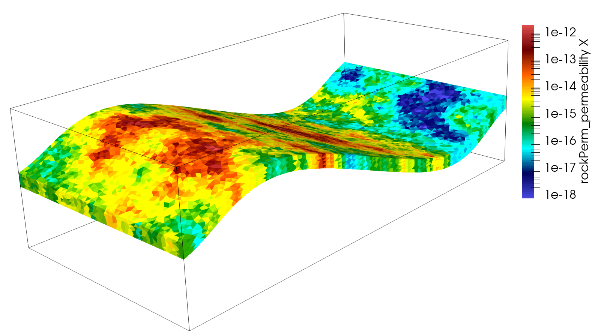

.. _TutorialFieldCase:

###############################################
Tutorial 3: Regions and Property Specifications
###############################################

**Context**

In this tutorial, we set up a simple field case for single-phase flow simulation (see :ref:`SinglePhaseFlow`). We demonstrate how to run a basic flow simulation in the reservoir layer. We do not consider any coupling with wells. Injection and production will be specified by imposing a high pressure in the cells close to the injection area and a low pressure in the cells close to the production area.

**Objectives**

At the end of this tutorial you will know:

  - how to import external mesh information and properties,
  - how to run a specific solver (here, flow) in a specific region only,
  - the basic method of using boxes to set up boundary conditions,
  - how to use *TableFunction* to import fields varying in time and/or space,
  - how to control output frequency and export results for visualization.

**Input file**

The XML input file for this test case is located at:

.. code-block:: console

  inputFiles/singlePhaseFlow/FieldCaseTutorial3_base.xml

.. code-block:: console

  inputFiles/singlePhaseFlow/FieldCaseTutorial3_smoke.xml

We consider the following mesh as a numerical support to the simulations in this tutorial:

This mesh contains three continuous regions:

  - a Bottom region (underburden, elementary tag = `Underburden`, attribute = ``1``)
  - a Middle region (reservoir layer, elementary tag = `Reservoir`, attribute = ``2``)
  - a Top region (overburden, elementary tag = `Overburden`, attribute = ``3``)

  .. image:: reservoir_transparent.png
     :width: 600px

The mesh is defined using the VTK file format (see :ref:`Meshes` for more information on
the supported mesh file format). Each tetrahedron is associated to a unique tag.

The XML file considered here follows the typical structure of the GEOS input files:

 #. :ref:`Solver <Solver_tag_field_case>`
 #. :ref:`Mesh <Mesh_tag_field_case>`
 #. :ref:`Geometry <Geometry_tag_field_case>`
 #. :ref:`Events <Events_tag_field_case>`
 #. :ref:`NumericalMethods <NumericalMethods_tag_field_case>`
 #. :ref:`ElementRegions <ElementRegions_tag_field_case>`
 #. :ref:`Constitutive <Constitutive_tag_field_case>`
 #. :ref:`FieldSpecifications <FieldSpecifications_tag_field_case>`
 #. :ref:`Outputs <Outputs_tag_field_case>`
 #. :ref:`Functions <Functions_tag_field_case>`

.. _Solver_tag_field_case:

--------------------
Single-phase solver
--------------------

Let us inspect the **Solver** XML tags.

.. literalinclude:: ../../../../../inputFiles/singlePhaseFlow/FieldCaseTutorial3_base.xml
  :language: xml
  :start-after: <!-- SPHINX_FIELD_CASE_SOLVER -->
  :end-before: <!-- SPHINX_FIELD_CASE_SOLVER_END -->

This node gathers all the information previously defined.
We use a classical ``SinglePhaseFVM`` Finite Volume Method,
with the two-point flux approximation
as will be defined in the **NumericalMethods** tag.
The ``targetRegions`` refers only
to the Reservoir region because we only solve for flow in this region.

The ``NonlinearSolverParameters`` and ``LinearSolverParameters`` are used to set usual
numerical solver parameters such as the linear and nonlinear tolerances, the preconditioner and solver types or the maximum number of nonlinear iterations.

.. _Mesh_tag_field_case:

-------
Mesh
-------

Here, we use the ``VTKMesh`` to load the mesh (see :ref:`ImportingExternalMesh`).
The syntax to import external meshes is simple : in the XML file,
the mesh ``file`` is included with its relative or absolute path to the location of the GEOS XML file and a user-specified ``name`` label for the mesh object.

.. literalinclude:: ../../../../../inputFiles/singlePhaseFlow/FieldCaseTutorial3_smoke.xml
  :language: xml
  :start-after: <!-- SPHINX_FIELD_CASE_MESH -->
  :end-before: <!-- SPHINX_FIELD_CASE_MESH_END -->

.. _Geometry_tag_field_case:

----------
Geometry
----------

        Here, we are using definition of ``source`` and ``sink`` boxes in addition to the ``all`` box in order to flag sets of nodes or cells which will act as injection or production.

.. literalinclude:: ../../../../../inputFiles/singlePhaseFlow/FieldCaseTutorial3_base.xml
  :language: xml
  :start-after: <!-- SPHINX_FIELD_CASE_GEOMETRY -->
  :end-before: <!-- SPHINX_FIELD_CASE_GEOMETRY_END -->

In order to define a box, the user defines ``xMax`` and ``xMin``, two diagonally opposite nodes of the box.

.. _Events_tag_field_case:

-------
Events
-------

The events are used here to guide the simulation through time,
and specify when outputs must be triggered.

.. literalinclude:: ../../../../../inputFiles/singlePhaseFlow/FieldCaseTutorial3_smoke.xml
  :language: xml
  :start-after: <!-- SPHINX_FIELD_CASE_EVENTS -->
  :end-before: <!-- SPHINX_FIELD_CASE_EVENTS_END -->

The **Events** tag is associated with the ``maxTime`` keyword defining the maximum time.
If this time is ever reached or exceeded, the simulation ends.

Two ``PeriodicEvent`` are defined.
- The first one, ``solverApplications``, is associated with the solver. The  ``forceDt`` keyword means that there will always be time-steps of 10e6 seconds.
- The second, ``outputs``, is associated with the output. The ``timeFrequency`` keyword means that it will be executed every 10e6 seconds.

.. _NumericalMethods_tag_field_case:

------------------
Numerical methods
------------------

Defining the numerical method used in the solver, we will provide information on how to discretize our equations. Here a classical two-point flux approximation (TPFA) scheme is used to discretize water fluxes over faces.

.. literalinclude:: ../../../../../inputFiles/singlePhaseFlow/FieldCaseTutorial3_base.xml
  :language: xml
  :start-after: <!-- SPHINX_FIELD_CASE_NUMERICAL -->
  :end-before: <!-- SPHINX_FIELD_CASE_NUMERICAL_END -->

.. _ElementRegions_tag_field_case:

--------
Regions
--------

Assuming that the overburden and the underburden are impermeable,
and flow only takes place in the reservoir, we need to define regions.

We need to define all the ``CellElementRegions`` according to the ``attribute`` values of the VTK file
(which are respectively ``1``, ``2`` and ``3`` for each region). As mentioned above, the solvers is only
applied on the reservoir layer, (on region ``2``). In this case, the **ElementRegions** tag is :

.. literalinclude:: ../../../../../inputFiles/singlePhaseFlow/FieldCaseTutorial3_base.xml
  :language: xml
  :start-after: <!-- SPHINX_FIELD_CASE_REGION -->
  :end-before: <!-- SPHINX_FIELD_CASE_REGION_END -->

.. note::
  This material list here is subject to change if the problem is not a single-phase flow problem.

.. _Constitutive_tag_field_case:

--------------------
Constitutive models
--------------------

We simulate a single-phase flow in the reservoir layer, hence with multiple types of materials, a fluid (water) and solid (rock permeability and porosity).

.. literalinclude:: ../../../../../inputFiles/singlePhaseFlow/FieldCaseTutorial3_base.xml
  :language: xml
  :start-after: <!-- SPHINX_FIELD_CASE_CONSTITUTIVE -->
  :end-before: <!-- SPHINX_FIELD_CASE_CONSTITUTIVE_END -->

The constitutive parameters such as the density, the viscosity, and the compressibility are specified in the International System of Units.

.. note::
  To consider an incompressible fluid, the user has to set the compressibility to 0.

.. note::
  Currently GEOS handles permeability as a diagonal matrix, so the three values of the permeability tensor are set individually using the ``component`` field.
  The ability for a full tensor permeability is planned for future releases.

.. _FieldSpecifications_tag_field_case:

--------------------
Defining properties
--------------------

The next step is to specify fields, including:

  - The initial value (here, the pressure has to be initialized)
  - The static properties (here, we have to define the permeability tensor and the porosity)
  - The boundary conditions (here, the injection and production pressure have to be set)

.. literalinclude:: ../../../../../inputFiles/singlePhaseFlow/FieldCaseTutorial3_base.xml
  :language: xml
  :start-after: <!-- SPHINX_FIELD_CASE_FIELD -->
  :end-before: <!-- SPHINX_FIELD_CASE_FIELD_END -->

You may note :

 - All static parameters and initial value fields must have ``initialCondition`` field set to ``1``.
 - The ``objectPath`` refers to the ``ElementRegion`` in which the field has its value,
 - The ``setName`` field points to the box previously defined to apply the fields,
 - ``name`` and ``fieldName`` have a different meaning: ``name`` is used to give a name to the XML block. This ``name`` must be unique. ``fieldName`` is the name of the field registered in GEOS. This value has to be set according to the expected input fields of each solver.

.. _Outputs_tag_field_case:

-------
Output
-------

The **Outputs** XML tag is used to trigger the writing of visualization files.
Here, we write files in a format natively readable by Paraview under the tag *VTK*:

.. literalinclude:: ../../../../../inputFiles/singlePhaseFlow/FieldCaseTutorial3_base.xml
  :language: xml
  :start-after: <!-- SPHINX_FIELD_CASE_OUTPUT -->
  :end-before: <!-- SPHINX_FIELD_CASE_OUTPUT_END -->

.. note::
  The ``name`` keyword defines the name of the output directory.

.. _Functions_tag_field_case:

---------------------------------------
Using functions to specify properties
---------------------------------------

Eventually, one can define varying properties using ``TableFunction`` (:ref:`FunctionManager`) under the **Functions** tag:

.. literalinclude:: ../../../../../inputFiles/singlePhaseFlow/FieldCaseTutorial3_base.xml
  :language: xml
  :start-after: <!-- SPHINX_FIELD_CASE_TFUNC -->
  :end-before: <!-- SPHINX_FIELD_CASE_TFUNC_END -->

Here, the injection pressure is set to vary with time. Attentive reader might have
noticed that ``sourceTerm`` was bound to a ``TableFunction`` named *timeInj* under
**FieldSpecifications** tag definition. The initial pressure is set based on the values
contained in the table formed by the files which are specified. In particular,
the files *xlin.geos*, *ylin.geos* and *zlin.geos* define a regular meshing of
the bounding box containing the reservoir. The *pressure.geos* file then defines the values of the pressure at those points.

We proceed in a similar manner as for *pressure.geos* to map a heterogeneous permeability field (here the 5th layer of the SPE 10 test case) onto our unstructured grid. This mapping will use a nearest point interpolation rule.

.. note::
  The varying values imposed in *values* or passed through *voxelFile* are premultiplied by the *scale* attribute from **FieldSpecifications**.

------------------------------------
Running GEOS
------------------------------------

The simulation can be launched with:

.. code-block:: console

  geosx -i FieldCaseTutorial3_smoke.xml

One can notice the correct load of the field function among the starting output messages

.. code-block:: console

        Adding Mesh: VTKMesh, SyntheticMesh
        Adding Event: PeriodicEvent, solverApplications
        Adding Event: PeriodicEvent, outputs
        Adding Solver of type SinglePhaseFVM, named SinglePhaseFlow
        Adding Geometric Object: Box, all
        Adding Geometric Object: Box, source
        Adding Geometric Object: Box, sink
        Adding Output: VTK, reservoir_with_properties
           TableFunction: timeInj
           TableFunction: initialPressureFunc
           TableFunction: permxFunc
           TableFunction: permyFunc
           TableFunction: permzFunc
        Adding Object CellElementRegion named Reservoir from ObjectManager::Catalog.
        Adding Object CellElementRegion named Burden from ObjectManager::Catalog.

------------------------------------
Visualization of results
------------------------------------

We can open the file `syntheticReservoirVizFile.pvd` with Paraview to visualize the simulation
results. In the event block, we have asked for the output to be generated at regular
intervals throughout the simulation, we can thus visualize the pressure
distribution at different simulation times, showing the variation in the injection control.

.. image:: pressure_1e8.png
  :width: 600px

-----------------------------------
To go further
-----------------------------------
**Feedback on this tutorial**

This concludes this tutorial. For any feedback, please submit a `GitHub issue on
the project's GitHub page <https://github.com/GEOS-DEV/GEOS/issues>`_.

**For more details**

  - More on meshes, please see :ref:`Meshes`.
  - More on events, please see :ref:`EventManager`.
