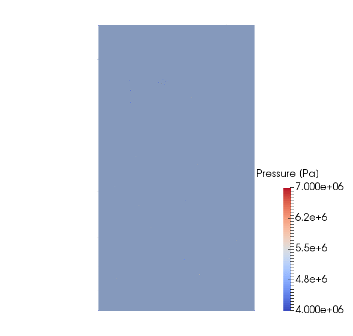
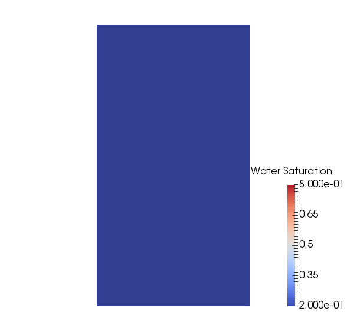

.. _TutorialDeadOilBottomLayersSPE10:

####################################################################
Tutorial 4: Multiphase flow
####################################################################

**Context**

In this tutorial, we set up a multiphase, multicomponent test case (see :ref:`CompositionalMultiphaseFlow`).
The permeability field corresponds to the two bottom layers (layers 84 and 85) of the SPE10 test case.
The thermodynamic behavior of the fluid mixture is specified using a simple immiscible (Dead-Oil) model.
Injection and production are performed using boundary conditions.

**Objective**

The main objective of this tutorial is to review the main elements of a simple two-phase simulation in GEOSX, including:

- the compositional multiphase flow solver,
- the multiphase constutive models,
- the specifications of multiphase boundary conditions.

**Input file**

This tutorial is based on the XML file located at

.. code-block:: console

  src/coreComponents/physicsSolvers/fluidFlow/benchmarks/SPE10/dead_oil_spe10_layers_84_85.xml

------------------------------------
GEOSX input file
------------------------------------

The XML file considered here follows the typical structure of the GEOSX input files:

 #. :ref:`Solver <Solver_tag_dead_oil_bottom_layers_spe10>`
 #. :ref:`Mesh <Mesh_tag_dead_oil_bottom_layers_spe10>`
 #. :ref:`Geometry <Geometry_tag_dead_oil_bottom_layers_spe10>`
 #. :ref:`Events <Events_tag_dead_oil_bottom_layers_spe10>`
 #. :ref:`NumericalMethods <NumericalMethods_tag_dead_oil_bottom_layers_spe10>`
 #. :ref:`ElementRegions <ElementRegions_tag_dead_oil_bottom_layers_spe10>`
 #. :ref:`Constitutive <Constitutive_tag_dead_oil_bottom_layers_spe10>`
 #. :ref:`FieldSpecifications <FieldSpecifications_tag_dead_oil_bottom_layers_spe10>`
 #. :ref:`Outputs <Outputs_tag_dead_oil_bottom_layers_spe10>`
 #. :ref:`Tasks <Tasks_tag_dead_oil_bottom_layers_spe10>`    

.. _Solver_tag_dead_oil_bottom_layers_spe10:

Solvers: setting up the multiphase solver
-----------------------------------------

In GEOSX, the setup of a multiphase simulation starts in the **Solvers** XML block of the input file.
This tutorial is relies on a solver of type **CompositionalMultiphaseFVM** that implements a fully implicit finite-volume
scheme based on the standard two-point approximation of the flux (TPFA).
More information on this solver can be found at :ref:`CompositionalMultiphaseFlow`.  

Let us have a closer look at the **Solvers** XML block displayed below.
The solver has a name (here, ``compositionalMultiphaseFlow``) that can be chosen by the user and is not imposed by GEOSX.
Note that this name is used in the **Events** XML block to trigger the application of the solver.
Using the ``targetRegions`` attribute, the solver defines the target regions on which it is applied.
In this tutorial, there is only one region, named ``reservoir``.

The constitutive models defined on these target regions must be specified in the **CompositionalMultiphaseFVM** block.
This is done by passing the name of the fluid PVT model using the ``fluidNames`` attribute, the name of the solid compressibility model
using the ``solidNames`` attribute, the name of the rock permeability model using the ``permeabilityNames`` attribute, and the name of
the relative permeability model using the ``relPermNames`` attribute.
If a capillary pressure model is employed in the simulation, its name must also be passed here, using the ``capPressureNames`` attribute.
All the constitutive model names passed here must be defined in the **Constitutive** block of the XML file (see below).

The **CompositionalMultiphaseFVM** block contains two important sub-blocks (**NonlinearSolverParameters** and **LinearSolverParameters**).
In **NonlinearSolverParameters**, one can fine-tune the nonlinear tolerance and the heuristics used to increase the time step size.
In **LinearSolverParameters**, the user can specify the linear tolerance, the type of (direct or iterative) linear solver, and the
type of preconditioner, if any.
For large multiphase flow problems, we recommend using an iterative linear solver (``solverType="gmres"`` or ``solverType="fgmres"``) combined
with the multigrid reduction (MGR) preconditioner (``preconditionerType="mgr"``). More information about the MGR preconditioner can be found in :ref:`LinearSolvers`.

.. note::
        For non-trivial simulations, we recommend setting the ``initialDt`` attribute to a small value (relative to the time scale of the problem) in seconds. If the simulation appears to be slow, use ``logLevel=1`` in **CompositionalMultiphaseFVM** to detect potential Newton convergence problems. If the Newton solver struggles, please set ``lineSearchAction=Attempt`` in **NonlinearSolverParameters**. If the Newton convergence is good, please add ``logLevel=1`` in the **LinearSolverParameters** block to detect linear solver problems, especially if an iterative linear solver is used.

.. literalinclude:: ../../../../coreComponents/physicsSolvers/fluidFlow/benchmarks/SPE10/dead_oil_spe10_layers_84_85.xml
  :language: xml
  :start-after: <!-- SPHINX_TUT_DEAD_OIL_BOTTOM_SPE10_SOLVERS -->
  :end-before: <!-- SPHINX_TUT_DEAD_OIL_BOTTOM_SPE10_SOLVERS_END -->

.. _Mesh_tag_dead_oil_bottom_layers_spe10:

Specifying a reservoir mesh
---------------------------

In this simulation, we define a simple mesh generated internally using the **InternalMesh** generator, as
illustrated in the previous tutorials.
The mesh dimensions and cell sizes are chosen to be those specified in the SPE10 test case, but are limited to the two bottom layers.
Note that the mesh description must be done in meters.

.. literalinclude:: ../../../../coreComponents/physicsSolvers/fluidFlow/benchmarks/SPE10/dead_oil_spe10_layers_84_85.xml
  :language: xml
  :start-after: <!-- SPHINX_TUT_DEAD_OIL_BOTTOM_SPE10_MESH -->
  :end-before: <!-- SPHINX_TUT_DEAD_OIL_BOTTOM_SPE10_MESH_END -->

.. _Geometry_tag_dead_oil_bottom_layers_spe10:

Geometry tag
-----------------

As in the previous tutorials, the **Geometry** XML block is used to select the cells in which the boundary conditions are applied.
To mimic the setup of the original SPE10 test case, we place a source term in the middle of the domain, and a sink term in each corner.
The specification of the boundary conditions applied to the selected mesh cells is done in the **FieldSpecifications** block of the XML file
using the names of the boxes defined here.

.. literalinclude:: ../../../../coreComponents/physicsSolvers/fluidFlow/benchmarks/SPE10/dead_oil_spe10_layers_84_85.xml
  :language: xml
  :start-after: <!-- SPHINX_TUT_DEAD_OIL_BOTTOM_SPE10_GEOMETRY -->
  :end-before: <!-- SPHINX_TUT_DEAD_OIL_BOTTOM_SPE10_GEOMETRY_END -->

.. _Events_tag_dead_oil_bottom_layers_spe10:

Specifying events
------------------------

In the **Events** XML block of this tutorial, we specify five types of **PeriodicEvents**
serving different purposes: solver application, result output, restart file generation, time history collection and output.

The periodic event named ``solverApplications`` triggers the application of the solvers
on their target regions. 
For a coupled simulation, this event must point to the coupling solver by name.
The name of the coupling solver is ``coupledFlowAndWells`` and was defined in the **Solvers** block.
The time step is initialized using the ``initialDt`` attribute of the coupling solver.
Then, if the solver converges in more than a certain number of nonlinear iterations (by default, 40% of the
maximum number of nonlinear iterations), the time step will be increased until it reaches the maximum
time step size specified with ``maxEventDt``. 
If the time step fails, the time step will be cut. The parameters defining the time stepping strategy
can be finely tuned by the user in the coupling solver block.
Note that all times are in seconds.

The output event forces GEOSX to write out the results at the frequency specified by the attribute
``timeFrequency``.
Here, we choose to output the results using the VTK format (see :ref:`TutorialSinglePhaseFlowExternalMesh`
for a tutorial that uses the Silo output file format).
Using ``targetExactTimestep=1`` in this XML block forces GEOSX to adapt the time stepping to
ensure that an output is generated exactly at the time frequency requested by the user.
In the ``target`` attribute, we must use the name defined in the **VTK** XML tag
inside the **Output** XML section, as documented at the end of this tutorial (here, ``vtkOutput``).

The restart event instructs GEOSX to write out one or multiple restart files at set times in the simulation.
Restart files are used to restart a simulation from a specific point in time.
These files contain all the necessary information to restoring all internal
variables to their exact state at the chosen time, and continue the simulation from here on.
Here, the ``target`` attribute must contain the name defined in the **Restart** XML sub-block 
of the **Output** XML block (here, ``restartOutput``).

The time history collection events instruct GEOSX to collect the rates of each producing well at a given frequency.
Using the ``target`` attribute, each collection event must point by name to a specific task defined in the **PackCollection** XML sub-block of the **Tasks** XML block discussed later (here, ``timeHistoryCollection1`` for the first well).

Finally, the time history output events instruct GEOSX when to output (i.e., write to an HDF5 file) the data collected by the task mentioned above. The ``target`` attribute points to the **TimeHistory** sub-block of the **Outputs** block  (here, ``timeHistoryOutput1`` for the first well). 

More information about events can be found at :ref:`EventManager`.

.. literalinclude:: ../../../../coreComponents/physicsSolvers/fluidFlow/benchmarks/SPE10/dead_oil_spe10_layers_84_85.xml
  :language: xml
  :start-after: <!-- SPHINX_TUT_DEAD_OIL_BOTTOM_SPE10_EVENTS -->
  :end-before: <!-- SPHINX_TUT_DEAD_OIL_BOTTOM_SPE10_EVENTS_END -->

.. _NumericalMethods_tag_dead_oil_bottom_layers_spe10:

Defining Numerical Methods
----------------------------------

In the **NumericalMethods** XML block, we select a two-point flux approximation (TPFA) finite-volume scheme to
discretize the governing equations on the reservoir mesh.
TPFA is currently the only numerical scheme that can be used with a flow solver of type
**CompositionalMultiphaseFlow**.
There is no numerical scheme to specify for the well mesh.

.. literalinclude:: ../../../../coreComponents/physicsSolvers/fluidFlow/benchmarks/SPE10/dead_oil_spe10_layers_84_85.xml
  :language: xml
  :start-after: <!-- SPHINX_TUT_DEAD_OIL_BOTTOM_SPE10_NUMERICAL_METHODS -->
  :end-before: <!-- SPHINX_TUT_DEAD_OIL_BOTTOM_SPE10_NUMERICAL_METHODS_END -->

.. _ElementRegions_tag_dead_oil_bottom_layers_spe10:

Defining reservoir and well regions
-----------------------------------

In the presence of wells, it is required to specify at least two types of element regions in
the **ElementRegions** XML block: **CellElementRegion** and **WellElementRegion**.

Here, we define a **CellElementRegion** named ``reservoir`` corresponding to the
reservoir mesh.
The attribute ``cellBlocks`` must be set to ``DEFAULT_HEX`` to point this element region
to the hexahedral mesh corresponding to the bottom layers of SPE10 that was
imported with the **PAMELAMeshGenerator**.
Note that ``DEFAULT_HEX`` is a name internally defined by the mesh importer to denote the only
hexahedral region of the reservoir mesh.
We refer to :ref:`TutorialSinglePhaseFlowExternalMesh` for a discussion on
hexahedral meshes in GEOSX.

.. note::
        If you use a name that is not ``DEFAULT_HEX`` for this attribute, GEOSX will throw an error at the beginning of the simulation.

The **CellElementRegion** must also point to the constitutive models that are used to update
the dynamic rock and fluid properties in the cells of the reservoir mesh.
The names ``fluid``, ``rock``, ``rockPerm`` and ``relperm`` used for this in the ``materialList``
correspond to the attribute ``name`` of the **Constitutive** block.

We also define five **WellElementRegions** corresponding to the five wells.
These regions point to the well meshes defined in the **Mesh** XML block
and to the constitutive models introduced in the **Constitutive** block.
As before, this is done using the names chosen by the user when these blocks
are defined.

.. literalinclude:: ../../../../coreComponents/physicsSolvers/fluidFlow/benchmarks/SPE10/dead_oil_spe10_layers_84_85.xml
  :language: xml
  :start-after: <!-- SPHINX_TUT_DEAD_OIL_BOTTOM_SPE10_ELEMENT_REGIONS -->
  :end-before: <!-- SPHINX_TUT_DEAD_OIL_BOTTOM_SPE10_ELEMENT_REGIONS_END -->

.. _Constitutive_tag_dead_oil_bottom_layers_spe10:

Defining material properties with constitutive laws
---------------------------------------------------------------------

For a simulation performed with the **CompositionalMultiphaseFlow** 
physics solver, at least four types of constitutive models must be
specified in the **Constitutive** XML block:

- a fluid model describing the thermodynamics behavior of the fluid mixture,
- a rock permeability model,
- a relative permeability model,
- a rock compressibility model.

All these models use SI units exclusively.
A capillary pressure model can also be specified in this block but is omitted here for simplicity.
  
Here, we introduce a fluid model  describing a simplified mixture thermodynamic behavior.
Specifically, we use a Dead-Oil model by placing the XML tag **BlackOilFluid** with the attribute
``fluidType=DeadOil``. Other fluid models can be used with the **CompositionalMultiphaseFlow**
solver, as explained in :ref:`FluidModels`.

With the tag **BrooksCoreyRelativePermeability**, we define a relative permeability model.
A list of available relative permeability models can be found at
:ref:`RelativePermeabilityModels`.

The properties are chosen to match those of the original SPE10 test case.
Note that the current fluid model implemented in GEOSX only supports unit
viscosities (i.e., 0.001 Pa.s). Therefore, we set the end point of the oil
relative permeability to 0.1 to preserve the mobility ratio of the SPE10 test case.
     
.. note::
   The names and order of the phases listed for the attribute ``phaseNames`` must be identical in the fluid model
   (here, **BlackOilFluid**) and the relative permeability model (here, **BrooksCoreyRelativePermeability**).
   Otherwise, GEOSX will throw an error and terminate.

We also introduce models to define rock compressibility and permeability.
This step is similar to what is described in the previous tutorials
(see for instance :ref:`TutorialSinglePhaseFlowWithInternalMesh`).

We remind the reader that the attribute ``name`` of the constitutive models defined here
must be used in the **ElementRegions** and **Solvers** XML blocks to point the element
regions and the physics solvers to their respective constitutive models.

.. literalinclude:: ../../../../coreComponents/physicsSolvers/fluidFlow/benchmarks/SPE10/dead_oil_spe10_layers_84_85.xml
  :language: xml
  :start-after: <!-- SPHINX_TUT_DEAD_OIL_BOTTOM_SPE10_CONSTITUTIVE -->
  :end-before: <!-- SPHINX_TUT_DEAD_OIL_BOTTOM_SPE10_CONSTITUTIVE_END -->

.. _FieldSpecifications_tag_dead_oil_bottom_layers_spe10:

Defining properties with the FieldSpecifications
---------------------------------------------------------------------

In the **FieldSpecifications** section, we define the initial conditions as well
as the geological properties not read from the mesh file, such as the porosity field in this tutorial.
All this is done using SI units.
Here, we focus on the specification of the initial conditions for
a simulation performed with the **CompositionalMultiphaseFlow** solver.
We refer to :ref:`TutorialSinglePhaseFlowWithInternalMesh` for a more general
discussion on the **FieldSpecification** XML blocks.

For a simulation performed with the **CompositionalMultiphaseFlow** solver,
we have to set the initial pressure as well as the initial global component
fractions (in this case, the oil, gas, and water component fractions).
The ``component`` attribute of the **FieldSpecification** XML block must use the
order in which the ``phaseNames`` have been defined in the **BlackOilFluid**
XML block. In other words, ``component=0`` is used to initialize the oil
global component fraction, ``component=1`` is used to initialize the gas global
component fraction, and ``component=2`` is used to initialize the water global
component fraction, because we previously set ``phaseNames="{oil, gas, water}"``
in the **BlackOilFluid** XML block. Since the SPE10 test case only involves
two-phase flow, we set the initial component fraction of gas to zero.

There is no initialization to perform in the wells since the well
properties are initialized internally using the reservoir initial conditions.

.. literalinclude:: ../../../../coreComponents/physicsSolvers/fluidFlow/benchmarks/SPE10/dead_oil_spe10_layers_84_85.xml
  :language: xml
  :start-after: <!-- SPHINX_TUT_DEAD_OIL_BOTTOM_SPE10_FIELD_SPECS -->
  :end-before: <!-- SPHINX_TUT_DEAD_OIL_BOTTOM_SPE10_FIELD_SPECS_END -->

.. _Outputs_tag_dead_oil_bottom_layers_spe10:

Specifying the output formats
-------------------------------------

In this section, we request an output of the results in VTK format, an output of the restart file, and the output of the well rate history to four HDF5 files (one for each producer).
Note that the names defined here must match the names used in the **Events** XML block to define the output frequency.

.. literalinclude:: ../../../../coreComponents/physicsSolvers/fluidFlow/benchmarks/SPE10/dead_oil_spe10_layers_84_85.xml
  :language: xml
  :start-after: <!-- SPHINX_TUT_DEAD_OIL_BOTTOM_SPE10_OUTPUT -->
  :end-before: <!-- SPHINX_TUT_DEAD_OIL_BOTTOM_SPE10_OUTPUT_END -->

.. _Tasks_tag_dead_oil_bottom_layers_spe10:

Specifying tasks
----------------------

In the **Events** block, we have defined four events requesting that a task periodically collects the rate for each producing well.
This task is defined here, in the **PackCollection** XML sub-block of the **Tasks** block.
The task contains the path to the object on which the field to collect is registered (here, a ``WellElementSubRegion``) and the name of the field (here, ``wellElementMixtureConnectionRate``).
The details of the history collection mechanism can be found in :ref:`TasksManager`. 

.. literalinclude:: ../../../../coreComponents/physicsSolvers/fluidFlow/benchmarks/SPE10/dead_oil_spe10_layers_84_85.xml
  :language: xml
  :start-after: <!-- SPHINX_TUT_DEAD_OIL_BOTTOM_SPE10_TASKS -->
  :end-before: <!-- SPHINX_TUT_DEAD_OIL_BOTTOM_SPE10_TASKS_END -->
       
	       
All elements are now in place to run GEOSX.

------------------------------------
Running GEOSX
------------------------------------

The first few lines appearing to the console are indicating that the XML elements are read and registered correctly:

.. code-block:: console

  Adding Solver of type CompositionalMultiphaseReservoir, named coupledFlowAndWells
  Adding Solver of type CompositionalMultiphaseFlow, named compositionalMultiphaseFlow
  Adding Solver of type CompositionalMultiphaseWell, named compositionalMultiphaseWell
  Adding Mesh: PAMELAMeshGenerator, mesh
  Adding Mesh: InternalWell, wellProducer1
  Adding Mesh: InternalWell, wellProducer2
  Adding Mesh: InternalWell, wellProducer3
  Adding Mesh: InternalWell, wellProducer4
  Adding Mesh: InternalWell, wellInjector1
  Adding Event: PeriodicEvent, solverApplications
  Adding Event: PeriodicEvent, vtk
  Adding Event: PeriodicEvent, restarts
  Adding Output: VTK, vtkOutput
  Adding Output: Restart, restartOutput
  Adding Object CellElementRegion named reservoir from ObjectManager::Catalog.
  Adding Object WellElementRegion named wellRegion1 from ObjectManager::Catalog.
  Adding Object WellElementRegion named wellRegion2 from ObjectManager::Catalog.
  Adding Object WellElementRegion named wellRegion3 from ObjectManager::Catalog.
  Adding Object WellElementRegion named wellRegion4 from ObjectManager::Catalog.
  Adding Object WellElementRegion named wellRegion5 from ObjectManager::Catalog.
		
This is followed by the creation of the 39600 hexahedral cells of the imported mesh:  

.. code-block:: console

  0 >>> **********************************************************************
  0 >>>                          PAMELA Library Import tool                   
  0 >>> **********************************************************************
  0 >>> ECLIPSE GRDECL FORMAT IDENTIFIED
  0 >>> *** Importing Eclipse mesh format file bottom_layers_of_SPE10
  0 >>> ---- Parsing bottom_layers_of_SPE10.grdecl
  0 >>>      o SPECGRID or DIMENS Found
  0 >>>      o COORD Found
  0 >>>      o ZCORN Found
  0 >>>      o PORO Found
  0 >>>      o PERMX Found
  0 >>>      o PERMY Found
  0 >>>      o PERMZ Found
  0 >>> *** Converting into internal mesh format
  0 >>> 39600  total GRDECL hexas
  0 >>> 39600  initially set as active hexas
  0 >>> 0  active but flat hexas (->deactivated)
  0 >>> 0  active but ill-shaped hexas (->deactivated)
  0 >>> 0  duplicated hexas
  0 >>> 39600  will actually be used in the GEOSX mesh
  0 >>> *** Filling mesh with imported properties
  0 >>> *** Creating Polygons from Polyhedra...
  0 >>> 132840 polygons have been created
  0 >>> *** Done
  0 >>> *** Perform partitioning...
  0 >>> TRIVIAL partitioning...
  0 >>> Ghost elements...
  0 >>> Clean mesh...
  0 >>> *** Done...
  0 >>> Clean Adjacency...
  0 >>> *** Done...
			
When ``Running simulation`` is shown, we are done with the case set-up and
the code steps into the execution of the simulation itself:

.. code-block:: console
		
  Time: 0s, dt:1000s, Cycle: 0
    Attempt:  0, NewtonIter:  0
    ( R ) = ( 6.88e+04 ) ; 
    Attempt:  0, NewtonIter:  1
    ( R ) = ( 2.73e+03 ) ; 
    Last LinSolve(iter,res) = (   1, 2.22e-16 ) ; 
    Attempt:  0, NewtonIter:  2
    ( R ) = ( 3.60e+00 ) ; 
    Last LinSolve(iter,res) = (   1, 2.22e-16 ) ; 
    Attempt:  0, NewtonIter:  3
    ( R ) = ( 1.30e-02 ) ; 
    Last LinSolve(iter,res) = (   1, 2.22e-16 ) ; 
    Attempt:  0, NewtonIter:  4
    ( R ) = ( 3.65e-07 ) ; 
    Last LinSolve(iter,res) = (   1, 2.22e-16 ) ; 
  coupledFlowAndWells: Newton solver converged in less than 8 iterations, time-step required will be doubled.

------------------------------------
Visualization of results
------------------------------------

A file compatible with Paraview is produced in this tutorial.
It is found in the output folder, and usually has the extension `.pvd`.
More details about this file format can be found
`here <https://www.paraview.org/Wiki/ParaView/Data_formats#PVD_File_Format>`_.
We can load this file into Paraview directly and visualize results:

|pic1| |pic2|

------------------------------------
To go further
------------------------------------

**Feedback on this tutorial**

This concludes the tutorial on setting up an immiscible two-phase flow simulation in a channelized permeability field.
For any feedback on this tutorial, please submit
a `GitHub issue on the project's GitHub page <https://github.com/GEOSX/GEOSX/issues>`_.

**Next tutorial**

In :ref:`TutorialDeadOilEgg`, we learn how to run a test case based on the Egg model.

**For more details**

  - A complete description of the reservoir flow solver is found here: :ref:`CompositionalMultiphaseFlow`.
  - The well solver is description at :ref:`CompositionalMultiphaseWell`. 
  - The available constitutive models are listed at :ref:`Constitutive`.
