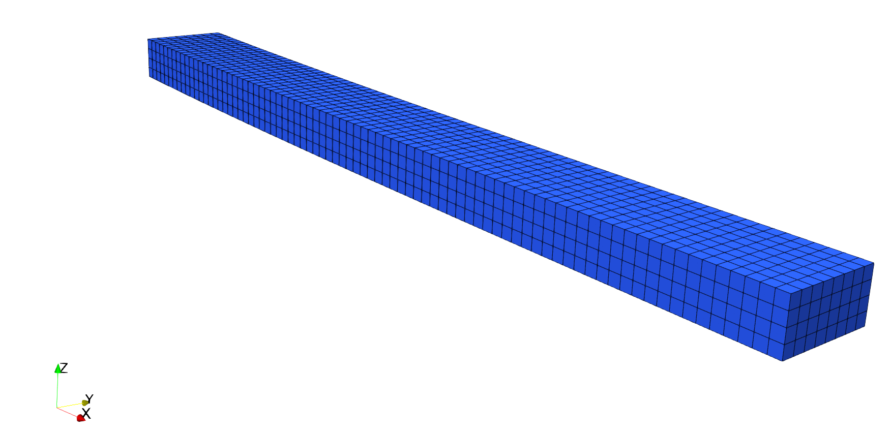

.. _TutorialElasticity:

############################################################
Tutorial 4: Boundary Conditions and Time-Dependent Functions
############################################################

**Context**

In this tutorial, we use a small strain linear elastic based solid mechanics solver
(see :ref:`SolidMechanicsLagrangianFEM`) from GEOS to solve for the bending problem of
a three-dimensional cantilever beam. The beam is fixed at one end, and subjects to a traction force pointing to the y-positive direction on the other end. The beam is deformed in the x-y plane.

**Objectives**

At the end of this tutorial, you will know:

  - how to use the solid mechanics solver to solve a quasistatic problem,
  - how to set up displacement boundary condition at element nodes,
  - how to set up traction boundary condition on element surfaces,
  - how to use a table function to control time-dependent loading.

**Input file**

This tutorial uses no external input files and everything required is
contained within a single GEOS input file.
The xml input file for this test case is located at:

.. code-block:: console

  inputFiles/solidMechanics/beamBending_base.xml
  inputFiles/solidMechanics/beamBending_benchmark.xml

------------------------------------
Discretized computational domain
------------------------------------

The following mesh is used in this tutorial:

This mesh contains 80 x 8 x 4 eight-node brick elements in the x, y and z directions, respectively.
Here, the ``InternalMesh``
is used to generate a structured three-dimensional mesh with ``C3D8`` as
the ``elementTypes``. This mesh is defined as a cell block with the name
``cb1``.

.. literalinclude:: ../../../../../inputFiles/solidMechanics/beamBending_benchmark.xml
  :language: xml
  :start-after: <!-- SPHINX_BeamBendingMesh -->
  :end-before:  <!-- SPHINX_BeamBendingMeshEnd -->

------------------------------------
Gravity
------------------------------------
The gravity is turned off explicitly at the beginning of the input file:

.. literalinclude:: ../../../../../inputFiles/solidMechanics/beamBending_benchmark.xml
  :language: xml
  :start-after: <!-- SPHINX_Gravity -->
  :end-before:  <!-- SPHINX_GravityEnd -->

------------------------------------
Solid mechanics solver
------------------------------------
The solid mechanics solver is based on the small strain Lagrangian finite element formulation.
The problem is run as ``QuasiStatic`` without considering the beam inertial. The computational
domain is discretized by ``FE1``,
which is defined in the ``NumericalMethods`` block. The material is designated as
``shale``, whose properties are defined in the
``Constitutive`` block.

.. literalinclude:: ../../../../../inputFiles/solidMechanics/beamBending_benchmark.xml
  :language: xml
  :start-after: <!-- SPHINX_SolidMechanicsSolver -->
  :end-before:  <!-- SPHINX_SolidMechanicsSolverEnd -->

------------------------------------
Finite element discretization
------------------------------------
The computational domain is discretized by ``C3D8`` elements with the first order interpolation
functions at each direction in the parent domain. The 2 x 2 x 2 Gauss quadrature rule is adopted to be
compatible with the first order interpolation functions.

.. literalinclude:: ../../../../../inputFiles/solidMechanics/beamBending_smoke.xml
  :language: xml
  :start-after: <!-- SPHINX_FEDiscretization -->
  :end-before:  <!-- SPHINX_FEDiscretizationEnd -->

------------------------------------
Constitutive model
------------------------------------
Recall that in the ``SolidMechanicsLagrangianSSLE`` block,
``shale`` is designated as the material in the computational domain. Here, the material
is defined as linear isotropic.

.. literalinclude:: ../../../../../inputFiles/solidMechanics/beamBending_base.xml
  :language: xml
  :start-after: <!-- SPHINX_Material -->
  :end-before:  <!-- SPHINX_MaterialEnd -->

------------------------------------
Boundary conditions
------------------------------------
As aforementioned, the beam is fixed on one end, and subjects to surface traction on
the other end. These boundary conditions are set up through the ``FieldSpecifications`` block.
Here, ``nodeManager`` and
``faceManager``
in the ``objectPath`` indicate that the boundary conditions are applied to the element nodes and faces, respectively.
Component ``0``, ``1``, and ``2`` refer to the x, y, and z direction, respectively. And the non-zero values given by
``Scale`` indicate the magnitude of the loading. Some shorthands, such as
``xneg`` and ``xpos``, are used as the locations where the boundary conditions are applied in the computational domain.
For instance, ``xneg`` means the portion of the computational domain located at the left-most in the x-axis, while
``xpos`` refers to the portion located at the right-most area in the x-axis. Similar shorthands include ``ypos``, ``yneg``,
``zpos``, and ``zneg``. Particularly, the time-dependent loading applied at the beam tip is defined through a function with
the name ``timeFunction``.

.. literalinclude:: ../../../../../inputFiles/solidMechanics/beamBending_base.xml
  :language: xml
  :start-after: <!-- SPHINX_BoundaryConditions -->
  :end-before:  <!-- SPHINX_BoundaryConditionsEnd -->

------------------------------------
Table function
------------------------------------
A table function is used to define the time-dependent loading at the beam tip. The ``coordinates`` and ``values`` form a time-magnitude
pair for the loading time history. In this case, the loading magnitude increases linearly as the time evolves.

.. literalinclude:: ../../../../../inputFiles/solidMechanics/beamBending_base.xml
  :language: xml
  :start-after: <!-- SPHINX_TableFunction -->
  :end-before:  <!-- SPHINX_TableFunctionEnd -->

------------------------------------
Execution
------------------------------------
Finally, the execution of the simulation is set up in the ``Events`` block, where
``target`` points to the solid mechanics solver defined in the ``Solvers`` block, and
the time increment ``forceDt`` is set as 1.0s.

.. literalinclude:: ../../../../../inputFiles/solidMechanics/beamBending_base.xml
  :language: xml
  :start-after: <!-- SPHINX_Execution -->
  :end-before:  <!-- SPHINX_ExecutionEnd -->

------------------------------------
Result
------------------------------------
The deformed beam is shown as following (notice that the displacement is visually magnified):

------------------------------------
To go further
------------------------------------

**Feedback on this tutorial**

This concludes the solid mechanics for small-strain linear elasticity tutorial.
For any feedback on this tutorial, please submit a `GitHub issue on the project's GitHub page <https://github.com/GEOS-DEV/GEOS/issues>`_.

**For more details**

  - More on meshes, please see :ref:`Meshes`.
  - More on events, please see :ref:`EventManager`.
