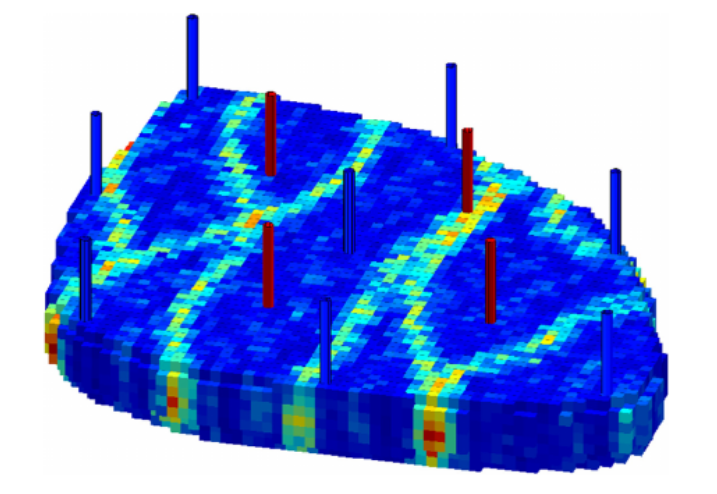
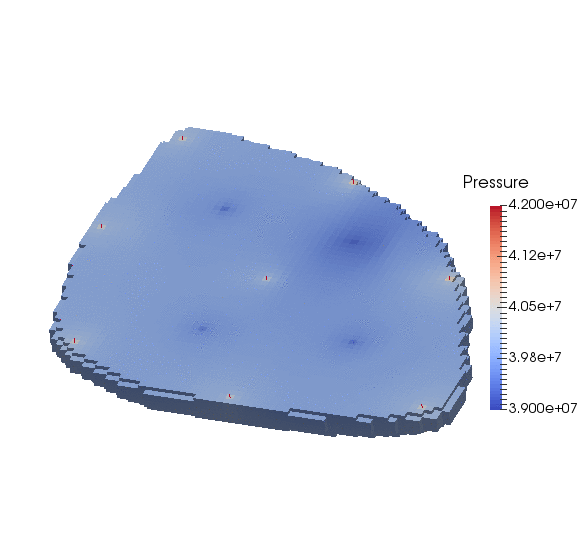
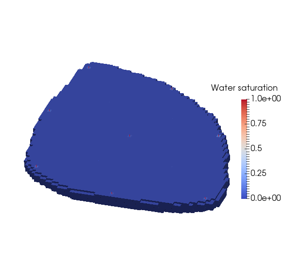

.. _TutorialDeadOilEgg:

########################################################
Tutorial 5: Multiphase flow in the Egg model  
########################################################

**Context**

In this tutorial, we illustrate the concepts presented in :ref:`TutorialDeadOilBottomLayersSPE10`
using the three-dimensional `Egg model <https://rmets.onlinelibrary.wiley.com/doi/full/10.1002/gdj3.21>`_.
We show how to set up a water injection problem relying on a Dead-Oil thermodynamic model.
The twelve wells (four producers and eight injectors) are placed according to the description
of the original test case.

**Objectives**

In this tutorial, we re-use many GEOSX features already presented in
:ref:`TutorialDeadOilBottomLayersSPE10`, with a focus on:

- how to import an external mesh with embedded geological properties (permeability) in the GMSH format (``.msh``),
- how to choose constitutive parameters matching those of the original test case, 
- how to tune the time stepping strategy and the nonlinear solver parameters.
  
**Input file**

This tutorial is based on the XML file located at

.. code-block:: console

  src/coreComponents/physicsSolvers/fluidFlow/benchmarks/Egg/dead_oil_egg.xml

The mesh file corresponding to the Egg model is stored in the GEOSXDATA repository.
Therefore, you must first download the GEOSXDATA repository in the same folder
as the GEOSX repository to run this test case.

.. note::
        GEOSXDATA is a separate repository in which we store large mesh files in order to keep the main GEOSX repository lightweight.
   
------------------------------------
GEOSX input file
------------------------------------

The XML file considered here follows the typical structure of the GEOSX input files:

 #. :ref:`Solver <Solver_tag_dead_oil_egg_model>`
 #. :ref:`Mesh <Mesh_tag_dead_oil_egg_model>`
 #. :ref:`Geometry <Geometry_tag_dead_oil_egg_model>`
 #. :ref:`Events <Events_tag_dead_oil_egg_model>`
 #. :ref:`NumericalMethods <NumericalMethods_tag_dead_oil_egg_model>`
 #. :ref:`ElementRegions <ElementRegions_tag_dead_oil_egg_model>`
 #. :ref:`Constitutive <Constitutive_tag_dead_oil_egg_model>`
 #. :ref:`FieldSpecifications <FieldSpecifications_tag_dead_oil_egg_model>`
 #. :ref:`Outputs <Outputs_tag_dead_oil_egg_model>`

.. _Solver_tag_dead_oil_egg_model:

Solvers
-------

In this tutorial, we use the approach described in :ref:`TutorialDeadOilBottomLayersSPE10`
to couple reservoir flow with wells.
That is, we define a *coupling solver* of type **CompositionalMultiphaseReservoir**
named ``coupledFlowAndWells``. 
This coupling solver drives the simulation and is in charge of binding the following
single-physics solvers:

- the single-physics reservoir flow solver, a solver of type **CompositionalMultiphaseFlow** named ``compositionalMultiphaseFlow`` and documented at :ref:`CompositionalMultiphaseFlow`,
- the single-physics well solver, a solver of type **CompositionalMultiphaseWell** named ``compositionalMultiphaseWell`` and documented at :ref:`CompositionalMultiphaseWell`.

The **Solvers** XML block is shown below.
The coupling solver points to the two single-physics solvers using the attributes
``flowSolverName`` and ``wellSolverName``.
We use the same names as in :ref:`TutorialDeadOilBottomLayersSPE10` for simplicity, but
these names can be chosen by the user and are not imposed by GEOSX.
The flow solver is applied to the reservoir and the well solver is applied to the wells,
as specified by their respective ``targetRegions`` attributes.
  
The solver information is specified in the **NonlinearSolverParameters** and
**LinearSolverParameters** XML blocks.
These blocks should be nested in the **CompositionalMultiphaseReservoir** XML block since
the coupling solver drives the solution strategy.
Note that any solver information specified in the single-phase physics XML blocks will
not be taken into account.

Here, we instruct GEOSX to perform at least ``newtonMinIter = 1`` Newton iterations and
at most ``newtonMaxIter = 10``. GEOSX will adjust the time step size as follows:

- if the Newton solver converges in ``dtIncIterLimit x newtonMaxIter = 5`` iterations or fewer, GEOSX will double the time step size for the next time step,
- if the Newton solver converges in ``dtCutIterLimit x newtonMaxIter = 8`` iterations or more, GEOSX will reduce the time step size for the next time step by a factor ``timestepCutFactor = 0.1``,
- if the Newton solver fails to converge in ``newtonMaxIter = 10``, GEOSX will cut the time step size by a factor ``timestepCutFactor = 0.1`` and restart from the previous converged time step.

The maximum number of time step cuts is specified by the attribute ``maxTimeStepCuts``.
Note that a backtracking line search can be activated by setting the attribute ``lineSearchAction`` to 1 or 2.
If ``lineSearchAction = 1``, we accept the nonlinear iteration even if the line search does not reduce the residual norm.
If ``lineSearchAction = 1``, we cut the time step if the line search does not reduce the residual norm. 

.. literalinclude:: ../../../../coreComponents/physicsSolvers/fluidFlow/benchmarks/Egg/dead_oil_egg.xml
  :language: xml
  :start-after: <!-- SPHINX_TUT_DEAD_OIL_EGG_SOLVERS -->
  :end-before: <!-- SPHINX_TUT_DEAD_OIL_EGG_SOLVERS_END -->

.. _Mesh_tag_dead_oil_egg_model:

Specifying a reservoir mesh and defining the geometry of the wells
------------------------------------------------------------------

The **Mesh** block consists of two parts:

- The reservoir mesh is described in the **PAMELAMeshGenerator** block,
- The wells are described in the **InternalWell** blocks, with one well per block.

The reservoir mesh is imported from a ``.msh`` file that contains the mesh geometry
and also includes the permeability values in the x, y, and z directions.
These quantities must be specified using the metric unit system, i.e., in meters
for the well geometry and square meters for the permeability field.
We note that the mesh file only contains the active cells, so there is no keyword
needed in the XML file  to define them.

As in :ref:`TutorialDeadOilBottomLayersSPE10`, the geometry of the twelve wells is defined
internally using the description provided in the **InternalWell** XML blocks.
We remind the user that each block **InternalWell** must point to the reservoir mesh
(using the attribute ``meshName``), the corresponding well region (using
the attribute ``wellRegionName``), and the corresponding well control
(using the attribute ``wellControlName``).
Each well is defined using a vertical polyline going through the seven layers of the
mesh, with a perforation in each layer.
The well transmissibility factors employed to compute the perforation rates are calculated
internally using the Peaceman formulation.
The well placement implemented here follows the pattern of the original test case.

.. literalinclude:: ../../../../coreComponents/physicsSolvers/fluidFlow/benchmarks/Egg/dead_oil_egg.xml
  :language: xml
  :start-after: <!-- SPHINX_TUT_DEAD_OIL_EGG_MESH -->
  :end-before: <!-- SPHINX_TUT_DEAD_OIL_EGG_MESH_END -->

.. _Geometry_tag_dead_oil_egg_model:

Geometry tag
-----------------

The **Geometry** XML block was used in the single-phase tutorials to specify boundary conditions.
Since we use wells and assume no-flow boundary conditions in this tutorial, the **Geometry**
block is not needed.

.. _Events_tag_dead_oil_egg_model:

Specifying events
------------------------

In the **Events** XML block, we specify two types of **PeriodicEvents**.

The periodic event named ``solverApplications`` notifies GEOSX that the
coupled solver ``coupledFlowAndWells`` has to be applied to its target
regions (here, reservoir and wells) at every time step.
The time stepping strategy has been fully defined in the **CompositionalMultiphaseReservoir**
coupling block using the ``initialDt`` attribute and the **NonlinearSolverParameters**
nested block.

As in :ref:`TutorialDeadOilBottomLayersSPE10`, we also define an output event
instructing GEOSX to write out ``.vtk`` files at the time frequency specified
by the attribute ``timeFrequency``.
The ``target`` attribute must point to the **VTK** sub-block of the **Outputs**
block (defined at the end of the XML file) by name (here, ``vtkOutput``).

.. literalinclude:: ../../../../coreComponents/physicsSolvers/fluidFlow/benchmarks/Egg/dead_oil_egg.xml
  :language: xml
  :start-after: <!-- SPHINX_TUT_DEAD_OIL_EGG_EVENTS -->
  :end-before: <!-- SPHINX_TUT_DEAD_OIL_EGG_EVENTS_END -->

.. _NumericalMethods_tag_dead_oil_egg_model:

Defining Numerical Methods
----------------------------------

In the ``NumericalMethods`` XML block, we instruct GEOSX to use a TPFA finite-volume
numerical scheme.
This part is identical to the corresponding section of :ref:`TutorialDeadOilBottomLayersSPE10`.

.. literalinclude:: ../../../../coreComponents/physicsSolvers/fluidFlow/benchmarks/Egg/dead_oil_egg.xml
  :language: xml
  :start-after: <!-- SPHINX_TUT_DEAD_OIL_EGG_NUMERICAL_METHODS -->
  :end-before: <!-- SPHINX_TUT_DEAD_OIL_EGG_NUMERICAL_METHODS_END -->

.. _ElementRegions_tag_dead_oil_egg_model:

Defining reservoir and well regions
-----------------------------------

In this section of the input file, we follow the procedure already described in
:ref:`TutorialDeadOilBottomLayersSPE10` for the definition of the reservoir and well
regions.

We associate a **CellElementRegion** named ``reservoir`` to the reservoir mesh.
Since we have imported a mesh with one region consisting of hexahedral cells, we
must set the attribute ``cellBlocks`` to ``DEFAULT_HEX``.

.. note::
        If you use a name that is not ``DEFAULT_HEX`` for this attribute, GEOSX will throw an error at the beginning of the simulation.

We also associate a **WellElementRegion** to each well. As the **CellElementRegion**,
it contains a ``materialList`` that must point (by name) to the constitutive models
defined in the **Constitutive** XML block.

.. literalinclude:: ../../../../coreComponents/physicsSolvers/fluidFlow/benchmarks/Egg/dead_oil_egg.xml
  :language: xml
  :start-after: <!-- SPHINX_TUT_DEAD_OIL_EGG_ELEMENT_REGIONS -->
  :end-before: <!-- SPHINX_TUT_DEAD_OIL_EGG_ELEMENT_REGIONS_END -->

.. _Constitutive_tag_dead_oil_egg_model:

Defining material properties with constitutive laws
---------------------------------------------------------------------

The **CompositionalMultiphaseFlow** physics solver relies on at least three types of constitutive
models listed in the **Constitutive** XML block:

- a fluid model describing the thermodynamics behavior of the fluid mixture,
- a relative permeability model,
- a rock compressibility model.

All the parameters must be provided using the SI unit system.

Although the original Egg test case only involves two phases, the Dead-Oil model currently
implemented in GEOSX requires the definition of three phases (oil, gas, and water).
This is done in the **BlackOilFluid** XML block. The same is true for the relative permeability
model introduced in the **BrooksCoreyRelativePermeability** block.

.. note::
        The names and order of the phases listed for the attribute ``phaseNames`` must be identical in the fluid model and the relative permeability model.

The rock compressibility is defined in the
**PoreVolumeCompressibleSolid** block.
The parameters of these three blocks have been chosen to be close to the original specifications
of the Egg test case.

.. literalinclude:: ../../../../coreComponents/physicsSolvers/fluidFlow/benchmarks/Egg/dead_oil_egg.xml
  :language: xml
  :start-after: <!-- SPHINX_TUT_DEAD_OIL_EGG_CONSTITUTIVE -->
  :end-before: <!-- SPHINX_TUT_DEAD_OIL_EGG_CONSTITUTIVE_END -->

.. _FieldSpecifications_tag_dead_oil_egg_model:

Defining properties with the FieldSpecifications
---------------------------------------------------------------------

We are ready to specify the reservoir initial conditions of the problem in the **FieldSpecifications**
XML block.
The well variables do not have to be initialized here since they will be defined internally.

The formulation of the **CompositionalMultiphaseFlow** physics solver (documented
at :ref:`CompositionalMultiphaseFlow`) requires the definition of the initial pressure field
and initial global component fractions.
We define here a uniform pressure field that does not satisfy the hydrostatic equilibrium,
but a hydrostatic initialization of the pressure field is possible using :ref:`FunctionManager`:.
For the initialization of the global component fractions, we remind the user that their ``component``
attribute (here, 0, 1, or 2) is used to point to a specific entry of the ``phaseNames`` attribute
in the **BlackOilFluid** block. 

Note that we also define the uniform porosity field here since it is not included in the mesh file
imported by the **PAMELAMeshGenerator**.

.. literalinclude:: ../../../../coreComponents/physicsSolvers/fluidFlow/benchmarks/Egg/dead_oil_egg.xml
  :language: xml
  :start-after: <!-- SPHINX_TUT_DEAD_OIL_EGG_FIELD_SPECS -->
  :end-before: <!-- SPHINX_TUT_DEAD_OIL_EGG_FIELD_SPECS_END -->

.. _Outputs_tag_dead_oil_egg_model:

Specifying the output formats
----------------------------------

In this section, we request an output of the results in VTK format.
Note that the name defined here must match the name used in the **Events** XML block to define the output frequency.

.. literalinclude:: ../../../../coreComponents/physicsSolvers/fluidFlow/benchmarks/Egg/dead_oil_egg.xml
  :language: xml
  :start-after: <!-- SPHINX_TUT_DEAD_OIL_EGG_OUTPUT -->
  :end-before: <!-- SPHINX_TUT_DEAD_OIL_EGG_OUTPUT_END -->

All elements are now in place to run GEOSX.

------------------------------------
Running GEOSX
------------------------------------

The first few lines appearing to the console are indicating that the XML elements are read and registered correctly:

.. code-block:: console

  Adding Solver of type CompositionalMultiphaseReservoir, named coupledFlowAndWells
  Adding Solver of type CompositionalMultiphaseFlow, named compositionalMultiphaseFlow
  Adding Solver of type CompositionalMultiphaseWell, named compositionalMultiphaseWell
  Adding Mesh: PAMELAMeshGenerator, mesh
  Adding Mesh: InternalWell, wellProducer1
  Adding Mesh: InternalWell, wellProducer2
  Adding Mesh: InternalWell, wellProducer3
  Adding Mesh: InternalWell, wellProducer4
  Adding Mesh: InternalWell, wellInjector1
  Adding Mesh: InternalWell, wellInjector2
  Adding Mesh: InternalWell, wellInjector3
  Adding Mesh: InternalWell, wellInjector4
  Adding Mesh: InternalWell, wellInjector5
  Adding Mesh: InternalWell, wellInjector6
  Adding Mesh: InternalWell, wellInjector7
  Adding Mesh: InternalWell, wellInjector8
  Adding Event: PeriodicEvent, solverApplications
  Adding Event: PeriodicEvent, vtk
  Adding Event: PeriodicEvent, silo
  Adding Output: Silo, siloOutput
  Adding Output: VTK, vtkOutput
  Adding Object CellElementRegion named reservoir from ObjectManager::Catalog.
  Adding Object WellElementRegion named wellRegion1 from ObjectManager::Catalog.
  Adding Object WellElementRegion named wellRegion2 from ObjectManager::Catalog.
  Adding Object WellElementRegion named wellRegion3 from ObjectManager::Catalog.
  Adding Object WellElementRegion named wellRegion4 from ObjectManager::Catalog.
  Adding Object WellElementRegion named wellRegion5 from ObjectManager::Catalog.
  Adding Object WellElementRegion named wellRegion6 from ObjectManager::Catalog.
  Adding Object WellElementRegion named wellRegion7 from ObjectManager::Catalog.
  Adding Object WellElementRegion named wellRegion8 from ObjectManager::Catalog.
  Adding Object WellElementRegion named wellRegion9 from ObjectManager::Catalog.
  Adding Object WellElementRegion named wellRegion10 from ObjectManager::Catalog. 
  Adding Object WellElementRegion named wellRegion11 from ObjectManager::Catalog.
  Adding Object WellElementRegion named wellRegion12 from ObjectManager::Catalog.
                
This is followed by the creation of the 18553 hexahedral cells of the imported mesh:  

.. code-block:: console

  0 >>> **********************************************************************
  0 >>>                          PAMELA Library Import tool                   
  0 >>> **********************************************************************
  0 >>> GMSH FORMAT IDENTIFIED
  0 >>> *** Importing Gmsh mesh format...
  0 >>> Reading nodes...
  0 >>> Done0
  0 >>> Reading elements...
  0 >>> Reading element data...
  0 >>> Number of nodes = 22227
  0 >>> Number of triangles = 0
  0 >>> Number of quadrilaterals = 0
  0 >>> Number of tetrahedra = 0
  0 >>> Number of hexahedra = 18553
  0 >>> Number of pyramids = 0
  0 >>> Number of prisms = 0
  0 >>> *** Done
  0 >>> *** Creating Polygons from Polyhedra...
  0 >>> 59205 polygons have been created
  0 >>> *** Done
  0 >>> *** Perform partitioning...
  0 >>> TRIVIAL partioning...
  0 >>> Ghost elements...
  0 >>> Clean mesh...
  0 >>> *** Done...
  0 >>> Clean Adjacency...
  0 >>> *** Done...
                
When ``Running simulation`` is shown, we are done with the case set-up and
the code steps into the execution of the simulation itself:

.. code-block:: console

  Running simulation 
  Time: 0s, dt:1000s, Cycle: 0
    Attempt:  0, NewtonIter:  0 ; 

    Attempt:  0, NewtonIter:  1 ; 
  Last LinSolve(iter,res) = (  1, 2.22e-16) ; 
    Attempt:  0, NewtonIter:  2 ; 
  Last LinSolve(iter,res) = (  1, 2.22e-16) ; 
    Attempt:  0, NewtonIter:  3 ; 
  Last LinSolve(iter,res) = (  1, 2.22e-16) ; 
    Attempt:  0, NewtonIter:  4 ; 
  Last LinSolve(iter,res) = (  1, 2.22e-16) ; 
    Attempt:  0, NewtonIter:  5 ; 
  Last LinSolve(iter,res) = (  1, 2.22e-16) ; 
    Attempt:  0, NewtonIter:  6 ; 
                
------------------------------------
Visualization of results
------------------------------------

A file compatible with Paraview is produced in this tutorial.
It is found in the output folder, and usually has the extension `.pvd`.
More details about this file format can be found 
`here <https://www.paraview.org/Wiki/ParaView/Data_formats#PVD_File_Format>`_.
We can load this file into Paraview directly and visualize results:

|pic1| |pic2|

------------------------------------
To go further
------------------------------------

**Feedback on this tutorial**

This concludes the tutorial on setting up a Dead-Oil simulation in the Egg model.
For any feedback on this tutorial, please submit
a `GitHub issue on the project's GitHub page <https://github.com/GEOSX/GEOSX/issues>`_.

**Next tutorial**

In the next tutorial :ref:`TutorialCO2FieldCaseUnstructuredGrid`, we learn how to run a
more complex test case based on an unstructured mesh.

**For more details**

  - A complete description of the reservoir flow solver is found here: :ref:`CompositionalMultiphaseFlow`.
  - The well solver is description at :ref:`CompositionalMultiphaseWell`. 
  - The available constitutive models are listed at :ref:`Constitutive`.

