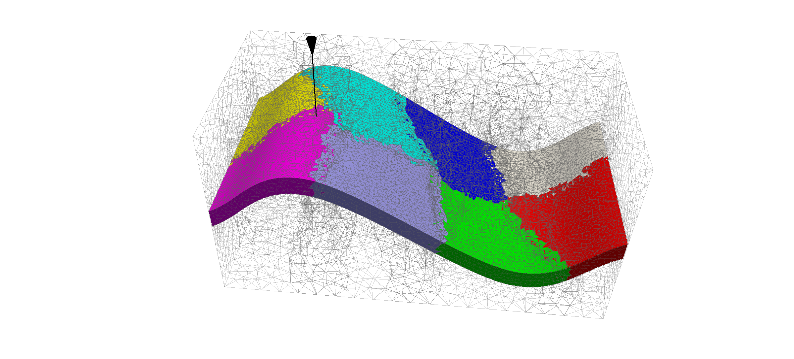
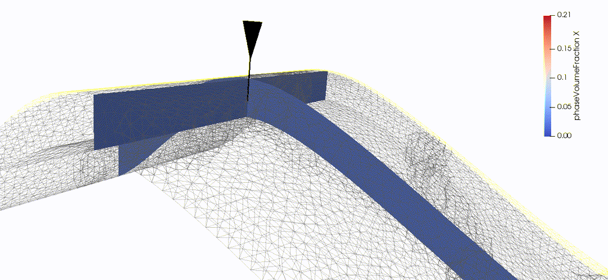
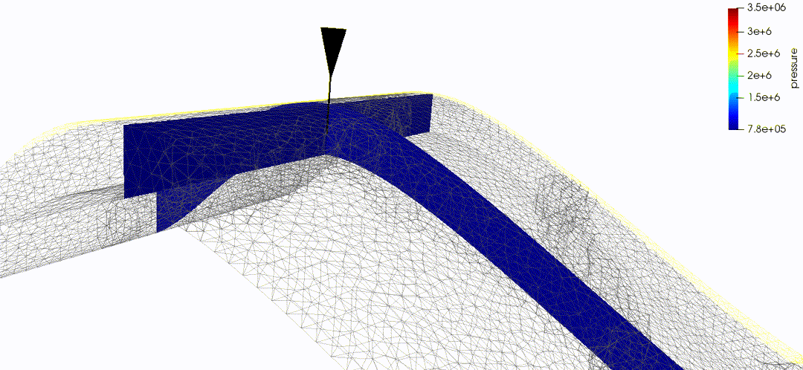

.. _TutorialCO2FieldCaseUnstructuredGrid:

##################################################################
Tutorial 6: CO :sub:`2` injection into an unstructured grid 
##################################################################

**Context**

In this tutorial, we go on with our previous field case (see :ref:`TutorialFieldCase`) adding a CO :sub:`2` injection well in the highest point of the reservoir. 

**Objectives**

At the end of this tutorial you will know:

 - how to set up a CO :sub:`2` injection scenario,
 - how to add well coupling into the domain, 
 - how to run a case using MPI-parallelism.

**Input file**

The XML file for this test case is located at :

.. code-block:: console

  src/coreComponents/physicsSolvers/multiphysics/integratedTests/FieldCaseCo2InjTutorial.xml

We consider the field case mesh as a numerical support to the simulations with a single injection point:

This mesh contains three continuous regions:

- a top region (overburden, elementary tag = 1).
- a middle region (reservoir layer, elementary tag = 2),
- a bottom region (underburden, elementary tag = 3).

A single injection wellbore is at the center of the reservoir. The picture shows an example of the 8-core METIS partitioning used to launch the simulation.

------------------------------------
GEOSX input file
------------------------------------

The XML file considered here follows the typical structure of the GEOSX input files:

 #. :ref:`Solver <Solver_tag_co2_field_case>`
 #. :ref:`Mesh <Mesh_tag_co2_field_case>`
 #. :ref:`Geometry <Geometry_tag_co2_field_case>`
 #. :ref:`Events <Events_tag_co2_field_case>`
 #. :ref:`NumericalMethods <NumericalMethods_tag_co2_field_case>`
 #. :ref:`ElementRegions <ElementRegions_tag_co2_field_case>`
 #. :ref:`Constitutive <Constitutive_tag_co2_field_case>`
 #. :ref:`FieldSpecifications <FieldSpecifications_tag_co2_field_case>`
 #. :ref:`Outputs <Outputs_tag_co2_field_case>`

.. _Solver_tag_co2_field_case:

Defining a solver
-----------------
Let us inspect the **Solver** XML tags.
It consists of 3 blocks **CompositionalMultiphaseFlow**, **CompositionalMultiphaseWell** and **CompositionalMultiphaseReservoir**, which are respectively handling the solution from multiphase flow in the reservoir, multiphase flow in the wells, and coupling between those two parts.

.. literalinclude:: ../../../../coreComponents/physicsSolvers/multiphysics/integratedTests/FieldCaseCo2InjTutorial.xml
  :language: xml
  :start-after: <!-- SPHINX_FIELD_CASE_Co2_SOLVER -->
  :end-before: <!-- SPHINX_FIELD_CASE_Co2_SOLVER_END -->

In the **CompositionalMultiphaseFlow** (:ref:`CompositionalMultiphaseFlow`), a classical multiphase compositional solver is detailed, including a TPFA discretization, reference to fluid data through ``fluidNames``, to solid data through ``solidNames`` and to relative permeability models through ``relPermNames`` attributes.

The **CompositionalMultiphaseWell** (:ref:`CompositionalMultiphaseWell`)  consists of wellbore specifications (see :ref:`TutorialDeadOilBottomLayersSPE10` for detailed tutorial on wells integration). As its reservoir counterpart, it includes references to fluid and relative permeability models, but also defines a  **WellControls** sub-tag, that can specified injector and producer `control` splitting between BHP-controlled or rate-controlled. Alongside with that attribute are the ``targetBHP`` and ``targetRate`` that specify the maximal admissible pressure and rate for the well. The injector-specific attribute, ``injectionStream``, describes the composition of the injected mixture.

The coupling section **CompositionalMultiphaseReservoir** describes the binding between those two previous elements (see :ref:`TutorialPoroelasticity` for detailed tutorial on coupling physics in GEOSX). In addition to being bound to the previously described blocks through ``flowSolverName`` and ``wellSolverName`` sub-tags, it contains the ``initialDt`` starting time-step size value and defines the **NonlinearSolverParameters** and **LinearSolverParameters** that are used to control Newton-loop and linear solver behaviors (see :ref:`LinearSolvers` for a detailed description of linear solvers attributes). 

.. _Mesh_tag_co2_field_case:

Specifying a computational mesh
---------------------------------
The **Mesh** tag is used as in previous tutorials to import the field mesh either internally (:ref:`TutorialSinglePhaseFlowWithInternalMesh`) or externally (:ref:`TutorialSinglePhaseFlowExternalMesh`). In the current tutorial, this tag is also of paramount importance as it is where the **InternalWell** multi-segmented wells are defined. Apart from the ``name`` identifier attribute and their ``wellRegionName`` (:ref:`ElementRegions <ElementRegions_tag_co2_field_case>`) and ``wellControlsName`` (:ref:`Solver <Solver_tag_co2_field_case>`) binding attributes, ``polylineNodeCoords`` and ``polylineSegmentConn`` attributes are used to define the path of the wellbore and connections between its nodes. The ``numElementsPerSegment`` is discretizing the wellbore segments while the ``radius`` attribute specifies the wellbore radius (:ref:`TutorialDeadOilBottomLayersSPE10` for details on wellbore use). Once the wellbore is defined and discretized, the position of **Perforations** is defined using curvilinear distance from the head of the wellbore (``distanceFromHead``).

.. literalinclude:: ../../../../coreComponents/physicsSolvers/multiphysics/integratedTests/FieldCaseCo2InjTutorial.xml
  :language: xml
  :start-after: <!-- SPHINX_FIELD_CASE_Co2_MESH -->
  :end-before: <!-- SPHINX_FIELD_CASE_Co2_MESH_END -->

.. note::
        It is the responsibility of the user to make sure that there is a perforation in the bottom cell of the well mesh, otherwise an error will be thrown and the simulation will terminate.

.. _Geometry_tag_co2_field_case:

Geometry tag
----------------

The **Geometry** XML block was used in single-phase tutorials to specify boundary conditions.
Since we use wells and assume no-flow boundary conditions in this tutorial, the **Geometry**
block is not needed.

.. _Events_tag_co2_field_case:

Specifying events
------------------------
        
The solver is applied as a periodic event whose target is referred to as **Solvers/coupledFlowAndWells** name-tag.
Using the ``maxEventDt`` attribute, we specify a max time step size of 1.5 x 10^6 seconds.

The output event triggers a vtk output  every 10^7 seconds, constraining the solver schedule to match exactly these dates.
The output path to data is specified as a ``target`` of this **PeriodicEvent**.

An other periodic event is defined under the name ``restarts``.
It consists of saved checkpoints every 5 x 10^6 seconds, whose physical output folder name are defined under the **Output** tag.

Finally, the time history collection and output events are used to trigger the mechanisms involved in the generation of a time series of well pressure (see the procedure outlined in :ref:`TasksManager`).

.. literalinclude:: ../../../../coreComponents/physicsSolvers/multiphysics/integratedTests/FieldCaseCo2InjTutorial.xml
  :language: xml
  :start-after: <!-- SPHINX_FIELD_CASE_Co2_EVENTS -->
  :end-before: <!-- SPHINX_FIELD_CASE_Co2_EVENTS_END -->

.. _NumericalMethods_tag_co2_field_case:

Defining Numerical Methods
----------------------------------

The ``TwoPointFluxApproximation`` is chosen as our fluid equation discretization. The tag specifies:

- A primary field to solve for as ``fieldName``. For a flow problem, this field is pressure. 
- A ``fieldName`` used to specify boundary objects with boundary conditions.
- A ``coefficientName`` used for TPFA transmissibilities constructions.

Here, we specify ``targetRegions`` (we only solve flow equations in the reservoir portion of our model).

.. literalinclude:: ../../../../coreComponents/physicsSolvers/multiphysics/integratedTests/FieldCaseCo2InjTutorial.xml
  :language: xml
  :start-after: <!-- SPHINX_FIELD_CASE_Co2_NUMERICAL -->
  :end-before: <!-- SPHINX_FIELD_CASE_Co2_NUMERICAL_END -->

.. _ElementRegions_tag_co2_field_case:

Defining regions in the mesh
-----------------------------------

As in :ref:`TutorialFieldCase`, the **ElementRegions** tag allows us to distinguish the over- and underburden from the reservoir. The novelty here is the addition of **WellElementRegions** that are not bound to a cellBlock and contain a list of modeled materials.

.. literalinclude:: ../../../../coreComponents/physicsSolvers/multiphysics/integratedTests/FieldCaseCo2InjTutorial.xml
  :language: xml
  :start-after: <!-- SPHINX_FIELD_CASE_Co2_REGION -->
  :end-before: <!-- SPHINX_FIELD_CASE_Co2_REGION_END -->

.. _Constitutive_tag_co2_field_case:

Defining material properties with constitutive laws
-------------------------------------------------------

Under the **Constitutive** tag, three items can be found:

- **MultiPhaseMultiComponentFluid** : this tag defines phase names, component molar weights and characteristic behaviors such as viscosity and density dependencies with respect to pressure and temperature. 
- **PoreVolumeCompressibleSolid** : this tag contains all the data needed to model rock compressibility.
- **BrooksCoreyRelativePermeability** : this tag defines the relative permeability model for each phase, its end-point values, residual volume fractions (saturations), and Corey exponents.
          
.. literalinclude:: ../../../../coreComponents/physicsSolvers/multiphysics/integratedTests/FieldCaseCo2InjTutorial.xml
  :language: xml
  :start-after: <!-- SPHINX_FIELD_CASE_Co2_CONSTITUTIVE -->
  :end-before: <!-- SPHINX_FIELD_CASE_Co2_CONSTITUTIVE_END -->

One can notice that the PVT data specified by **MultiPhaseMultiComponentFluid** is set to model the behavior of CO2 in the liquid and gas phases as a function of pressure and temperature. These *pvtgas.txt* and *pvtliquid.txt* files are composed as follows:

.. code:: 

        DensityFun SpanWagnerCO2Density 1e6 1.5e7 5e4 94 96 1
        ViscosityFun FenghourCO2Viscosity 1e6 1.5e7 5e4 94 96 

.. code::
  
        DensityFun BrineCO2Density 1e6 1.5e7 5e4 94 96 1 0
        ViscosityFun BrineViscosity 0

The first keyword is an identifier for either a density or a viscosity model, generated by GEOSX at runtime. It is followed by an identifier for the type of model (see :ref:`FluidModels`). Then, the lower, upper and step increment values for pressure and temperature range are specified. The trailing 0 for BrineCO2Density entry is the salinity of the brine (see :ref:`CO2-EOS`).

.. note::
  The *0* value for *BrineViscosity* indicates that liquid CO2 viscosity is constant with respect to pressure and temperature. 

.. _FieldSpecifications_tag_co2_field_case:

Defining properties with the FieldSpecifications
---------------------------------------------------------------------

As in previous tutorials, the **FieldSpecifications** tag is used to declare fields such as directional permeability, reference porosity, initial pressure, and compositions. Here, these fields are homogeneous, except for the permeability field that is taken from the 5th layer of the SPE10 test case and specified in **Functions** as in :ref:`TutorialFieldCase`.

.. literalinclude:: ../../../../coreComponents/physicsSolvers/multiphysics/integratedTests/FieldCaseCo2InjTutorial.xml
  :language: xml
  :start-after: <!-- SPHINX_FIELD_CASE_Co2_FIELD -->
  :end-before: <!-- SPHINX_FIELD_CASE_Co2_FIELD_END -->

.. _Outputs_tag_co2_field_case:

Specifying output formats
----------------------------------

The **Outputs** XML tag is used to write visualization, restart, and time history files.

Here, we write visualization files in a format natively readable by Paraview under the tag **VTK**.
A **Restart** tag is also be specified. In conjunction with a **PeriodicEvent**,
a restart file allows to resume computations from a set checkpoint in time. 
Finally, we require an output of the well pressure history using the **TimeHistory** tag. 

.. literalinclude:: ../../../../coreComponents/physicsSolvers/multiphysics/integratedTests/FieldCaseCo2InjTutorial.xml
  :language: xml
  :start-after: <!-- SPHINX_FIELD_CASE_Co2_OUTPUT -->
  :end-before: <!-- SPHINX_FIELD_CASE_Co2_OUTPUT_END -->

.. _Tasks_tag_dead_oil_egg_model:

Specifying tasks
----------------------------------

In the **Events** block, we have defined an event requesting that a task periodically collects the pressure at the well.
This task is defined here, in the **PackCollection** XML sub-block of the **Tasks** block.
The task contains the path to the object on which the field to collect is registered (here, a ``WellElementSubRegion``) and the name of the field (here, ``pressure``).
The details of the history collection mechanism can be found in :ref:`TasksManager`. 

.. literalinclude:: ../../../../coreComponents/physicsSolvers/multiphysics/integratedTests/FieldCaseCo2InjTutorial.xml
  :language: xml
  :start-after: <!-- SPHINX_FIELD_CASE_Co2_TASKS -->
  :end-before: <!-- SPHINX_FIELD_CASE_Co2_TASKS_END -->

.. 
        ------------------------------------------------
        Using Functions to specify dependent properties
        ------------------------------------------------
        The *TableFunctions* are used to map heterogeneous properties (here permeabiity and porosity) onto the mesh via the reading of regular grid coordinate in *xlin.geos*, *ylin.geos* and *zlin.geos* and a ND-table at *voxelFile* adress containing heterogenous data. (see :ref:`TutorialFieldCase` for more details on those) 

------------------------------------
Running GEOSX
------------------------------------

The simulation can be launched with on 8 cores using MPI-parallelism: 

.. code-block:: console

  mpirun -np 8 geosx -i FieldCaseCo2InjTutorial.xml

Then, the multicore loading will rank-prefix the usual GEOSX mesh pre-treatment output as

.. code-block:: console

        1 >>> **********************************************************************
        1 >>>                          PAMELA Library Import tool                   
        1 >>> **********************************************************************
        1 >>> GMSH FORMAT IDENTIFIED
        1 >>> *** Importing Gmsh mesh format...
        3 >>> **********************************************************************
        6 >>> **********************************************************************
        6 >>>                          PAMELA Library Import tool                   
        6 >>> **********************************************************************
        6 >>> GMSH FORMAT IDENTIFIED
        3 >>>                          PAMELA Library Import tool                   
        3 >>> **********************************************************************
        3 >>> GMSH FORMAT IDENTIFIED
        6 >>> *** Importing Gmsh mesh format...
        3 >>> *** Importing Gmsh mesh format...
        7 >>> **********************************************************************
        7 >>>                          PAMELA Library Import tool                   
        7 >>> **********************************************************************
        7 >>> GMSH FORMAT IDENTIFIED
        7 >>> *** Importing Gmsh mesh format...
        0 >>> **********************************************************************
        0 >>>                          PAMELA Library Import tool                   
        0 >>> **********************************************************************
        0 >>> GMSH FORMAT IDENTIFIED
        0 >>> *** Importing Gmsh mesh format...
        5 >>> **********************************************************************
        5 >>>                          PAMELA Library Import tool                   
        5 >>> **********************************************************************
        5 >>> GMSH FORMAT IDENTIFIED
        5 >>> *** Importing Gmsh mesh format...
        4 >>> **********************************************************************
        4 >>>                          PAMELA Library Import tool                   
        4 >>> **********************************************************************
        4 >>> GMSH FORMAT IDENTIFIED
        4 >>> *** Importing Gmsh mesh format...
        2 >>> **********************************************************************
        2 >>>                          PAMELA Library Import tool                   
        2 >>> **********************************************************************
        2 >>> GMSH FORMAT IDENTIFIED
        2 >>> *** Importing Gmsh mesh format...
        7 >>> Reading nodes...
        4 >>> Reading nodes...
        1 >>> Reading nodes...
        5 >>> Reading nodes...
        0 >>> Reading nodes...
        6 >>> Reading nodes...
        3 >>> Reading nodes...
        2 >>> Reading nodes...
        6 >>> Done0
        6 >>> Reading elements...
        5 >>> Done0
        5 >>> Reading elements...
        4 >>> Done0
        4 >>> Reading elements...
        3 >>> Done0
        3 >>> Reading elements...
        1 >>> Done0
        1 >>> Reading elements...
        7 >>> Done0
        7 >>> Reading elements...
        0 >>> Done0
        0 >>> Reading elements...
        2 >>> Done0

A restart from a checkpoint file `FieldCaseCo2InjTutorial_restart_000000015.root` is always available thanks to the following command line :

.. code-block:: console

  mpirun -np 8 geosx -i FieldCaseCo2InjTutorial.xml -r FieldCaseCo2InjTutorial_restart_000000015  

The output then shows the loading of HDF5 restart files by each core. 

.. code-block:: console

        Loading restart file /work/simu/geosx/test/FieldCaseCo2InjTutorial_restart_000000015
        Rank 0: rankFilePattern = /work/simu/geosx/test/FieldCaseCo2InjTutorial_restart_000000015/rank_%07d.hdf5
        Rank 0: Reading in restart file at /work/simu/geosx/test/FieldCaseCo2InjTutorial_restart_000000015/rank_0000000.hdf5
        Rank 4: Reading in restart file at /work/simu/geosx/test/FieldCaseCo2InjTutorial_restart_000000015/rank_0000004.hdf5
        Rank 5: Reading in restart file at /work/simu/geosx/test/FieldCaseCo2InjTutorial_restart_000000015/rank_0000005.hdf5
        Rank 7: Reading in restart file at /work/simu/geosx/test/FieldCaseCo2InjTutorial_restart_000000015/rank_0000007.hdf5
        Rank 1: Reading in restart file at /work/simu/geosx/test/FieldCaseCo2InjTutorial_restart_000000015/rank_0000001.hdf5
        Rank 3: Reading in restart file at /work/simu/geosx/test/FieldCaseCo2InjTutorial_restart_000000015/rank_0000003.hdf5
        Rank 2: Reading in restart file at /work/simu/geosx/test/FieldCaseCo2InjTutorial_restart_000000015/rank_0000002.hdf5
        Rank 6: Reading in restart file at /work/simu/geosx/test/FieldCaseCo2InjTutorial_restart_000000015/rank_0000006.hdf5

------------------------------------
Visualization of results
------------------------------------

Post-treating under Paraview, we can isolate the *Reservoir* block and focus on planes orthogonal to the injection wellbore.  

.. image:: fcCo2_saturation-1.png
   :width: 600px

Closing up to the wellbore, we can see the reservoir filling up with CO :sub:`2`,

Inspecting the pressure value along the same plane slices, we can check pressure rise at the injector

------------------------------------
To go further
------------------------------------

**Feedback on this tutorial**

This concludes the CO :sub:`2` injection field case tutorial.
For any feedback on this tutorial, please submit a `GitHub issue on the project's GitHub page <https://github.com/GEOSX/GEOSX/issues>`_.

**Next tutorial**

In the next tutorial :ref:`TutorialElasticity`, we switch to mechanics and learn how to run a bending case to get familiar with mechanical problems in GEOSX.

**For more details**

  - A complete description of the reservoir flow solver is found here: :ref:`CompositionalMultiphaseFlow`.
  - The well solver is described at :ref:`CompositionalMultiphaseWell`. 
  - The available fluid constitutive models are listed at :ref:`FluidModels`.

