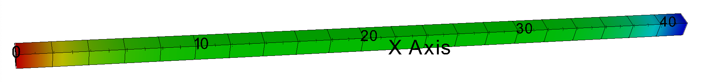
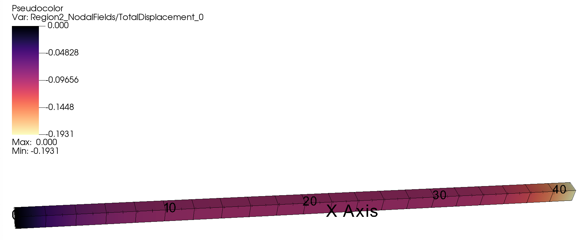
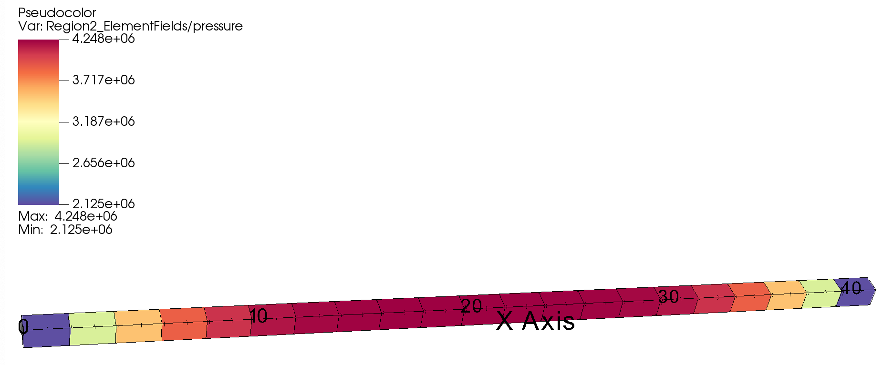

.. _TutorialPoroelasticity:

##############################################
Tutorial 8: Terzaghi's poroelastic problem
##############################################

**Context**

In this tutorial, we use a coupled solver to solve a
simple poroelastic Terzaghi-type problem.
We do so by coupling a single phase flow solver
with a small-strain Lagrangian mechanics solver.

**Objectives**

At the end of this tutorial you will know:

  - how to use multiple solvers for poroelastic problems,
  - how to define finite elements and finite volume numerical methods,
  - how to input traction as a function of time on a specific part of a domain.

**Input file**

This tutorial uses no external input files and everything required is
contained within a single GEOSX input file.
The xml input file for this test case is located at:

.. code-block:: console

  src/coreComponents/physicsSolvers/multiphysics/integratedTests/poroElastic_Terzaghi_monolithic.xml

------------------------------------------------------------------
Description of the case
------------------------------------------------------------------

Here, our goal is to apply a compressive force
on the extremity of a porous, beam-like, object.

GEOSX will calculate the local deformation and
pressure changes along the beam as a function of time.

------------------------------------------------------------------
Preparing the input files
------------------------------------------------------------------

All inputs for this case are contained inside a single XML file.
In this tutorial, we focus our attention on the ``Solvers`` tags,
the ``NumericalMethods`` tags, and we will briefly inspect the mesh
and field specification tags.

Solvers: setting up a multiphysics coupling
---------------------------------------------

GEOSX is a multi-physics tool. Different combinations of
physics solvers available in the code can be applied
in different regions of the mesh at different moments of the simulation.
The XML ``Solvers`` tag is used to list and parameterize these solvers.

To specify a coupling between two solvers, as done here,
we define and characterize each single-physics solver separately.
Then, we define a *coupling solver* between these single-physics
solvers as another, separate, solver.
This approach allows for generality and flexibility in our multi-physics resolutions.
The order in which these solver specifications is done is not important.
It is important, though, to instantiate each single-physic solvers
with meaningful names. The names given to these single-physics solver instances
will be used to recognize them and create the coupling.

To define a poroelastic coupling, we will effectively define three solvers:

 - the single-physics flow solver, a solver of type ``SinglePhaseFVM`` called here ``SinglePhaseFlow`` (more information on these solvers at :ref:`SinglePhaseFlow`),
 - the small-stress Lagrangian mechanics solver, a solver of type ``SolidMechanicsLagrangianSSLE`` called here ``lagsolve`` for Lagrangian Solver (more information here: :ref:`SolidMechanicsLagrangianFEM`),
 - the coupling solver that will bind the two single-physics solvers above, an object of type ``Poroelastic`` called here ``poroSolve`` (more information at :ref:`PoroelasticSolver`).
 
Note that the ``name`` attribute of these solvers is
chosen by the user and is not imposed by GEOSX.

The two single-physics solvers are parameterized as explained
in their respective documentation, each with their own tolerances,
verbosity levels, target regions,
and other solver-specific attributes.

Let us focus our attention on the coupling solver.
This solver (``poroSolve``) uses a set of attributes that specifically describe the
coupling for a poroelastic framework.
For instance, we must point this solver to the correct fluid solver (here: ``SinglePhaseFlow``), the correct solid solver (here: ``lagsolve``).
Now that these two solvers are tied together inside the coupling solver,
we have a coupled multiphysics problem defined.
More parameters are required to characterize a coupling.
Here, we specify the coupling type (``FIM``, fully implicit method; a choice among several possible options),
the discretization method (``FE1``, defined further in the input file),
and the target regions (here, we only have one, ``Region2``).

.. literalinclude:: ../../../../coreComponents/physicsSolvers/multiphysics/integratedTests/poroElastic_Terzaghi_monolithic.xml
  :language: xml
  :start-after: <!-- SPHINX_POROELASTIC_SOLVER -->
  :end-before: <!-- SPHINX_POROELASTIC_SOLVER_END -->

Multiphysics numerical methods
---------------------------------

Numerical methods in multiphysics settings are similar to single physics numerical methods. All can be defined under the same ``NumericalMethods`` XML tag.
In this problem, we use finite volume for flow and finite elements for solid mechanics.
Both of these methods require additional parameterization attributes to be defined here.

As we have seen before, the coupling solver and the solid mechanics solver require the specification of a discretization method called ``FE1``.
This discretization method is defined here as a finite element method
using linear basis functions and Gaussian quadrature rules.
For more information on defining finite elements numerical schemes,
please see the dedicated :ref:`FiniteElementDiscretization` section.

The finite volume method requires the specification of a discretization scheme.
Here, we use a two-point flux approximation as described in the dedicated documentation (found here: :ref:`FiniteVolumeDiscretization`).

.. literalinclude:: ../../../../coreComponents/physicsSolvers/multiphysics/integratedTests/poroElastic_Terzaghi_monolithic.xml
  :language: xml
  :start-after: <!-- SPHINX_POROELASTIC_NUMERICAL_METHODS -->
  :end-before: <!-- SPHINX_POROELASTIC_NUMERICAL_METHODS_END -->

  

Setting up the mesh
---------------------------------

Last, let us take a closer look at the geometry of this simple problem.
We use the internal mesh generator to create a beam-like mesh,
with one single element along the Y and Z axes, and 21 elements along the X axis.
All the elements are hexahedral elements (C3D8) of the same dimension (2x1x1 meters).

We also define a pair of geometric boxes that will help us
locate and specify our boundary conditions. These boundary conditions are defined under the ``FieldSpecifications`` tag.

.. literalinclude:: ../../../../coreComponents/physicsSolvers/multiphysics/integratedTests/poroElastic_Terzaghi_monolithic.xml
  :language: xml
  :start-after: <!-- SPHINX_POROELASTIC_MESH -->
  :end-before: <!-- SPHINX_POROELASTIC_MESH_END -->

  

To give some physical meaningfulness to our problem,
we specify the material properties of our beam domain in the
``Constitutive`` and ``FieldSpecifications`` sections.
Here, we have a homogeneous shaly material with a 0.3 porosity and an isotropic permeability of about 50mD, completely saturated with water.
The shale has a bulk modulus of 61.9 MPa, and a density of 2,700 kg/m3. Our beam is subject to compression forces exerted at one if its extremities.

As shown in the ``Events`` section, we run this simulation for 2,000 seconds. We use a function specification to change our constraints in time. For more on functions, see :ref:`FunctionManager`.

------------------------------------------------------------------
Running the case and inspecting the results
------------------------------------------------------------------

Running the case
---------------------------------

To run the case, use the following command:

``path/to/geosx -i src/coreComponents/physicsSolvers/multiphysics/integratedTests/poroElastic_Terzaghi_monolithic.xml``

When it is finished, if successful, you should see something like this:

.. code-block:: sh

  Cleaning up events
  Rank 0: Writing out restart file at poroElastic_Terzaghi_restart_000000014/rank_0000000.hdf5

  init time = 0.015293s, run time = 0.44605s
  Umpire            HOST high water mark:  540.6 KB

Inspecting the console output
---------------------------------

Depending on the individual level of log verbosity,
coupled solvers may display information about the Newton
convergence of each single-physics solver.

Here, we see for instance the ``RSolid`` and ``RFluid`` (residual values for solid and fluid mechanics solvers, respectively), and we see that the iterative coupling has converged in 5 iterations.

.. code-block:: sh

  ( RSolid ) = (1.22e-15) ; Last LinSolve(iter,tol) = ( 200, 1.00e-10) ;
    Iteration: 6, FlowSolver:
      Attempt:  0, NewtonIter:  0 ;
  ( Rfluid ) = (1.89e-07) ;
  ***** The iterative coupling has converged in 5 iterations! *****

Inspecting results
---------------------------------

We have requested VisIt formatted output in this file.
We can therefore import our Silo files into VisIt and visualize the outcome.

We can verify the pressure and displacements are conform to our expectations.

------------------------------------------------------------------
To go further
------------------------------------------------------------------

**Feedback on this tutorial**

This concludes the poroelastic tutorial.
For any feedback on this tutorial, please submit a `GitHub issue on the project's GitHub page <https://github.com/GEOSX/GEOSX/issues>`_.

**For more details**

  - More on poroelastic multiphysics solvers, please see :ref:`PoroelasticSolver`.
  - More on numerical methods, please see :ref:`NumericalMethodsManager`.
  - More on functions, please see :ref:`FunctionManager`.

