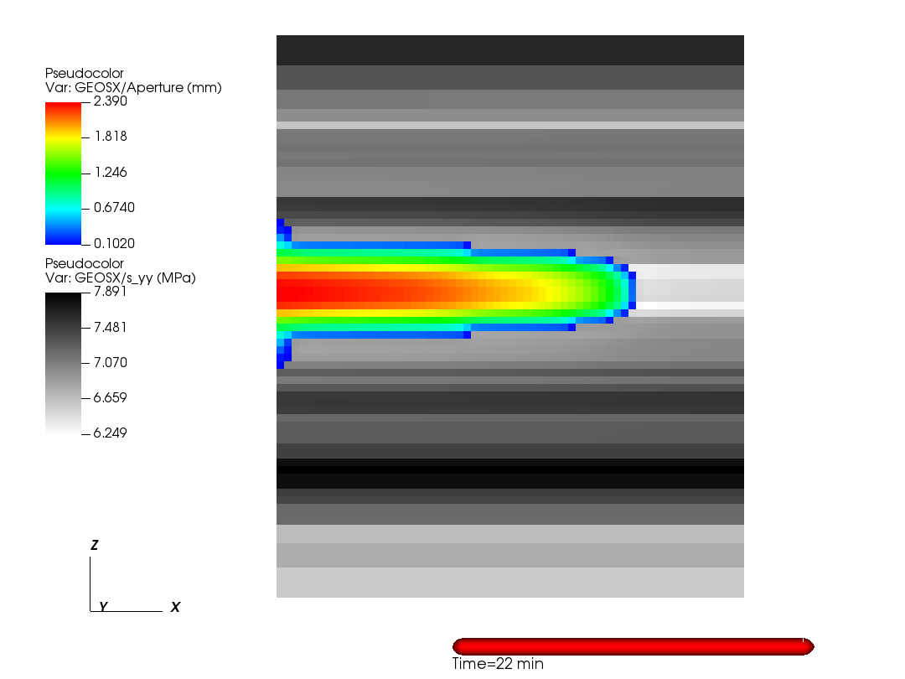
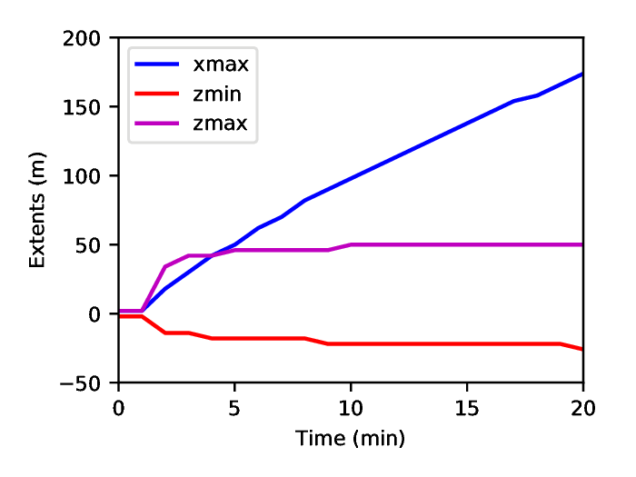
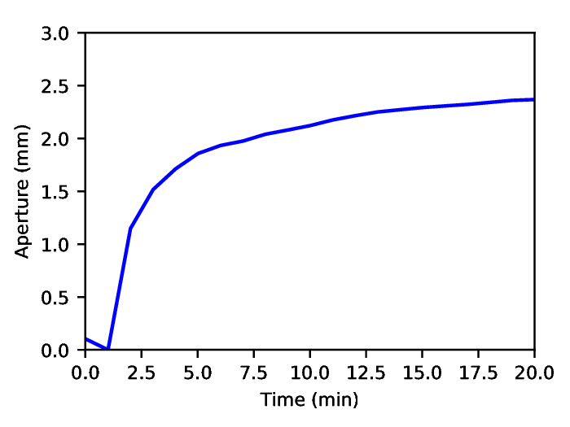
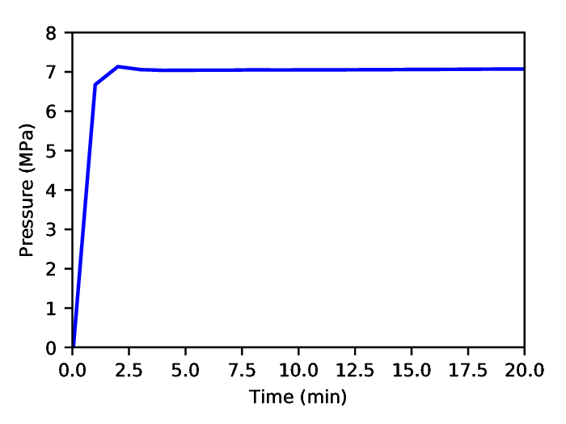

.. _TutorialHydraulicFractureWithAdvancedXML:

#####################################################
Tutorial 9: Hydraulic Fracturing 
#####################################################

**Context**

In this tutorial, we use a fully coupled hydrofracture solver from GEOSX to solve for the propagation of a single within a reservoir with hetrogeneous in-situ properties.
Advanced xml features will be used throughout the example.

**Objectives**

At the end of this tutorial you will know:

  - how to use multiple solvers for hydraulic fracturing problems,
  - how to specify pre-existing fractures and where new fractures can develop,
  - how to construct a mesh with bias
  - how to specify heterogeneous in-situ properties and initial conditions
  - how to use parameters, symbolic math, and units in xml files.

**Input files**

This tutorial uses a set of input files and table files located at:

.. code-block:: console

  examples/hydraulicFracturing/heterogeneousInSituProperties

Note: because these files use the advanced xml features, they must be preprocessed using the geosx_xml_tools package.
To install geosx_xml_tools, see :ref:`advanced_xml_features`

------------------------------------------------------------------
Description of the case
------------------------------------------------------------------

Here, our goal is to demonstrate how hydraulic fractures are modeled in an typical environment.
The in-situ properties and initial conditions are a based upon a randomly generated, fractal, 1D layer-cake model.

------------------------------------------------------------------
Preparing the input files
------------------------------------------------------------------

The inputs for this case are contained inside a case-specific (``heterogeneousInSitu_singleFracture.xml``) and base (``heterogeneousInSitu_base.xml``) XML file.
The ``tables`` directory contains the pre-constructed geologic model.
This tutorial will first focus on the case-specific input file, which contains the key parameter definitions, then consider the base-file.

Included: including external xml files
---------------------------------------------

At the head of the case-specific xml file is a block that will instruct GEOSX to include an external file.
In our case, this points to the base hydraulic fracturing input file.

.. literalinclude:: ../../../../../examples/hydraulicFracturing/heterogeneousInSituProperties/heterogeneousInSitu_singleFracture.xml
  :language: xml
  :start-after: <!-- SPHINX_HYDROFRACTURE_INCLUDED -->
  :end-before: <!-- SPHINX_HYDROFRACTURE_INCLUDED_END -->

Parameters: defining variables to be used throughout the file
--------------------------------------------------------------

The ``Parameters`` block defines a series of variables that can be used throughout the input file.
These variables allow a given input file to be easily understood and/or modified for a specific environment, even by non-expert users.  Parameters are specified in pairs of names and values.
The names should only contain alphanumeric characters and underlines.
The values can contain any type (strings, doubles, etc.).

Parameters can be used throughout the input file (or an included input file) by placing them in-between dollar signs.
Barring any circular-definition errors, parameters can be used within other parameters.
For example, see the parameter ``mu_upscaled``
This value of this parameter is a symbolic expression, which is denoted by the surrounding back-ticks, and is dependent upon two other parameters.
During pre-processing, geosx_xml_tools will subsititue in the parameter definitions, and evaluate the symbolic expression using a python-derived syntax.

A number of the input parameters include optional unit definitions, which are denoted by the square brackets follwing a value.
For example, the parameter ``t_max`` is used to set the maximum time for the simulation to 20 minutes.

.. literalinclude:: ../../../../../examples/hydraulicFracturing/heterogeneousInSituProperties/heterogeneousInSitu_singleFracture.xml
  :language: xml
  :start-after: <!-- SPHINX_HYDROFRACTURE_PARAMETERS -->
  :end-before: <!-- SPHINX_HYDROFRACTURE_PARAMETERS_END -->

Mesh: building a mesh with biased boundaries
--------------------------------------------------------------

The mesh block for this example uses a biased mesh along the simulation boundaries to reduce the size of the problem, while maintaining the desired spatial extents.
For a given element region with bias, the left-hand element will be x% smaller and the right-hand element will be x% larger than the average element size.
Along the x-axis of the mesh, we select a value of zero for the first region to indicate that we want a uniform-sized mesh, and we select a bias of -0.6 for the second region to indicate that we want the element size to smoothly increase in size as it moves in the +x direction.
The other dimensions of the mesh follow a similar pattern.

.. literalinclude:: ../../../../../examples/hydraulicFracturing/heterogeneousInSituProperties/heterogeneousInSitu_singleFracture.xml
  :language: xml
  :start-after: <!-- SPHINX_HYDROFRACTURE_MESH -->
  :end-before: <!-- SPHINX_HYDROFRACTURE_MESH_END -->

Geometry: defining a fracture nodeset
--------------------------------------------------------------

For this example, we want to propagate a single hydraulic fracture along the y=0 plane.
To acheive this, we need to define three nodesets:

- source_a: The location where we want to inject fluid.  Typically, we want this to be a single face in the x-z plane.
- perf_a: This is the initial fracture for the simulation.  This nodeset needs to be at least two-faces wide in the x-z plane (to represent the fracture at least one internal node needs to be open)
- fracturable_a: This is the set of faces where we will allow the fracture to grow. For a problem where we expect the fracture to curve out of the y=0 plane, this could be relaced.

.. literalinclude:: ../../../../../examples/hydraulicFracturing/heterogeneousInSituProperties/heterogeneousInSitu_singleFracture.xml
  :language: xml
  :start-after: <!-- SPHINX_HYDROFRACTURE_GEOMETRY -->
  :end-before: <!-- SPHINX_HYDROFRACTURE_GEOMETRY_END -->

Boundary Conditions: defining boundary conditions
-----------------------------------------------------------------

The boundary conditions for this problem are defined in the case-specific and the base xml files.
The case specific block includes four instructions:

- frac: this marks the initial perforation
- separableFace: this marks the set of faces that are allowed to break during the simualtion
- waterDensity: this initializes the fluid in the perforation
- sourceTerm: this instructs the code to inject fluid into the source_a nodeset.  Note the use of the symbolic expression and parameters in the scale.  This boundary condition is also driven by a function, which we will define later. 

.. literalinclude:: ../../../../../examples/hydraulicFracturing/heterogeneousInSituProperties/heterogeneousInSitu_singleFracture.xml
  :language: xml
  :start-after: <!-- SPHINX_HYDROFRACTURE_BC -->
  :end-before: <!-- SPHINX_HYDROFRACTURE_BC_END -->

The base block includes instructions to set the initial in-situ properties and stress.
It also is used to specify the external mechanical boundaries on the system.
In this example, we are using roller-boundary conditions (zero normal-displacement).
Depending upon how close they are to the fracture, they can significantly effect its growth.
Therefore, it is important to test whether the size of the model is large enough to avoid this.

.. literalinclude:: ../../../../../examples/hydraulicFracturing/heterogeneousInSituProperties/heterogeneousInSitu_base.xml
  :language: xml
  :start-after: <!-- SPHINX_HYDROFRACTURE_BC_BASE -->
  :end-before: <!-- SPHINX_HYDROFRACTURE_BC_BASE_END -->

Solvers: setting up the coupled hydraulic fracturing solver
-----------------------------------------------------------------

The Solvers block is located in the base xml file.
Note that the ``gravityVector`` attribute indicates that we are applying gravity in the -z direction in this problem.

Similar to other coupled physics solver, the Hydrofracture solver is specified in three parts:

- Hydrofracture: this is the primary solver, which will be called by the event manager.  Two of its key attributes are the names of the dependent solid and fluid solvers.
- SolidMechanicsLagrangianSSLE: this is the solid mechancis solver
- SinglePhaseFVM: this is the fluid solver

The final solver present in this example is the SurfaceGenerator, which manages how faces in the model break.

.. literalinclude:: ../../../../../examples/hydraulicFracturing/heterogeneousInSituProperties/heterogeneousInSitu_base.xml
  :language: xml
  :start-after: <!-- SPHINX_HYDROFRACTURE_SOLVERS -->
  :end-before: <!-- SPHINX_HYDROFRACTURE_SOLVERS_END -->

Events: setting up flexible events
-----------------------------------------------------------------

Rather than explicitly specify the desired timestep behavior, this example uses a flexible approach to timestepping.
The hydrofracture solver is applied in three segments, where ``maxEventDt`` indicates the maximum allowable timestep:

- solverApplications_a: this corresponds to the problem initialization, where we request ``$dt_max_a$=10``.
- solverApplications_b: this corresponds to the period of initial fluid injection, where we request ``$dt_max_b$=2``.
- solverApplications_c: this corresponds to rest of the problem where we request ``$dt_max_c$=4``.

Depending upon how well the solution converges, the timestep may be smaller than the maximum requested value.
Other key events in this problem include:

- preFracture: this calls the surface generator at the beginning of the problem and helps to initialize the fractures.
- outputs: this produces output silo files
- restarts: this is a HaltEvent, which tracks the external clock.  When the runtime exceeds the spefified value (here $t_allocation$=28 minutes), the code will call the target (which writes a restart file) and instruct the code to exit.

.. literalinclude:: ../../../../../examples/hydraulicFracturing/heterogeneousInSituProperties/heterogeneousInSitu_base.xml
  :language: xml
  :start-after: <!-- SPHINX_HYDROFRACTURE_EVENTS -->
  :end-before: <!-- SPHINX_HYDROFRACTURE_EVENTS_END -->

Functions: building functions to set in-situ properties
-----------------------------------------------------------------

The function definitions are in the base xml file, and rely upon the files in the tables directory.
The functions in this example include the flow rate over time, the in-situ principle stress, and the bulk/shear modulus of the rock.
Note the use of the table_root parameter, which contains the root path to the table files.

The flow_rate TableFunction is an example of a 1D function.
It has a single input, which is time.
The table is defined using a single coordinateFile:

.. literalinclude:: ../../../../../examples/hydraulicFracturing/heterogeneousInSituProperties/tables/flowRate_time.csv
  :language: none

And a single voxelFile:

.. literalinclude:: ../../../../../examples/hydraulicFracturing/heterogeneousInSituProperties/tables/flowRate.csv
  :language: none

Given the specified linear interpoation method, these values define a simple trapezoidal-function.
Note: since this is a 1D table, these values could alternately be given within the xml file using the ``coordinates`` and ``values`` attributes.

The sigma_xx TableFunction is an example of a 3D function.
It uses ``elementCenter`` as its input, which is a vector.
It is specified using a set of three coordinate files (one for each axis), and a single voxel file.
The geologic model in this example is a layer-cake, which was randomly generated, so the size of the x and y axes are 1.
The interpolation method used here is upper, so the values in the table indicate those at the top of each layer.

.. literalinclude:: ../../../../../examples/hydraulicFracturing/heterogeneousInSituProperties/heterogeneousInSitu_base.xml
  :language: xml
  :start-after: <!-- SPHINX_HYDROFRACTURE_FUNCTIONS -->
  :end-before: <!-- SPHINX_HYDROFRACTURE_FUNCTIONS_END -->

------------------------------------------------------------------
Running the case and inspecting the results
------------------------------------------------------------------

Preprocessing the input file
---------------------------------

Because we are using advanced xml features in this example, the input file must be pre-processed using geosx_xml_tools.
To build the final input file ``hydrofracture_processed.xml``, run the following:

``geosx_bin_dir/format_xml examples/hydraulicFracturing/heterogeneousInSituProperties/heterogeneousInSitu_singleFracture.xml -o hydrofracture_processed.xml``

Running the case
---------------------------------

This is a moderate-sized example, so it is reccomended to run this problem in parallel.
For example, this will run the code on the debug partition using a total of 36 cores:

``srun -n 36 -ppdebug geosx_bin_dir/geosx -i hydrofracture_processed.xml -x 6 -y 2 -z 3``

Inspecting results
---------------------------------

In the above example, we requested silo-format output files every minute.
We can therefore import these into VisIt or python and visualize the outcome.
The following figure shows the extents of the generated fracture over time:

Because we did not explicitly specify the any fracture barriers in this example, the fracture dimensions are controlled by the in-situ stress.
During the first couple of minutes of growth, the fracture quickly reaches its maximum/minimum height, which corresonds to a region of low in-situ minimum stress.

The following figures show the aperture and pressure of the hydraulic fracture (near the source) over time:

------------------------------------------------------------------
To go further
------------------------------------------------------------------

**Feedback on this tutorial**

This concludes the poroelastic tutorial.
For any feedback on this tutorial, please submit a `GitHub issue on the project's GitHub page <https://github.com/GEOSX/GEOSX/issues>`_.

**For more details**

  - More on advanced xml features, please see :ref:`advanced_xml_features`.
  - More on functions, please see :ref:`FunctionManager`.
  - More on biased meshes, plase see :ref:`Mesh_bias`.

