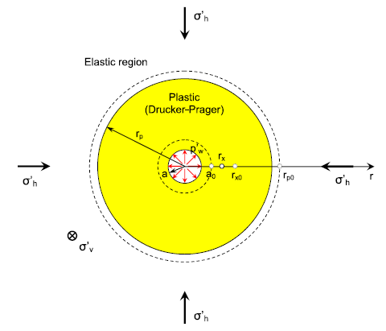
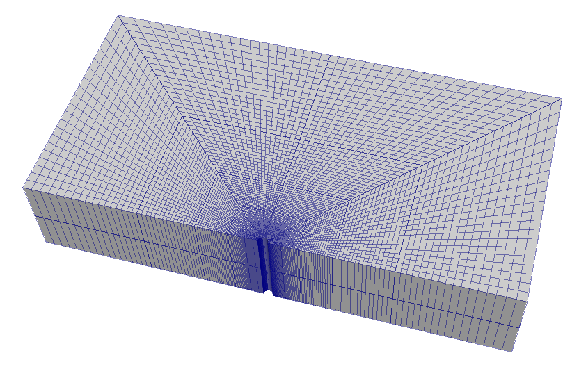
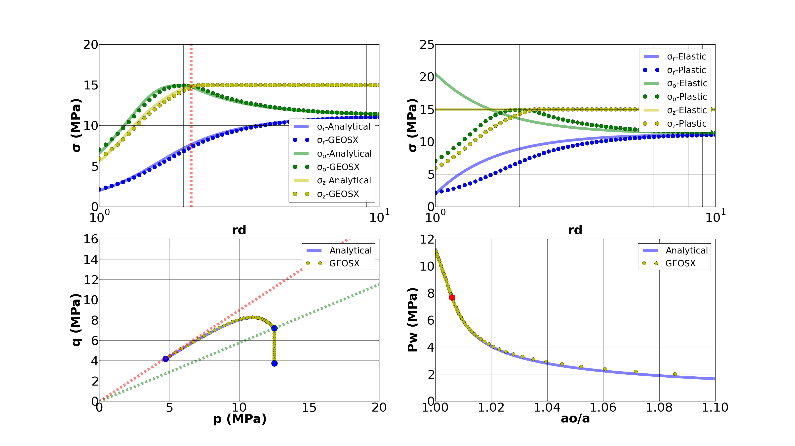

.. _TutorialPlasticity:

####################################################
Tutorial 11: Plasticity Model for Wellbore Problems
####################################################

**Context**

The main goal of this tutorial is to learn how to use internal mesh generator and plasticity models to handle wellbore problems in GEOSX. In this tutorial, the Extended Drucker-Prager model (see :ref:`TwoInvariantPlasticity`) is applied to solve for elastoplastic deformation within the vicinity of a vertical wellbore. For the presented example, an analytical solution is employed to verify the accuracy of the numerical result obtained with this plasticity model in GEOSX. This makes GEOSX a reliable engine to guide real field applications (e.g., wellbore drilling, fluid injection and storage) and provide adequate assessments of inelastic deformation. 

**Objectives**

At the end of this tutorial you will know:

  - how to construct meshes for wellbore problems with internal mesh generator,
  - how to specify initial and boundary conditions, such as in-situ stresses and variation of traction at wellbore wall,
  - how to use a plastic model for mechanical problems in the near wellbore region.

**Input file**

This tutorial uses no external input files and everything required is
contained within a single GEOSX input file. 
The xml input file for this test case is located at:

.. code-block:: console

  examples/plasticity/DruckerPrager_Verification.xml

------------------------------------------------------------------
Description of the case
------------------------------------------------------------------

We simulate the drained wellbore problem subjected to isotropic horizontal stress (:math:`\Sigma_h`) and vertical stress (:math:`\Sigma_v`). By lowering the wellbore supporting pressure (:math:`P_w`), wellbore will contract, and reservoir rock will experience elastoplastic deformation and a plastic zone will be developed in the near wellbore region, as shown in Fig.1.

.. _problemSketchFig:

   Fig.1 Sketch of the wellbore problem `(Chen and Abousleiman, 2017)  <https://www.sciencedirect.com/science/article/pii/S1365160917301090>`__

To simulate this phenomenon, the strain hardening Extended Drucker Prager model with an associated flow rule in GEOSX is used in this tutorial. Displacement and stress fields around the wellbore are numerically calculated. These numerical predictions are then compared with the corresponding analytical solutions `(Chen and Abousleiman, 2017)  <https://www.sciencedirect.com/science/article/pii/S1365160917301090>`__ from the literature. 

------------------------------------------------------------------
Preparing the input files
------------------------------------------------------------------

All inputs for this case are contained inside a single XML file.
In this tutorial, we focus our attention on the ``Mesh`` tags,
the ``Constitutive`` tags, and the ``FieldSpecifications`` tags.

Mesh: discretizing computational domain
--------------------------------------------------------------------

Fig.2 shows the generated mesh that is used for solving this 3D wellbore problem

.. _problemSketchFig:

   Fig.2 Generated mesh for the wellbore problem

Let us take a closer look at the geometry of this wellbore problem.
We use the internal mesh generator ``InternalWellbore`` to create a rock domain
(:math:`10\, m \, \times 5 \,  m \, \times 2 \, m`), with a wellbore of
initial radius equal to :math:`0.1` m.
Coordinates of ``trajectory`` defines the wellbore trajectory, which represents a perfect vertical well in this tutorial. 
By turning on ``autoSpaceRadialElems="{ 1 }"``, the internal mesh generator automatically sets number and spacing of elements in the radial direction, which overrides the values of ``nr``. 
With ``useCartesianOuterBoundary="0"``, a Cartesian aligned outer boundary on the outer block is enforced.
In this way, a structured three-dimensional mesh is created with 100 x 80 x 2 elements in the radial, tangential and z directions, respectively. All the elements are eight-node hexahedral elements (``C3D8``) and refinement is performed
to conform with the wellbore geometry. This mesh is defined as a cell block with the name
``cb1``.

.. literalinclude:: ../../../../../examples/plasticity/DruckerPrager_Verification.xml
    :language: xml
    :start-after: <!-- SPHINX_DP_WELLBORE_MESH -->
    :end-before: <!-- SPHINX_DP_WELLBORE_MESH_END -->

Solver: setting up the solid mechanics solver
-----------------------------------------------------------

For the drained wellbore problem, the pore pressure variation is omitted and can be subtracted from the analysis. Therefore, we just need to define a solid mechanics solver, which is called ``mechanicsSolver``. 
This solid mechanics solver (see :ref:`SolidMechanicsLagrangianFEM`) is based on the small strain Lagrangian finite element formulation. 
The problem is run as ``QuasiStatic`` without considering the inertial. 
The computational domain is discretized by ``FE1``, which is defined in the ``NumericalMethods`` section. 
The material is named as ``rock``, whose mechanical properties are specified in the ``Constitutive`` section.

.. literalinclude:: ../../../../../examples/plasticity/DruckerPrager_Verification.xml
  :language: xml
  :start-after: <!-- SPHINX_DP_WELLBORE_SOLVER -->
  :end-before: <!-- SPHINX_DP_WELLBORE_SOLVER_END -->

Constitutive model: defining material properties with constitutive laws
-----------------------------------------------------------

For this drained wellbore problem, we simulate the elastoplastic deformation caused by wellbore contraction.
A homogeneous domain with one solid material is assumed, whose mechanical properties are specified in the ``Constitutive`` section: 

.. literalinclude:: ../../../../../examples/plasticity/DruckerPrager_Verification.xml
    :language: xml
    :start-after: <!-- SPHINX_DP_WELLBORE_MATERIAL -->
    :end-before: <!-- SPHINX_DP_WELLBORE_MATERIAL_END -->

Recall that in the ``SolidMechanicsLagrangianSSLE`` section, 
``rock`` is designated as the material in the computational domain. 
Here, Extended Drucker Prager model ``ExtendedDruckerPrager`` is used to simulate the elastoplastic behavior of ``rock``.
As for the material parameters, ``defaultInitialFrictionAngle``, ``defaultResidualFrictionAngle`` and ``defaultCohesion`` denote the initial friction angle, the residual friction angle, and cohesion, respectively, as defined by the Mohr-Coulomb failure envelope in the :math:`\Sigma` - :math:`\Tau` plane.
As the residual friction angle ``defaultResidualFrictionAngle`` is larger than the initial one ``defaultInitialFrictionAngle``, the strain hardening model is automatically chosen, whose hardening rate is given as ``defaultHardening="0.01"``. 
If the residual friction angle is set to be less than the initial one, strain weakening will take place. 
And ``defaultDilationRatio="1.0"`` corresponds to an associated flow rule.
The constitutive parameters such as the density, the bulk modulus, and the shear modulus are specified in the International System of Units.

Initial and Boundary Conditions: defining properties with the FieldSpecifications
-----------------------------------------------------------

The next step is to specify fields, including:

  - The initial value (the in-situ stresses and traction at the wellbore wall have to be initialized)
  - The boundary conditions (the reduction of wellbore pressure and constraints of the outer boundaries have to be set)

In this tutorial, we need to specify isotropic horizontal stress (:math:`\Sigma_h` = 11.25 MPa) and vertical stress (:math:`\Sigma_v` = 15.0 MPa). 
To reach equilibrium, a compressive traction :math:`P_w` = -11.25 MPa is instantaneously applied at the wellbore wall ``rneg`` at time :math:`t` = 0 s, which will then be gradually reduced to a lower value (-2.0 MPa) to let wellbore contract.
The remaining parts of the outer boundaries are subjected to roller constraints.  
These boundary conditions are set up through the ``FieldSpecifications`` section.

.. literalinclude:: ../../../../../examples/plasticity/DruckerPrager_Verification.xml
    :language: xml
    :start-after: <!-- SPHINX_DP_WELLBORE_BC -->
    :end-before: <!-- SPHINX_DP_WELLBORE_BC_END -->

With ``tractionType="1"``, traction is applied to the wellbore wall ``rneg`` as a pressure specified from the product of scale ``scale="-11.25e6"`` and the outward face normal. 
A table function ``timeFunction`` is used to define the time-dependent traction ``ExternalLoad``. 
The ``coordinates`` and ``values`` form a time-magnitude
pair for the loading time history. In this case, the loading magnitude decreases linearly as the time evolves. 

.. literalinclude:: ../../../../../examples/plasticity/DruckerPrager_Verification.xml
    :language: xml
    :start-after: <!-- SPHINX_DP_WELLBORE_TABLE -->
    :end-before: <!-- SPHINX_DP_WELLBORE_TABLE_END -->

You may note :

 - All initial value fields must have ``initialCondition`` field set to ``1``,
 - The ``setName`` field points to the previously defined box to apply the fields,
 - ``nodeManager`` and ``faceManager`` in the ``objectPath`` indicate that the boundary conditions are applied to the element nodes and faces, respectively,
 - ``fieldName`` is the name of the field registered in GEOSX,
 - Component ``0``, ``1``, and ``2`` refer to the x, y, and z direction, respectively.
 - And the non-zero values given by ``Scale`` indicate the magnitude of the loading. 
 - Some shorthand, such as ``xneg`` and ``xpos``, are used as the locations where the boundary conditions are applied in the computational domain. For instance, ``xneg`` means the portion of the computational domain located at the left-most in the x-axis, while ``xpos`` refers to the portion located at the right-most area in the x-axis. Similar shorthand include ``ypos``, ``yneg``, ``zpos``, and ``zneg``. 

 
The parameters used in the simulation are summarized in the following table.

+------------------+-------------------------+------------------+---------------+
| Symbol           | Parameter               | Units            | Value         |
+==================+=========================+==================+===============+
| :math:`K`        | Bulk modulus            | [MPa]            | 500           |
+------------------+-------------------------+------------------+---------------+
| :math:`G`        | Shear Modulus           | [MPa]            | 300           |
+------------------+-------------------------+------------------+---------------+
| :math:`C`        | Cohesion                | [MPa]            | 0.0           |
+------------------+-------------------------+------------------+---------------+
| :math:`\phi_i`   | Initial Friction Angle  | [degree]         | 15.27         |
+------------------+-------------------------+------------------+---------------+
| :math:`\phi_r`   | Residual Friction Angle | [degree]         | 23.05         |
+------------------+-------------------------+------------------+---------------+
| :math:`c_h`      | Hardening Rate          | [-]              | 0.01          |
+------------------+-------------------------+------------------+---------------+
| :math:`\Sigma_h` | Horizontal Stress       | [MPa]            | 11.25         |
+------------------+-------------------------+------------------+---------------+
| :math:`\Sigma_v` | Vertical Stress         | [MPa]            | 15.0          |
+------------------+-------------------------+------------------+---------------+
| :math:`a_0`      | Initial Well Radius     | [m]              | 0.1           |
+------------------+-------------------------+------------------+---------------+
| :math:`P_w`      | Well Pressure           | [MPa]            | 2.0           |
+------------------+-------------------------+------------------+---------------+

Inspecting results
---------------------------------

In the above example, we requested silo-format output files. We can therefore import these into VisIt and use python scripts to visualize the outcome. Fig.3 shows the comparisons between the numerical predictions (marks) and the corresponding analytical solutions (solid curves) with respect to the distributions of normal stress components, stress path, the supporting wellbore pressure and wellbore size. It is clear that the GEOSX predictions are in excellent agreement with the analytical results for this specific case. 

.. _problemVerificationFig:

   Fig.3 Comparing GEOSX results with analytical solutions

For the same wellbore problem, using different constitutive models (plastic vs. elastic), obviously, distinct differences in rock deformation and distribution of resultant stresses is also observed and highlighted.  

------------------------------------------------------------------
To go further
------------------------------------------------------------------

**Feedback on this tutorial**

This concludes the tutorial on Plasticity Model for Wellbore Problems.
For any feedback on this tutorial, please submit a `GitHub issue on the project's GitHub page <https://github.com/GEOSX/GEOSX/issues>`_.

**For more details**

  - More on plasticity models, please see :ref:`TwoInvariantPlasticity`.
  - More on wellbore meshes, please see :ref:`InternalWellbore`.
  - More on functions, please see :ref:`FunctionManager`.

